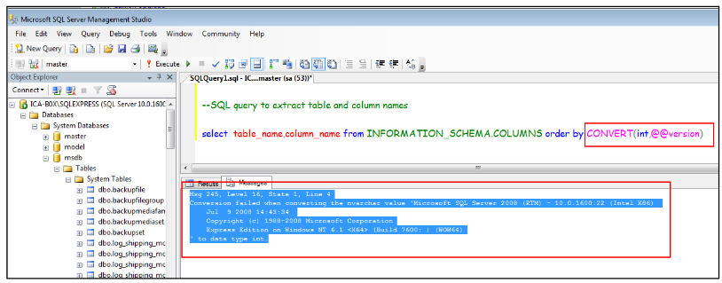

:orphan:
(finding-sql-injection-practical-cases)=
# Finding SQL Injection: Practical Cases
 
Finding the **injection point** is the first step in exploiting a SQL injection, after which you can create a **payload** to take over the target dynamic query. By probing an online application's inputs with characters that are known to make the SQL query syntactically improper and force it to return an error, it is possible to locate SQL injections within it most easily. Please take note that not all web application inputs are utilized when creating SQL queries. We advising categorizing the various input parameters and saving the ones utilized for manipulating and retrieving database data in the *information gathering* step of pentesting. We'll look at how to leverage the data collected to find and take advantage of SQLi vulnerabilities in the ensuing slides.

**GET, POST, HEADERS, and COOKIES requests** all include input arguments. Therefore, we must examine every channel via which data is obtained from the client. 

The circumstances where inputs are taken directly from the URL will be examined in the following instances for the sake of simplicity (with the GET method). The other channels use the same methods.

We developed a simple (vulnerable) e-commerce web application exhibiting cell phones for sale in order to demonstrate the process of identifying SQL Injections. 

**Example:**

Using the `id` input parameter, the `ecommerce.php` script, for instance, reads the product features from the database and prints them on the page.


<p style="width:250px; display:inline-block;">
An integer is anticipated for the `id` parameter. When the `id=1` `GET` parameter is sent, the application operates as intended.</p>


However, the application throws an error if you send a comma.


In order to test an input for SQL injection
+ one must attempt to inject: 
+ `'and "` are string terminators; **SELECT, UNION,** and other SQL operations are available. 
+ SQL comments: `# or —` 

And observe any strange behavior displayed by the online application. 

**One injection at a time** is always tested! Otherwise, you won't be able to comprehend what an effective injection vector is.

On its output pages, the web application we just saw displays internal faults. 

This behavior aids penetration testers and developers in comprehending a web application's inner workings.

When SQL queries are executed incorrectly, each **DBMS** provides a unique **error message**. 

Error messages vary even within the same DBMS depending on the particular function a web application employs to communicate with it. 

**Example:**

In the last example, we observed that our improper input caused the `mysql fetch assoc()` method to throw an error.

An `MS-SQL` error typically looks like this:



While a typical `MySQL` error more closely resembles this:

```sql
You have an error in your SQL syntax. Check the manual that corresponds to your MySQL server version for the right syntax to use near [query snippet]
```

It's highly likely that the application is open to SQL injection attacks if you see problems similar to the ones mentioned above when working on a project. 

This isn't always the case; occasionally, you have to make informed assumptions to determine whether or not a web app is susceptible.

The majority of production websites do not yet show these problems. 

This occurs due to the application's usability—displaying faults to end users who cannot comprehend them or correct them is useless—and to achieve **security through obscurity**.

The practice of providing security through secrecy in design, implementation, or configuration is known as **security through obscurity**. 

You'll see in the following slides why this method is ineffective at protecting a weak application from **SQL injection attacks**.

**A Boolean-based detection method** can be used to test for SQL injection even if a web application does not show faults on its output. 

The basic yet ingenious idea behind this technique is to create payloads that translate web application inquiries into True/False conditions. The results of the queries can then be deduced by the penetration tester by observing how the behavior of the application varies under various True/False scenarios.

<p style="width:280px; display:inline-block;">We developed a website displaying a picture gallery to show off a Boolean-based SQLi detection. 
Each photograph is uniquely identified by an ID.</p>


As usual, we transmit SQL-reserved characters to the web application in an effort to find the injection location. a string termination character is used in this case. There is no image displayed by the online application.


Unfortunately, when we request a picture that does not actually exist, the application still acts in the same manner. For instance, if we use the GET argument id=999999


We believe that the page's hidden search is something like

```sql
SELECT <some fields> FROM <some table> WHERE id='GETID';
```

So we can try to inject 999999' or '1'='1 to transform the query
into:

```{code-block} sql
:force:
SELECT <some fields> FROM <some table> WHERE id='999999 or '1'='1';
```

Which basically is an **always true condition!**

<p style="width:200px; display:inline-block;">We receive an output after testing the payload on the web application. We must also test an always false condition in order to be certain.</p>


We then change our payload to 999999' or '1'='2 which is an **always false condition**.


Another always true or always false condition that may be used to test a little more is:
+ 1141' and 'els'='els
+ 1141' and 'els'='elsec
+ 1141' and 'hello'='hello
+ 1141' and 'hello'='bye
+ els' or '1'='1
+ els' or '1'='2

Once an injection site has been identified, it is time to determine whether it can actually be exploited. 

You will see many methods to exploit SQL injection flaws in the MSCI courses that.

You will learn how to recognize SQL injection vectors in the next video. 

You will learn how to test for vulnerable parameters using Boolean logic injections and how to do fundamental SQLi exploitation using SQLMap. 

Later on in this subject, we will also explore in detail how to use SQL.

## Exploiting In-Band SQL Injections

By using the **UNION** SQL command, in-band SQL injection techniques give the database retrieval of data a strong boost. **In-band SQL injections** are also referred to as *UNION-based SQL injections* because of this. 

A penetration tester can use this type of attack to extract the database content, including the database name, table schemas, and real data.

The `UNION` statement combines the result-set of two or more `SELECT` queries, as we saw in the first chapter of this topic.

`Example:`

```sql
SELECT <field list> FROM <table> UNION SELECT <field list> FROM <another table>;
```

We will examine a few instances to see how to take advantage of in-band SQL injection. The database in the first example has two tables: CreditCards and Users.


The foreign key of the Users table is the user id column. In this illustration, Fred's credit card number is 0123 4567 8901 2345, while admin's credit card number is 0000 1111 2222 3333.


The following code is used by the web application to show usernames:

```php
<?php
$rs=mysql_query("SELECT real_name FROM users WHERE id=".$_GET['id'].";"); $row=mysql_fetch_assoc($rs);
 echo $row['real_name']; ?>
SQL injection!
```

As you can see, the SQL query's id column clearly contains a SQL injection.

Now that SQLi is vulnerable, we can utilize it to access the credit card linked to a username.

Our payload is:

```sql
9999 UNION ALL SELECT cc_num FROM CreditCards WHERE user_id=1
```

The following is how the web application's query changes as a result of the payload:

```sql
SELECT real_name FROM users WHERE id=9999 UNION ALL SELECT cc_num FROM CreditCards WHERE user_id=1;
```

The web application will show the first user's cc num on its output since there are no users with the id=9999!

We can now send a `GET request` using the browser or another tool to provide the payload to the web application:

```sql
/vuln_to_inband.php?id=9999 UNION ALL SELECT cc_num FROM
CreditCards WHERE user_id=1
```

Take note of the `ALL` operator usage. In the initial web application query, we used it to prevent the impact of a potential `DISTINCT` clause.

Utilizing **comments** is another another effective tactic for exploiting a SQL injection vulnerability. a payload like:

```sql
9999 UNION ALL SELECT cc_num FROM CreditCards WHERE user_id=1; -- -
```

Comment out any more SQL code that might be executed after our injection point.

There are numerous aspects of the prior attack to note: 
+ The second SELECT query's fields should be of the same type as those in the first statement
+ The number of fields should match that of the first statement. 
+ In order to execute the attack successfully, we must be aware of the database's table and column names.

We may use a sophisticated method to determine which columns are used in a SELECT operation to resolve the first two problems. The quantity and type of columns are what we're after. 

Later, we'll look at how to reconstruct the database structure. We presume that we are familiar with the database's structure in the instances that follow.

Let's look at how to count the number of fields or columns that a query selects. The susceptible statement is found in the following line:

```php
mysql_query("SELECT id, real_name FROM users WHERE id=".$GET['id'].";");
```

> **Looking to expand your knowledge of penetration testing? Check out our online course, [MPT - Certified Penetration Tester](https://www.mosse-institute.com/certifications/mpt-certified-penetration-tester.html)**