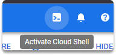
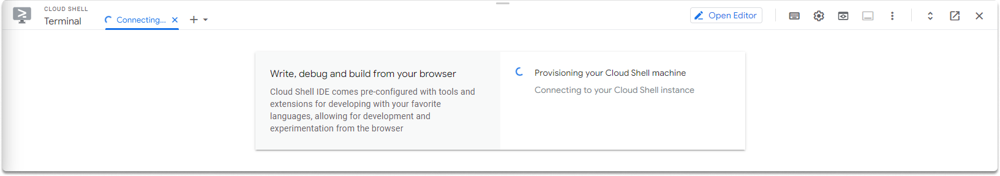
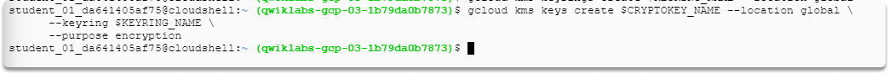
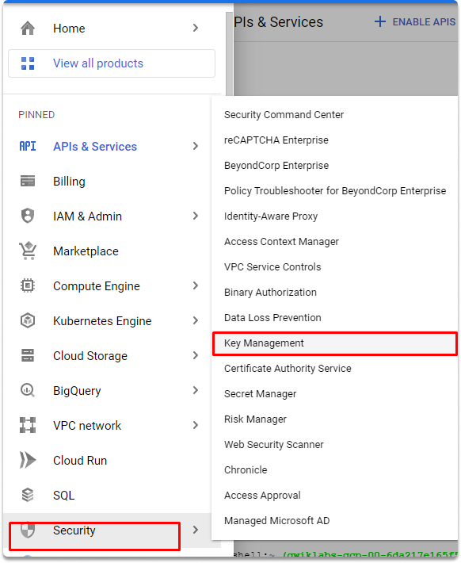
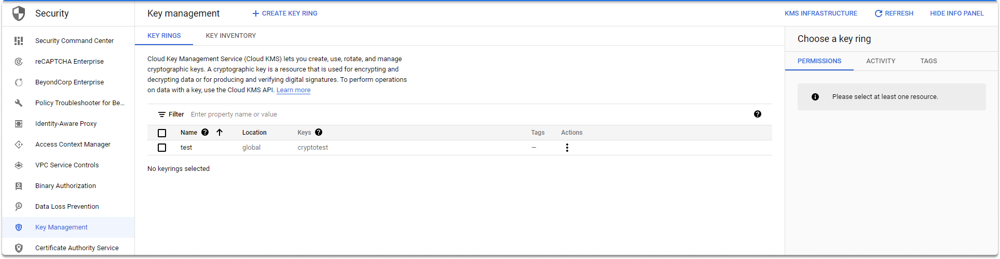
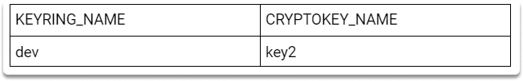

:orphan:
(hands-on-with-google-cloud-key-management-service-kms)=

# Hands-on with Google Cloud Key Management Service (KMS)

Google Cloud Key Management Service (KMS) is a cloud-based key management system that enables you to manage encryption keys for your cloud services. It is a fully managed service that provides a central repository for your keys and enables you to control their access and use. In this blog post, we will take a hands-on look at KMS and show you how to use it to manage your keys.

## What is KMS?

Cloud KMS, is Google's access control solution. It provides a sophisticated service of handling App Engine secrets. Cloud KMS also includes tools for generating, storing, and rotating encryption keys. Apps may encrypt and decode data stored nearly anywhere using KMS.

Using the KMS API, for example, you may encrypt program credentials. Because the encrypted value may be saved anyplace, this means that it is not engine specific rather it is transferable across all Google Cloud services.
Now that we learned what a KMS is, lets make a quick exercise to learn KMS better.

### Getting Started with Cloud KMS

Initiate the Cloud Shell icon in the Cloud Console.





### Enabling Cloud KMS

As we previously stated, cloud KMS is a Google Cloud encryption keys administration service. Before using this service, first, we need to activate KMS in our project. To activate KMS, run this command in your session:

`$ gcloud services enable cloudkms.googleapis.com`


### Using KMS to create a Keyring and Cryptokey

A key in Cloud KMS pertains to a key ring, that is located in a certain location. To encrypt the content, you must first construct a key ring and a crypto key. You may give your key ring and crypto key to any names you choose. To create variables in Cloud Shell, use the following command:

`$ KEYRING_NAME=test CRYPTOKEY_NAME=cryptotest`


And then run this command to create the KeyRing. You can choose whatever region you want, in this case, we will choose global.

`$ gcloud kms keyrings create $KEYRING_NAME --location global`


Run this command to create a crypto key named `cryptotest` with the specified attributes:

```
$ gcloud kms keys create $CRYPTOKEY_NAME --location global \
      --keyring $KEYRING_NAME \
      --purpose encryption
```



### Checking our crypto keys in the KMS web UI

You can check your keys on the Key Management page as shown in the illustration.





## Sumamry

In this blog post, we made an introduction to Google Key Management Service. We took a step further and made a quick activity in which we enabled KMS via cloud shell, learned what is a key and created a key ring and crypto key, and lastly checked our newly created key in the KMS interface.

## Project Idea

Here is a quick task for you to solidify your KMS knowledge better.



- Create another key with the specified values by following the steps in this article.
- And then check the second key on the Key Management page.

:::{seealso}
Want to learn practical cloud skills? Enroll in MCSI’s - [MCSF Cloud Services Fundamentals ](https://www.mosse-institute.com/certifications/mcsf-cloud-services-fundamentals.html)
:::
