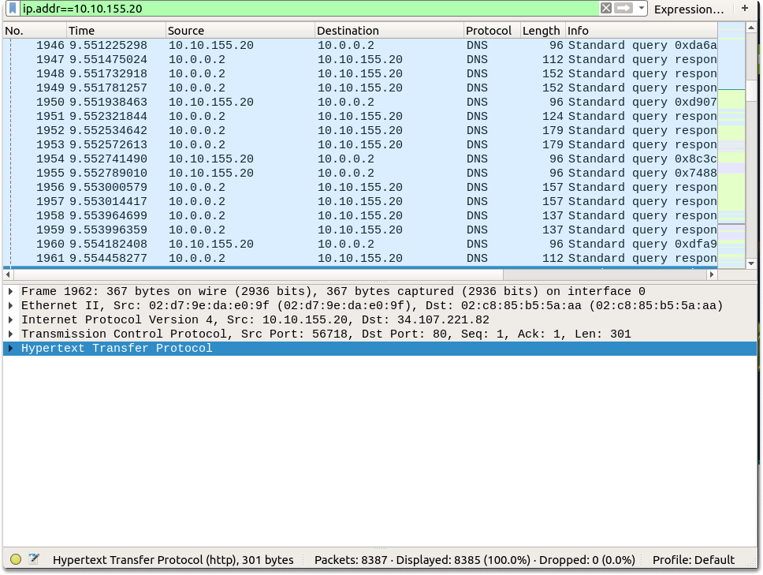
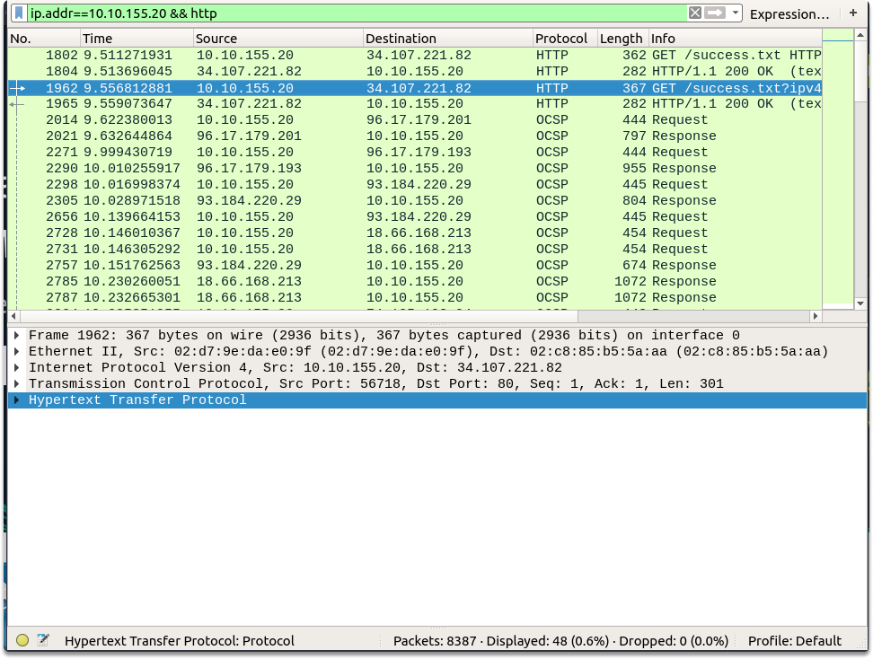
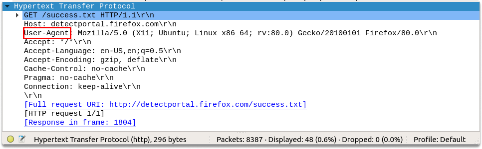
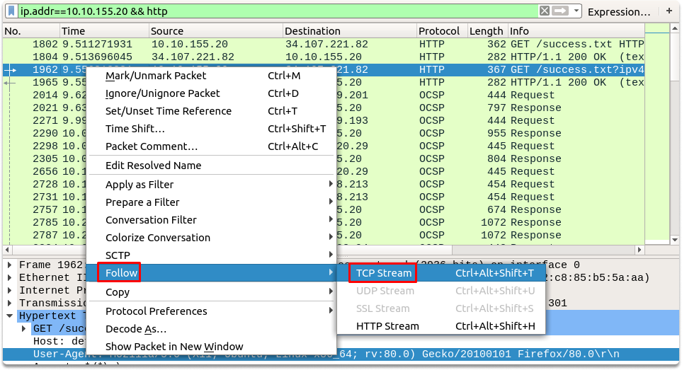
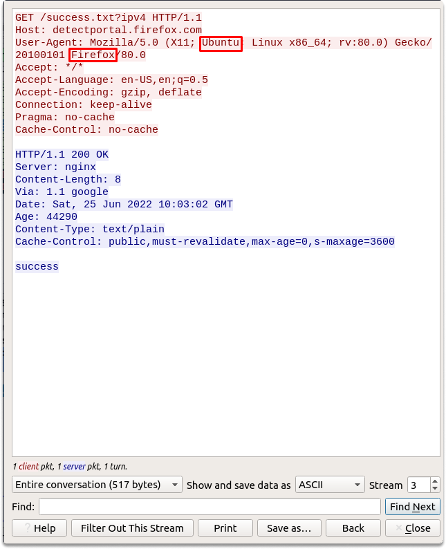
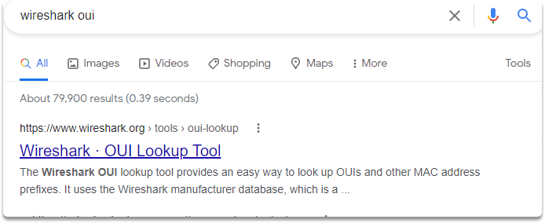
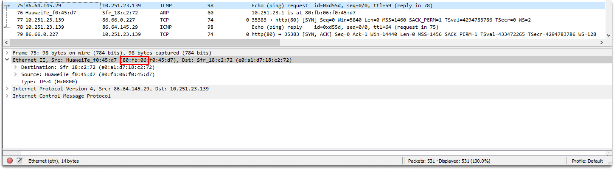
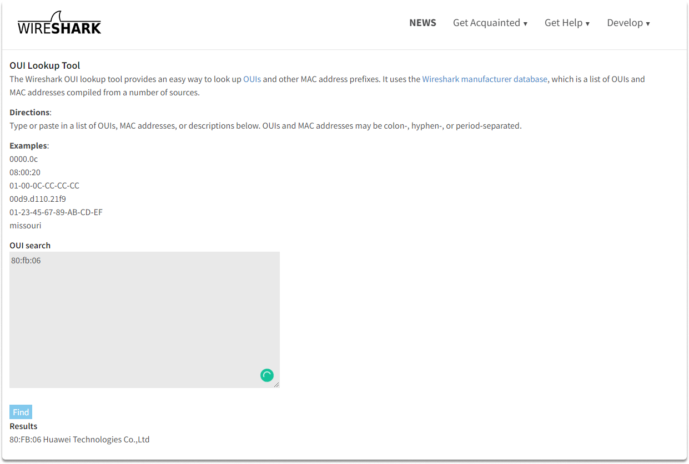

:orphan:
(hands-on-with-wireshark-basic-os-and-vendor-analysis)=

# Hands-on with Wireshark: Basic OS and Vendor Analysis

In this blog page, we are going to analyze a network traffic flow in Wireshark and learn how to find OS software details and the manufacturer of an IP address. We will also learn how to apply a display filter to narrow down traffic results to find a specific address we are looking for. Upon completion of this page, you will be able to transfer these skills to various operations you perform as a security operations practitioner.

**Question 1-** What operating system and type of device is on 10.10.155.20?

Now let’s start by searching for a specific IP address in the Wireshark display filter section. We will type the following filter in the text field and type enter.

`ip.addr==10.10.155.20`

Now as you can see Wireshark filtered down the results to the IP address we specified either in the source or destination section.

**Question 2-** Identify what type of OS is running on 10.100.1.33.

To answer this question, we are going to analyze the User-Agent field in HTTP. The User-Agent header includes information about the requesting program's underlying OS and software version.

Let’s narrow down the traffic more by updating the display filter field with the addition of `&& http` and clicking enter. && will logically concatenate the two operators and show the results meeting both of the requirements.

`ip.addr==10.10.155.20 && http`

As we already learned, the 5th section in the Wireshark details pane corresponds to the application layer in the OSI model. Now let’s expand this section which is Hypertext Transfer Protocol in our case. Now we are going to look if the string-agent field is passed to the browser.

As you can see in the above screenshot, 10.10.155.20 is passing its OS and software version details in the user-agent section. We can see that the operating system is Ubuntu and the host uses a firefox web browser. We can also verify this by right-clicking on the packet and following the TCP stream as shown in the image.

**Question 3-** Find the manufacturer of mac address of 86.64.145.29.

Now we will look at a previous pcap file to identify the vendor of a mac address. Unless it is modified (we have learned that this is a really easy trick that you can master in a couple of steps) the first half of a mac address is vendor-specific bits. To acquire vendor bits we are going to analyze the Ethernet II section in the details pane. We can also visit this link to search for a manufacturer name: https://www.wireshark.org/tools/oui-lookup.html

As we can see in the screenshot, 86.64.145.29 has the following mac address: 80:fb:06:f0:45:d7. Let’s copy and paste the first half of this value and click on find.

As you can see the manufacturer is Huawei Technologies Co.,Ltd.

**Quick Task**

Can you identify your system and vendor details using Wireshark by going over the steps we followed through in this blog page?

:::{seealso}
Looking to expand your knowledge of penetration testing? Check out our online course, [MPT - Certified Penetration Tester](https://www.mosse-institute.com/certifications/mpt-certified-penetration-tester.html)
:::
