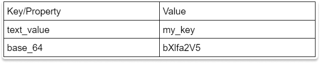
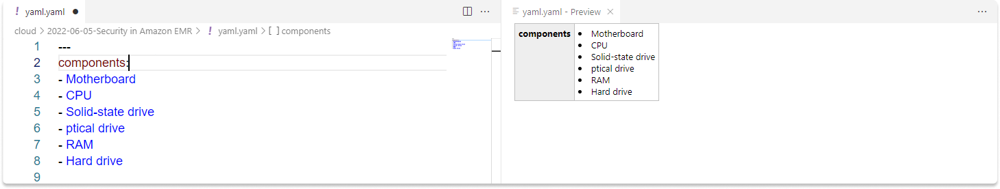
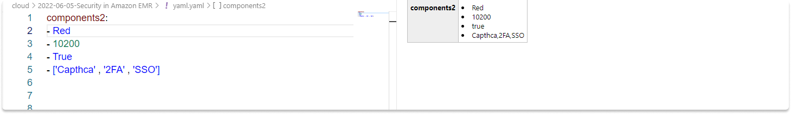
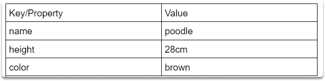

:orphan:
(hands-on-with-yaml-basics)=

# Hands-on with YAML Basics

There was no standardized way of marking up the text before XML, but now there are other possibilities, including JavaScript Object Notation (JSON) and Yet Another Markup Language, or YAML Ain't Markup Language (YAML). In this blog post, we will look at the basics of YAML briefly. You can also follow along with us by copying and pasting the codes in your favorite text editor.

## What is YAML?

Ain't Markup Language (YAML) is a data serialization language. YAML is commonly adopted in Quarkus and Spring Boot frameworks to manage microservice parameters.

## Key features of YAML syntax

- It is intended to be human-readable and mainly relies on key-value-like structures arranged using a syntax akin to Python.
- Hierarchies in YAML are defined using spaces.

A basic YAML key/value file looks like this:


```
text_value: my_key
base_64: bXlfa2V5
```

- Each sample in this section has three hyphens (---) at the start; this is a YAML standard that signals the opening of our YAML document.
- No quotation marks or double quotation marks (' or "). One of the good things about YAML is that we rarely need to use a quotation or double-quote marks to signify a string; the YAML parser typically detects this automatically.

## Creating a list of six items and indentation rules

The following is a list of hardware components:

```
---
components:
- Motherboard
- CPU
- Solid-state drive
- optical drive
- RAM
- Hard drive
```



There are six items in this YAML document. If you look at the component names we can verify that each item is made up of _strings_. You can also see that each of these elements is preceded by a hyphen.

Because all four of these strings are printed at the same level (no indentation), we can say that they form a 6-item list.

## Nested data structures

In this case, we have another list with a length of four. The following list is also known as a nested data structure. You can see that each object has another data type such as string, int, bool, and array.

```
components2:
- Red
- 10200
- True
- ['Capthca' , '2FA' , 'SSO']
```

Here is a list of all the different data kinds.

- Red is a string data type in the first item.
- The second component is a number (which is abbreviated as int).
- The third component is a boolean value (true or false).
- And finally, we have an array of three string elements.

As you can see, each item is separated by a hyphen.



## How is the data interpreted by YAML?

A YAML interpreter, such as PyYAML, does this "interpretation." PyYAML, in particular, does a decent job at determining what type of data the user is attempting to send.

## Summary

In this blog post we made a brief introduction to YAML syntax and introduced some basic file structure elements and rules such as lists, nested data structure and data types.

## Task: Create a YAML Dictionary

_Time Estimated: 5 minutes_

Here is a quick project for you:

- Open your favourite IDE or grab an online YAML editor tool.
- Add additional properties to the dictionary.



Good luck!
