:orphan:
(hunting-webshells-linux-and-windows-commands)=

# Hunting Webshells: Linux and Windows Commands

Webshells are malicious scripts used by attackers to gain remote access to a server. They can be used to execute arbitrary commands, upload and download files, or even to establish a reverse shell connection. In this blog post, we'll show you how to use Linux and Windows commands to locate webshells on your server.

## Introduction
Log analysis is one of the techniques used to hunt for web shells (Apache, IIS, etc.). We will not devote a great deal of time to analyzing web shell logs.

Instead, we will use the Log Parser Studio tool to analyze IIS web logs, including the tools mentioned in the previous section as well as native built-in OS commands and/or scripting languages, in order to locate hidden web shells in the web server's directories.

Before moving on to the actual tools, let's examine some fundamental Linux web server commands for locating web shells.

Note that these are not the only techniques for locating web shells. Only a few will be addressed.

In the following sections, we will examine techniques and tools for attempting to locate four web shells on a particular Linux web server.

- Two files are not obfuscated, while two files are.

- Additionally, two files have the.php file extension and two web shells have the.txt file extension.

This is done for completion's sake and to confirm successful detection.

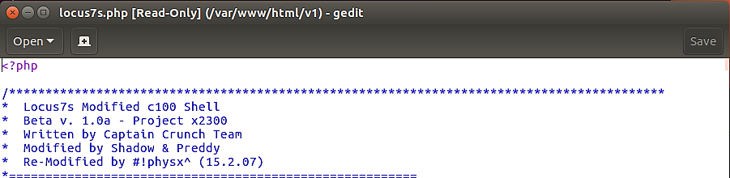

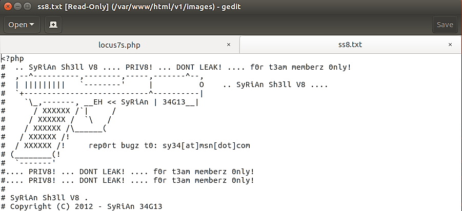

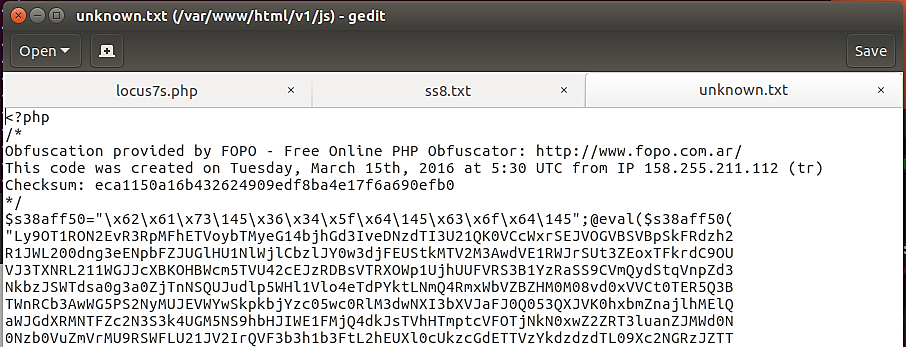

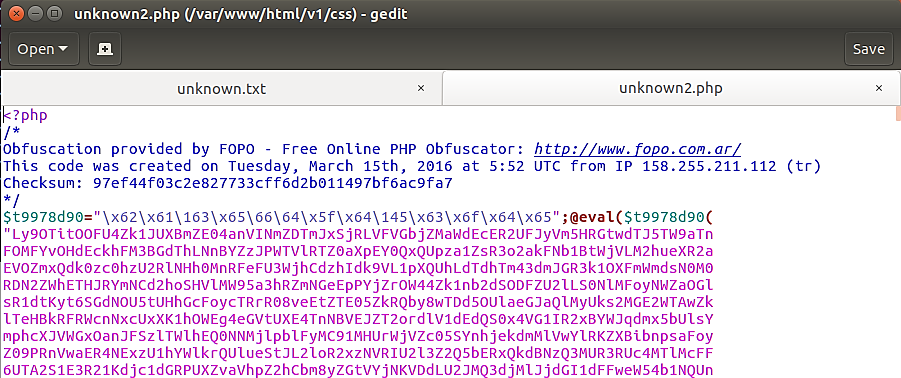

We see from the previous pictures the following web shells reside on the server:

- `locus7s.php (/var/www/html/)`
- `unknown.txt (/var/www/html/js/)`
- `ss8.txt (/var/www/html/images/)`
- `unknown2.php (/var/www/html/css/)`

## Linux commands

The following command will locate new files that have been uploaded to the web server within the past 24 hours. This is beneficial if you are committed to daily web shell scans on web servers in your environment.

```bash
find . -type f -name '*.php' -mtime -1
```

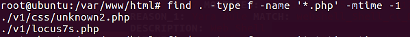

With the preceding command, we instruct Linux to search for files (`-type f`) within the current directory (`.`) that match the following criteria: any PHP files (`-name '*.php'`) that are less than 24 hours old (`-mtime -1`).

The `-mtime` file attribute stores the time and date of the file's last modification. Only the content, not the attributes themselves. This information can be viewed by using the command:

```bash
ls -l
```

We can do the same for `txt` files, or any files for that matter:

```bash
find . -type f -name '*.txt' -mtime -1
```

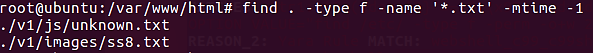

The preceding command examines nothing within the files. It only checks the last modified time of the file contents at the search location.

Let's take a look at some Linux commands that look for suspicious code within a file.

We will modify the existing Linux command with `xargs` and `grep` in order to locate suspicious code within the files.

Below is a brief explanation of both arguments:

- `xargs` generates and executes command lines based on standard input.

- `grep` - displays lines that match a pattern

This command will search for instances of the PHP `eval()` function. Execute the following command to search for PHP web shells.

```bash
find . -type f -name '*.php' | xargs grep -l "eval *("
```

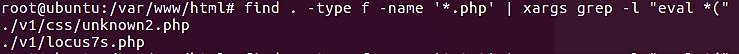

If we search for TXT files rather than PHP files, we will get the same results as before:

```bash
find . -type f -name '*.txt' | xargs grep -l "eval *("
```

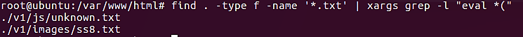

Let's make one more change to this Linux command, and then look for another PHP function. This time around, we will look for the `base64_decode()` function.

Let's have a look at the result while we search for this function inside of any PHP files that might be on the web server:

```bash
find . -type f -name '*.php' | xargs grep -l "base64_decode*("
```

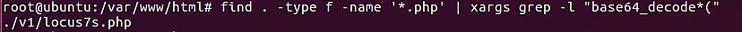

According to the output from the previous command, we can see that this time there was just one file detected, and it is the file that is not encrypted.

We will investigate more techniques that can assist in the filing of disguised web shells.

PHP-based web shells and trojans frequently make use of the `eval()` and `base64_decode()` functions of the PHP programming language. Other PHP functions, such as `str_rot13()` and `gzinflate`, are utilized in this example.

You can execute a single line of code that will search for any and all PHP functions, even those that are frequently located in malicious PHP scripts.

```bash
find . -type f -name '*.php' | xargs egrep -i "(mail|fsockopen|pfsockopen|exec|system|passthru|eval|base64_decode) *\("
```

The Linux command that you saw earlier will utilize `egrep` to search for a number of different keywords within the files that are stored on the server. Everything that scores a hit will be shown on the terminal as soon as it happens.

The following is a concise explanation of each function that hasn't been covered up until this point:

- `mail()` - can be used to send spam
- `fsockopen()` - can be used to open a network connect to send remote requests
- `pfsockopen()` - same as `fsockopen()`
- `exec()` - this is for command execution
- `system()` - can be used with `exec()`
- `passthru()` - can be used with `exec()`

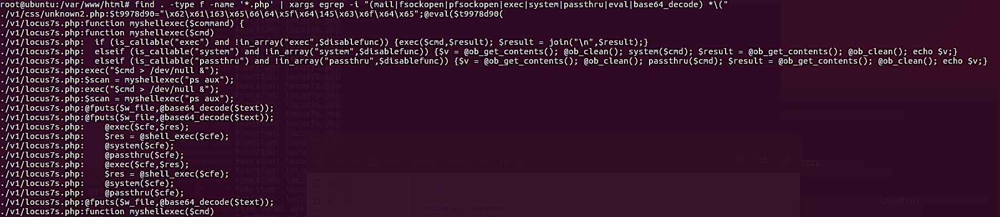

Because we are just looking for PHP files, it was able to find both of our web shells, which both include the extension PHP in their file names. If we run the same search for web shells that have been saved as TXT, will the results be the same?

```bash
find . -type f -name '*.txt' | xargs egrep -i
"(mail|fsockopen|pfsockopen|exec|system|passthru|eval|
base64_decode) *\("
```

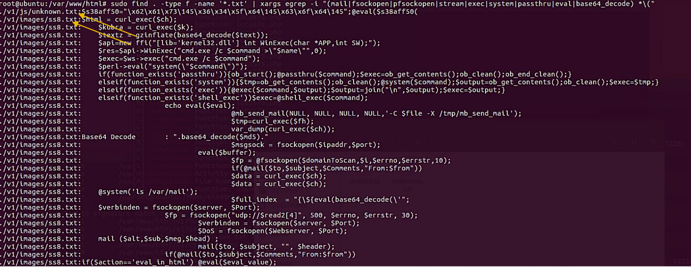

The Linux commands are, for the most part, performing as expected.

Now, we're going to show you a PHP backdoor that's completely hidden and obfuscated. Within the code, there are no PHP functions that are readily apparent.

Some information about this file:

- The following directory is where the save for this file was made: `/var/www/html/v1/fonts/`

### Unknown PHP backdoor

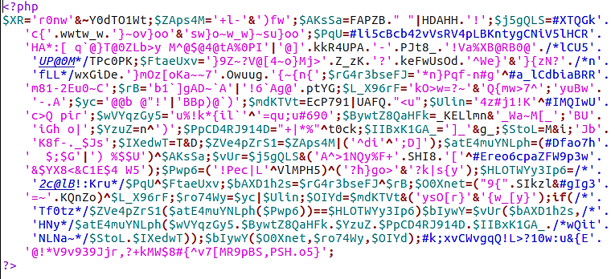

The output that we obtain when we run the final Linux command, which is a one-liner, is shown below:

```bash
sudo find . -type f -name '*.txt' | xargs egrep -i
"(mail|fsockopen|pfsockopen|exec|system|passthru|eval|
base64_decode) *\("
```

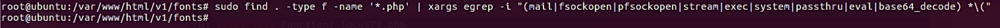

As was to be anticipated, the command did not find anything. We can only hope that some of the other techniques will be able to assist us in our search for web shells like this.

## Windows commands

PowerShell's `Get-ChildItem` and `Select-String` cmdlets allow us to do tasks similar to those of the grep command on Windows, allowing us to search for keywords within files stored in the file system.

In this example, all we will do is go over PowerShell's one-line implementation of the grep command:

```powershell
get-childitem -recurse -include "*.php" | select-string  "(mail|fsockopen|pfsockopen|exec\b|system\b|passthru|eval\b|base64_decode)" | % {"$($_.filename):$($_.line)"} | out-gridview
```

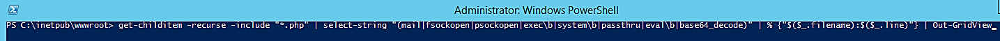

An explanation of this command in PowerShell, in a nutshell:

- `Get-ChildItem` is the command that corresponds to the dir command in CMD and the `ls` command in Linux.
- `-Recurse` will traverse all of the directories that are beneath the root directory.
- Specifying a file extension with the `-Include` switch instructs PowerShell to examine only that particular file type.
- `|` (pipe), the usage of which is comparable to that of Linux and CMD.
- The `Select-String` command is Linux's equivalent to the `grep` command.
- The `\b` character denotes a word boundary, which tells PowerShell to halt processing exactly at that word.
- The output of the percent symbol `"%{$($_.filename:$($ .line)"}` provides the name of the file and the line in which the word was discovered.
- If you use the `Out-Gridview` command, the output will be shown in a grid view rather than in console format.

The results of the previous PowerShell command are displayed below for your perusal:

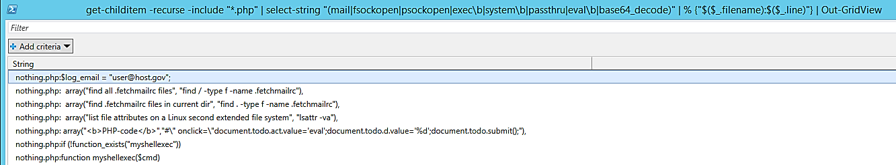

The preceding program can be changed to point to the actual web logs and scan for any keywords within the logs to identify any evidence of maliciousness. The grep command in Linux works exactly the same way.

:::{seealso}
Want to learn practical Threat Hunting tactics and strategies? Enrol in [MTH - Certified Threat Hunter Certification](https://www.mosse-institute.com/certifications/mth-certified-threat-hunter.html)
:::
