:orphan:
(hunting-webshells-tools)=

# Hunting Webshells: Tools

In this article we are going to discuss tools that can be use to discover Webshells.

## LOKI Simple IOC Scanner

The LOKI Simple IOC Scanner is going to be the first tool that we investigate.

Let's put this tool through its paces in the `/var/www/html/` directory and see what kind of results it returns.

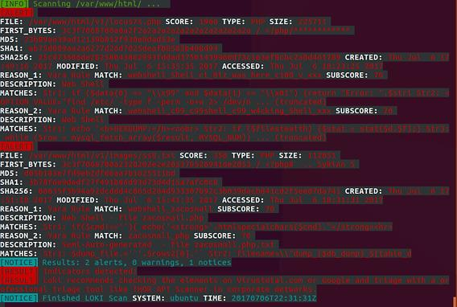

This tool was successful in locating the web shells that were not obfuscated, which were `locus7s.php` and `ss8.txt`, as you ought to have anticipated it would be able to do.

This instrument operates on the basis of signatures and/or a rule set, sometimes known as IOCs.

The report clearly demonstrates that Yara Rules were utilized in the process of locating these files.

We are able to view all of the Yara rules that are implemented with Loki if we navigate to the `/Loki/signature-base/yara` directory.

A sample of the items contained in that specific folder can be found toward the bottom of this page:

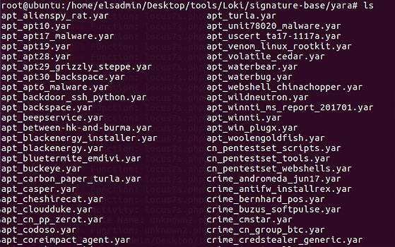

Let's examine the Yara rules used by Loki for web shells. The file is referred to as `thor-webshells-yar`:

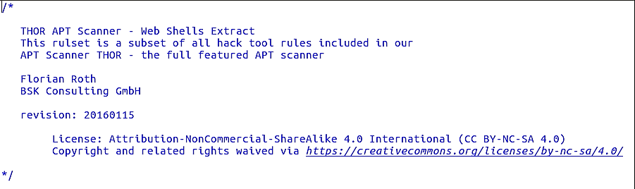

Loki detected the first alert, `locus7s.php`, based on the following Yara rule in the `thor-webshells.yar` file: (`webshell_c99_c99shell_c99_w4cking_Shell_xxx`)

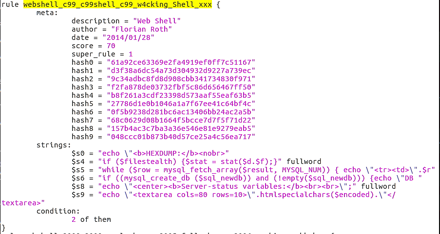

Even though this is the precise Yara rule that matched this web shell, please be aware that this file contains other Yara rules for `locus7s` web shells.

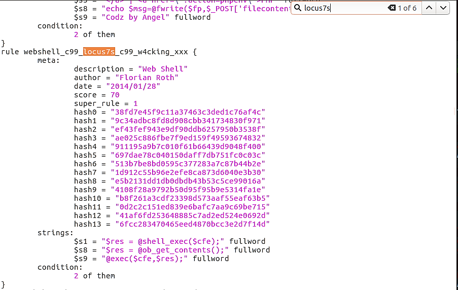

Six entries are found within this Yara file.

Loki was able to discover the second web shell within the file `ss8.txt`.

The Yara rule that proved decisive was: `webshell_zacosmall`

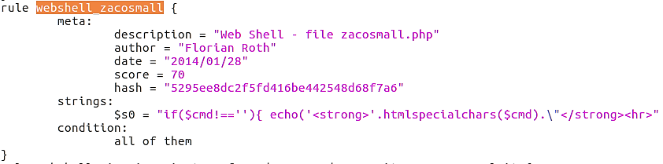

Circling back, we observe that Loki did not discover our obfuscated web shells. This could change in the future if we create Yara rules with a YAR file to identify these shells.

Let's examine NeoPI and employ it to hunt for these web shells.

## NeoPI

The output from NeoPI under Top 10 lowest IC files and Top 10 entropic files for a specific search rapidly reveals that there are no web shells:

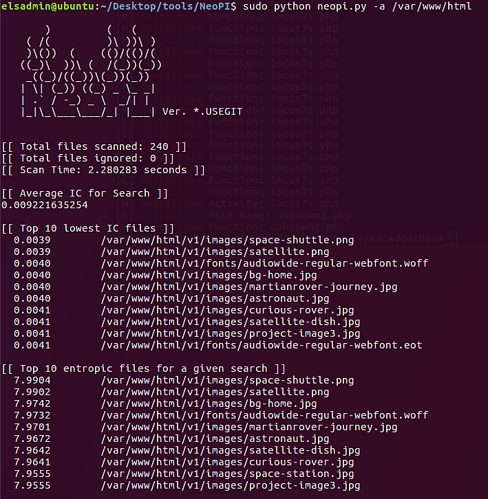

Note that NeoPI will generate a result based on the following criteria:

- Top ten IC files
- Top ten entropic files
- Top ten longest word files
- Top ten signature match counts
- Top ten SUPER-signature match counts

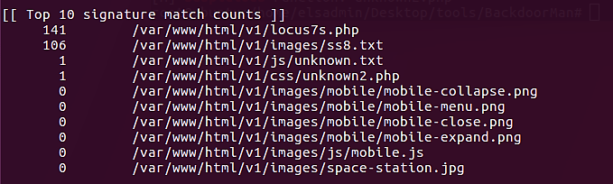

NeoPI was able to identify four of our web shells, but not our fully-obfuscated web shell, as evidenced by the image above. We observe several signatures for two of the web shells, but only one for `unknown.txt` and `unknown2.php`.

This is likely to receive only one hit from these two files, the `eval()` function.

Note that NeoPI was capable of identifying possibly harmful code in `PHP` and `TXT` files.

Next, we will examine the BackdoorMan script to determine if it was effective in locating our fully-obfuscated web shell.

## BackdoorMan

According to the output on the bottom, the script rapidly identified the `Locus7` web shell.

Each output entry will indicate why the file was flagged.

In the screenshot, two functions are flagging this specific PHP file.

- php_uname
- popen

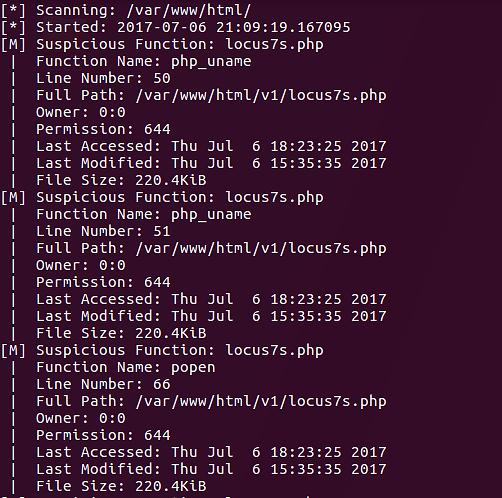

We can see additional functions that the
script has flagged:

- exec
- system
- passthru
- base64_decode

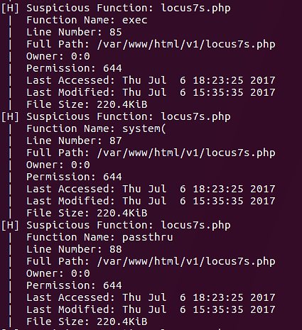

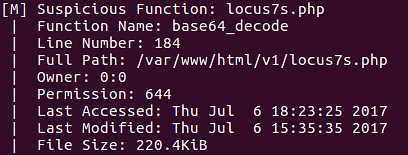

The next file discovered by this script is `unknown2.php`.
`eval()` is the only PHP function present in this script.

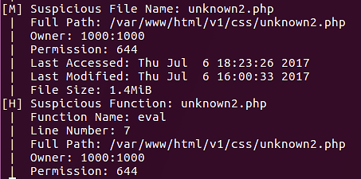

The BackdoorMan software was finally able to locate our fully-obscured web shell. You may now wonder what happened to the other two web shells. Remember that they were deliberately saved in a different file format, `TXT`.

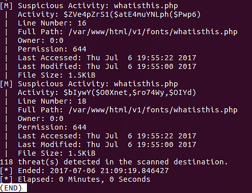

It should be noted that the output of the BackdoorMan script is often colored. It was not colored in the screenshots since the output was piped to less (`| less`) so that it could be read easily.

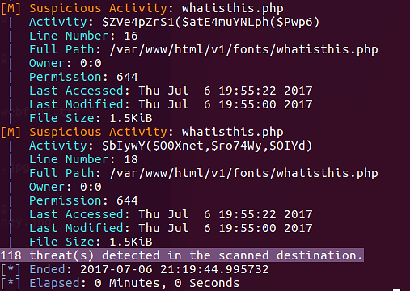

## File Stacking

Now, we will transition from tool-based strategies to file-based techniques in our search for web shells. We will begin with File Stacking.

File Stacking is a method for identifying possibly harmful files that have been modified or newly formed within an existing file structure.

This may appear to be a "needle in a haystack" strategy, but we will employ scripts to assist us with this work. The following PowerShell function will assist us with the file stacking process.

```powershell
Param(
    [Parameter (Position=0,Mandatory=$True)]
    [String[]]
    $searchPath
)

Get-ChildItem $searchPath -Recurse -File | Select-Object fullname, length, lastwritetime | Out-GridView
```

A brief explanation of the code:

- `Get-ChildItem $searchpath` will retrieve the files using the value within `$searchpath` variable as the starting point.
- `-Recurse` will instruct PowerShell to check all subfolders.
- `-File` will instruct PowerShell only to retrieve files, not folders.
- `Select-Object fullname, length, lastwritetime` will return only the full name of the file (including path), plus length of file and last write time.
- `Out-GridView` will display the output in a grid view format instead of console


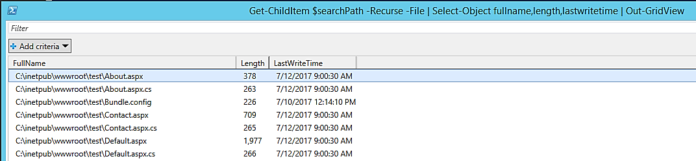

In this image, the `FullName` column has been filtered so that File Stacking can be used to identify anomalies. In this instance, we are examining the file paths to identify anything out of the norm.

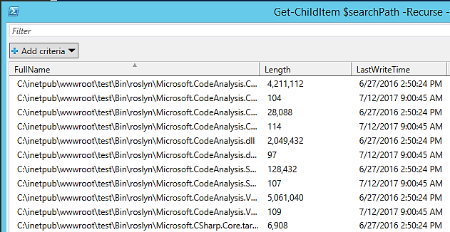

File Stacking based on complete file paths is a method. You can use this technique to identify suspicious-looking files, such as a file in an unfamiliar directory.

Next, we will examine File Stacking according to file creation times:

```powershell
Param(
      [Parameter(Position=0,Mandatory=$True)]
      [String[]]
      $searchPath,
      [Parameter(Position=1,Mandatory=$True)]
      [DateTime[]]
      $pubDate
)

Get-ChildItem -path $searchPath -File -Recurse -Include "*.aspx", "*.asp" | `
Where-Object {($_.LastWriteTime.ToShortDateString() -gt $pubDate.ToShortDateString()) -or `
($_.LastWriteTime.ToShortTimeString() -gt $pubDate.ToShortTimeString())} | `
Select-Object directory,name,length,lastwritetime | Format-Table -Autosize
```

How does this benefit us?

If you know that a particular web file structure was last updated by the development team on a specific day, say `July 1, 2017, at 3 p.m.`, then we may use that date as a "baseline" to discover newly created suspicious files.

## Baselines

Utilizing baselines inside your company will assist you in locating irregularities within system processes, services, drivers, installed apps, file structures, etc.

A baseline is a file used to compare current settings and/or setups. The present state of a machine, file system, etc. can be compared to the baseline to identify any anomalies.

In the following sections, we will create a baseline for the web directory and then use a PowerShell script to detect any changed or newly created files. This could assist us in locating freshly installed web shells on web servers.

We will use the `Get-ChildItem` and `Get-FileHash` PowerShell cmdlets to construct our baseline file. Using the `Export-CSV` cmdlet, we'll export the data to a `CSV` file.

```powershell
Get-ChildItem -Path .\foocompany -File -Recurse | Get-FileHash -Algorithm MD5 | Export-CSV C:\baseline-WWW-foocompany.csv
```

We'll use `Get-ChildItem` to retrieve all the files within the
`foocompany` directory, including subdirectories. `Get-FileHash` will get the `MD5` (`-Algorithm`) of each file. The `MD5` hash will be written to a CSV using `Export-CSV`.

Below is a portion of the CSV file:

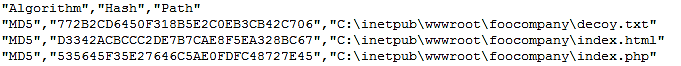

The CSV file has the information we anticipated it to contain. With this baseline, we can now identify any newly produced or changed files since the baseline's creation.

`Compare-FileHashesList.ps1` is a PowerShell script authored by Jason Fossen of Enclave Consulting LLC. This and many other PowerShell scripts are available [here](https://blueteampowershell.com/).

In order to completely apply this strategy, we must generate a second `CSV` file with the MD5 hash for every file in the directory. We will compare the baseline `CSV` and this newly produced `CSV` using these two files.

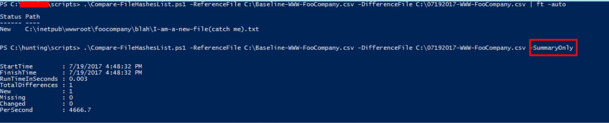

In the preceding image, we are executing `Compare-FileHashesList.ps1` and providing it the baseline `CSV` file, `C:\Baseline-WWW-FooCompany.csv`, along with the most recent `CSV` file, in this case `C:\07192017-WWW-FooCompany.csv`.

After executing the script twice, we have two distinct results. Simply echo the file's state (new, altered, missing) and path. The latter will just provide a summary of the results; the actual file location will not be displayed.

## References

[LOKI](https://github.com/Neo23x0/Loki)

[NeoPI](https://github.com/Neohapsis/NeoPI)

[BackdoorMan](https://github.com/cys3c/BackdoorMan)

[Compare-FileHashesList.ps1](https://blueteampowershell.com/)

:::{seealso}
Want to learn practical Threat Hunting tactics and strategies? Enrol in [MTH - Certified Threat Hunter Certification](https://www.mosse-institute.com/certifications/mth-certified-threat-hunter.html)
:::
