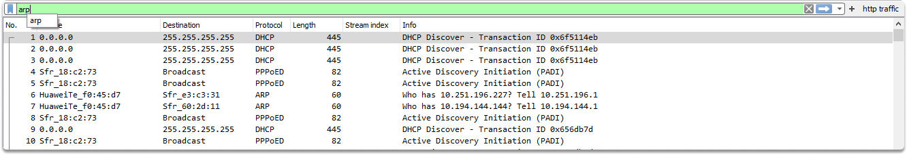
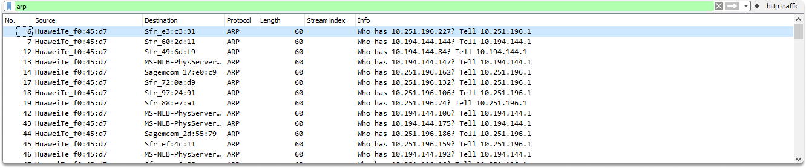
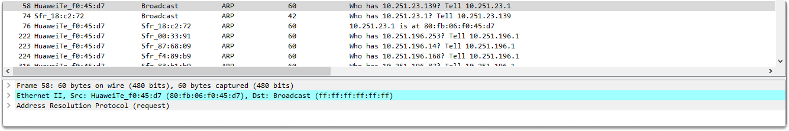
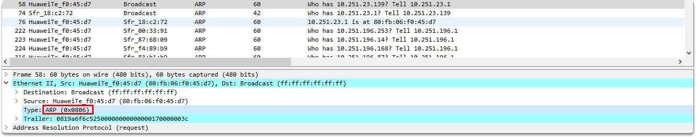
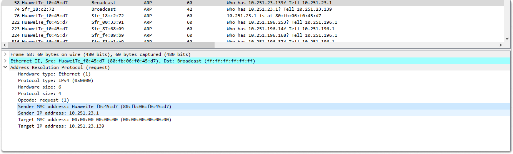
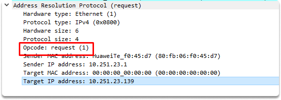

:orphan:
(identifying-arp-request-packets-with-wireshark)=

# Identifying ARP Request Packets with Wireshark

One of the most significant abilities of penetration testers is the ability to understand and analyze network traffic. In this blog article, we will go over what an Address Resolution Protocol (ARP) is and what messages it includes. Finally, we'll look at how to identify the ARP request message in Wireshark by performing an ARP packet analysis. First, here is a quick refresher on ARP.

## What is Address Resolution Protocol (ARP) ?

ARP simply converts an IP address into a physical address. ARP is a protocol that is utilized to connect layer 3 logical addresses to layer 2 physical network addresses.

### Basic Sequence of ARP request and reply messages

When a host intends to interact with some other host on the same physical network, it needs a MAC address. What happens if it does not know the destination MAC address? If it doesn’t know the target address then it transmits specific data packets called address resolution protocol (ARP) requests. The broadcast will be received by all hosts on the network, but only the one that knows its own IP address will reply.

**Identifying an ARP request sourcing from a device to broadcast mac address in Wireshark**

Now we have some theoretical knowledge but it would be more efficient to see these in action. We will utilize Wireshark for this purpose.

Wireshark is a fantastic tool for doing packet capture and examining each packet to uncover sensitive information transported across a network.
In the upcoming screenshot, you will see that we have a `pcap` file that contains some network traffic. Since there are so many packets that may seem intimidating at first, we are going to apply a filter. Type `arp` in the display filter section.

Now we are going to analyze packet 58.

When we look at the Ethernet II section under Frame, we can verify the ARP reserved hex number which is `0x0806`(each protocol has a different hexadecimal value). This value guides us that the ARP section will follow the Ethernet II section.

Now let’s expand Address Resolution Protocol (request) section. You can see our hardware type is Ethernet, ARP protocol type is IPv4 (which means we request the mac address of the target host by IPv4) and you can also see our IP and mac addresses along with the target mac address. Did you notice that he target mac address is all zeros? The reason is that we don’t know yet the target IP address thus we need to refer to our default gateway which is 10.251.23.139.

**ARP request or reply**

Lastly, let’s talk about how to identify if this is an ARP request or reply. We can also see that the operation code is set to 1, which means that this is an ARP request.

From this point on what will happen is that our default gateway will broadcast the request to all its nodes except HuaweiTe_f0:45:d7. It will simply ask this question:

- Who has 10.251.23.139? Tell HuaweiTe_f0:45:d7

## Conclusion

Upon completion of this blog page now you have learned how to identify an ARP request structure. You can also tell who is the sender and who is the target of the request message by analyzing the Address Resolution Protocol (request) section of a captured traffic.

:::{seealso}
Looking to expand your knowledge of penetration testing? Check out our online course, [MPT - Certified Penetration Tester](https://www.mosse-institute.com/certifications/mpt-certified-penetration-tester.html)
:::
