:orphan:
(identifying-malware-persistance)=

# Identifying Malware Persistance

This article will discuss the most prevalent persistent techniques employed by malware.

This does not imply that these are the only options available, but they are the most prevalent.

- Windows Registry
- Task Scheduling
- Startup Folders
- WinLogon
- AppInit_DLLs
- DLL Search Order
- Windows Service

## Windows Registry

While the Windows Registry is utilized by the system to store and retrieve system and user settings, malware authors also exploit persistence between system reboots to ensure their infection remains active.

These are the registry locations that are used the most frequently by writers of malicious software to autorun their malicious executables. However, there are numerous other places in the registry that are utilized for this purpose. If you are interested, other venues can be found [here](https://www.amazon.com/Windows-Internals-Part-architecture-management/dp/0735684189) for you to choose from.

### Windows Registry Locations for autoruns

- `NTUSER.DAT\Software\Microsoft\ Windows\CurrentVersion\Run`
- `HKCU\Software\Wow6432Node\Microsoft\Windows`
- `NT\CurrentVersion\Windows`
- `HKLM\Software\Microsoft\Windows\CurrentVersion\RunOnce\*`
- `HKLM\Software\Wow6432Node\Microsoft\Windows\CurrentVersion\Run\*`
- `HKLM\Software\Wow6432Node\Microsoft\Windows\CurrentVersion\RunOnce\*`
- `HKLM\Software\Microsoft\Windows\CurrentVersion\Policies\Explorer\Run\*`

You can list the majority of the locations that are being used to automatically execute by employing the program [Autoruns](https://docs.microsoft.com/en-us/sysinternals/downloads/autoruns).

The execution of Autoruns is depicted on the figure located to the bottom.

You shouldn't be surprised if there are a lot of submissions here!

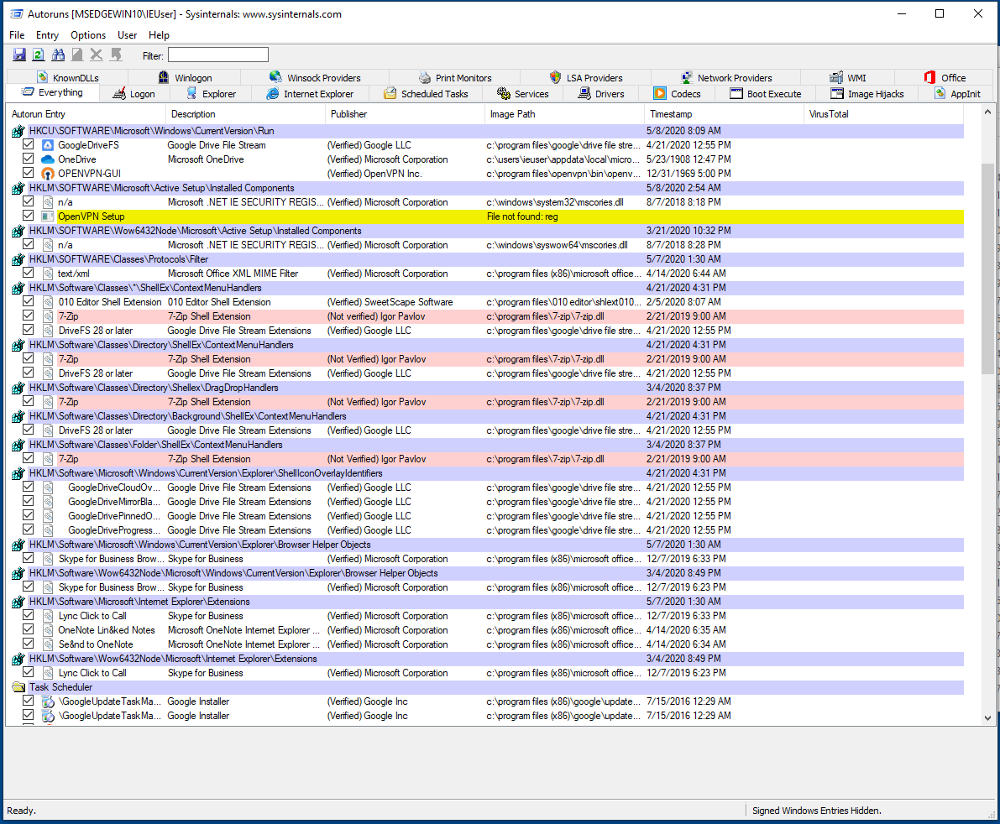

You can also hide Windows Entries:

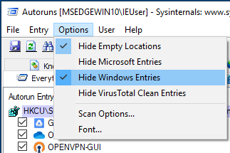

You might also use it to check particular entries:

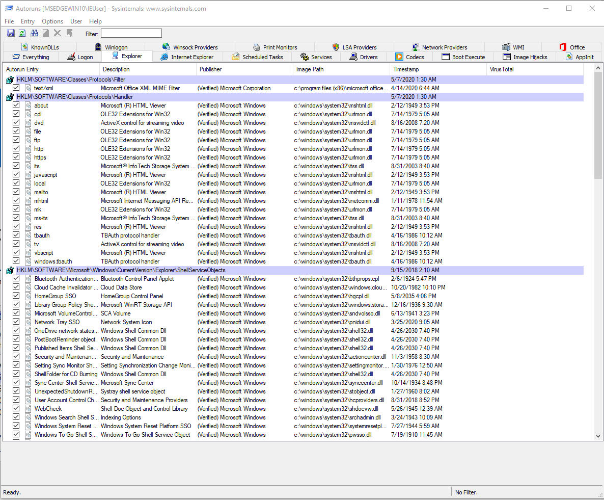

When monitoring or analyzing malware samples, whatever of the approach you choose, be on the lookout for Windows APIs that reference the registry, particularly those that add or modify entries in the registry.

It is not my intention to imply that the ones that read the registry are not significant; nevertheless, the ones that edit the register can be an indication that persistence is being employed.

## Task Scheduling

Authors of malicious software may also use the task scheduler to program their malware to launch at a predetermined time, upon the occurrence of a predefined event, or even while the operating system is booting up (boot-time).

Using the Windows `schtasks` command to schedule a task is one of the most straightforward methods available.

The following is an example of how the schtasks command can be used, which can be found in the following example:

```powershell
schtasks /create /tn svchost /tr C:\Users\<victim- user>\AppData\Local\<Name>\svchost.exe /sc ONSTART /f
```

This will establish a scheduled job and set it up so that it starts automatically whenever the system does. The executable program, if run, has the potential to be deleted by the malicious software, which would then add this as a persistence mechanism.

By monitoring the execution of the `schtasks` command, checking _Autostart_ as shown in the figure below, or looking in the `C:\Windows\System32\Tasks` directory for any tasks that may already be there, we are able to determine whether or not a new task has been created:

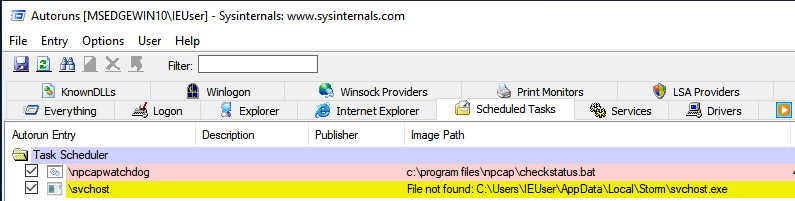

If we check the directory where tasks are stored, we can find
their configuration files, which are easy to read, since they are in `XML` format:

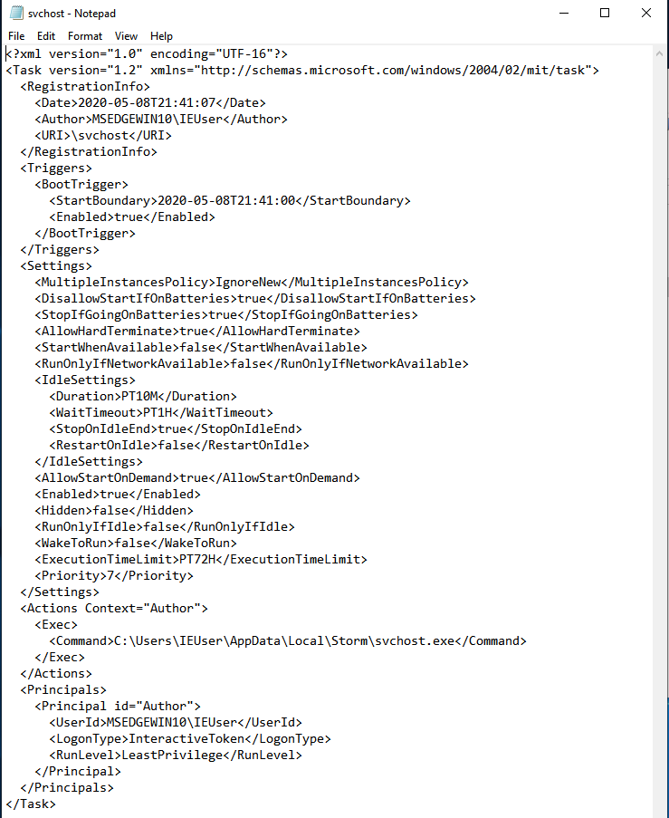

It is important to keep in mind that `WMI` and `PowerShell` both have the capacity to schedule tasks.

Monitoring the activities of the system via a logging tool, such as _Sysmon_, _PowerShell Script Block Logging_, or _Transactional logs_ is one method for determining whether or not this is the case.

## Windows Startup Folders

Having malicious applications installed in the Windows Startup Folders is a second straightforward method for executing malware and achieving persistence. After a user logs into the system, these programs will execute.

These directories are separated into User-level & System-level folders. If a program is placed in a user folder, it will only run when that user logs in; but, if it is placed in a system folder, it will be launched for all users.

Using the Windows Run dialog box (`Winkey+R`) and inputting `shell:startup` is one of the simplest ways to locate the folder and its contents.

The locations for all users is:

`C:\ProgramData\Microsoft\Windows\Start Menu\Programs\StartUp`

While for a specific user, it is:

`C:\Users\<Username>\AppData\Roaming\Microsoft\Windows\Start Menu\Programs\Startup`

## Winlogon

The Winlogon process is accountable for the following:

- User login and logoff
- Initialization and Shutdown
- Locking the display

Authors of malware could alter the registry entries that the Winlogon process uses to gain persistence.

By default, the Winlogon process will launch `userinit.exe`, which is responsible for executing various logon scripts and network-related activities.
`Userinit.exe` is controlled by the following registry key:

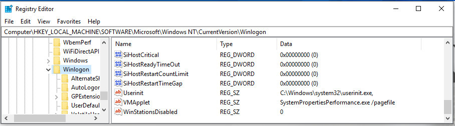

Now, if you check the Windows Processes again, you will see that `userinit.exe` is the process responsible for launching the user's shell, which is `explorer.exe`. This is regulated by a second `shell` registry value in the same path:

`HKLM\Software\Microsoft\Windows NT\CurrentVersion\Winlogon\Userinit`

As you can see in the figure below, by default `Shell` is supposed to load `explorer.exe`:

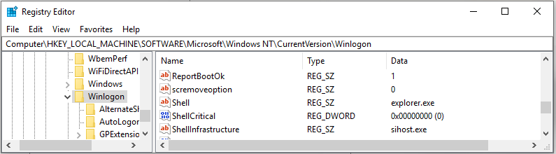

The persistence of malware could be achieved by altering the `Shell` value to launch `explorer.exe` and something else!

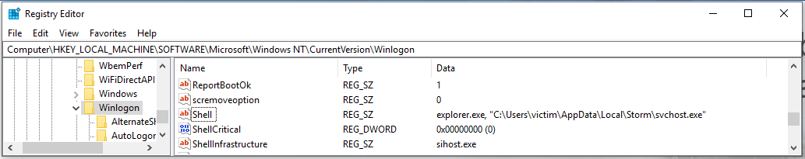

There are definitely other locations, therefore using Autoruns is good for getting an overview of them and their values:

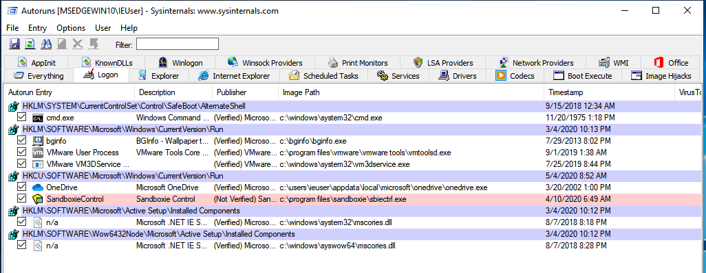

## AppInit DLLs

Is a registry value that controls which DLLs are loaded when the `User32.dll` library is loaded. Given that several processes may utilize the `User32.DLL` library, the libraries provided in this registry value may be used to achieve persistence. Two registry places exist:

- `HKLM\Software\Microsoft\Windows NT\CurrentVersion\Windows`
- `HKLM\Software\Wow6432Node\Microsoft\Windows NT\CurrentVersion\Windows`

Currently, according to Microsoft's documentation, this setting is deactivated by default starting from `Windows 8` if the system is using secure boot. Please visit the Microsoft URL listed below for more information.

`T9000` was one of the backdoors that utilized this strategy (named by the PaloAlto team). Here you can read more about it:

[T9000: Advanced Modular Backdoor Uses Complex Anti-Analysis Techniques](https://unit42.paloaltonetworks.com/t9000-advanced-modular-backdoor-uses-complex-anti-analysis-techniques/)

## DLL Search Order Hijacking

We are well aware at this point that programs need libraries (also known as DLLs) in order to accomplish a variety of tasks. These Dynamic Link Libraries (DLLs) are either included in the distribution package of the application itself, or they are DLLs that are included in the operating system that the applications run on.

Now, whenever a process requests to load a library, Microsoft Windows follows a predetermined order to look for the location of the library in question.

This search order is taken over by malware authors in order to achieve a variety of malevolent goals on the system of the victim, one of which is persistence, which is the topic of discussion in this article.

Before we go any further with our explanation of the DLL search sequence, it is essential to point out that the initial check will be:

- DLLs already loaded in memory.
- DLLs that are defined in the KnownDLLs, which could be found in the Windows Registry Key below:
  `HKLM\SYSTEM\CurrentControlSet\Control\Session Manager\KnownDLLs`

Below you can see a list of known DLLs:

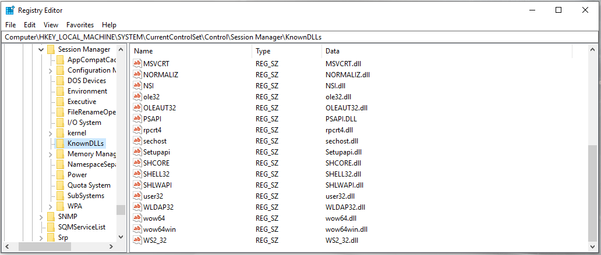

The first question that might pop into your head at this point is, _"What is the DLL Search Order that Windows uses?"_

1 st : the directory from where the application was loaded.
2 nd : the system directory `C:\Windows\System32`.
3 rd : the 16-bit system directory `C:\Windows\System`.
4 th : the Windows directory `C:\Windows`.
5 th : the current working directory.
6 th : the directories defined by the `PATH` environment variable

Running [procmon](https://docs.microsoft.com/en-us/sysinternals/downloads/procmon) from sysinternals and configuring it with the following filters is by far the most frequent method for locating missing DLLs within a system:

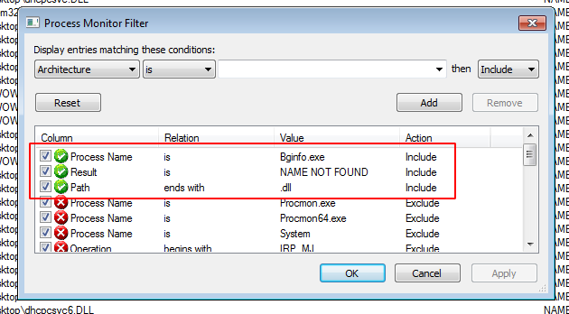

## Running as a Services

We are aware that a service is an application that runs in the system's background without direct user interaction. In order to gain persistence, malware authors could also arrange and install their software to run as a background service.

This could be achieved by executing the malware as a standalone application, a DLL loaded into a container (`svchost.exe`), or a kernel driver service.

Windows services could be controlled using the `sc` command or the `services.msc` GUI application.

Below we can see an example that could be passed through a batch file or directly in cmd.exe to create a service named
`Skype`, have it auto-start on boot and then start the service:

```powershell
sc create Skype binPath= C:\Users\IEUser\AppData\Local\Skype\skype.exe start= auto && sc start Skype
```

We can check the status of the service using the command below
or using the `services.msc` as seen in the figure.

```powershell
sc query Skype
```

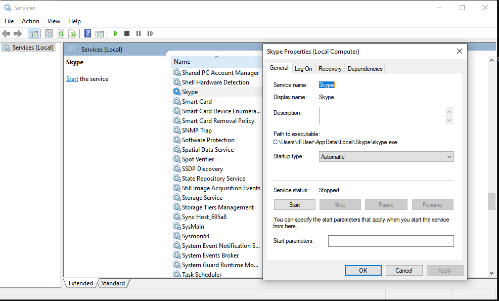

Under the registry location, Microsoft Windows describes its services as follows:

`HKLM\SYSTEM\CurrentControlSet\Services`

Every service will have its own unique subkey, with its own parameters to boot.

There are numerous instances of malware that utilize services to acquire persistence. Here are few instances:

- [WannaCry](https://www.fireeye.com/blog/threat-research/2017/05/wannacry-malware-profile.html)
- [Gh0st RAT](https://www.nccgroup.trust/us/about-us/newsroom-and-events/blog/2018/april/decoding-network-data-from-a-gh0st-rat-variant/)
- [KeyBoy](https://blog.rapid7.com/2013/06/07/keyboy-targeted-attacks-against-vietnam-and-india/)
- [TinyZBot](https://www.cylance.com/content/dam/cylance/pages/operation-cleaver/Cylance_Operation_Cleaver_Report.pdf)

## DLL Analysis

You extracted a malicious DLL or it was provided to you for study; how would you analyze it, considering that a DLL requires another application to call and utilize its exported functions?

While you could develop a simple application to load and execute the desired functions, the Windows operating system includes a utility called `rundll32.exe` that already performs this.

`Rundll32.exe` can be used as a following (for example):

```powershell
rundll32.exe Malware.DLL, Runme
```

## References

[Autoruns](https://docs.microsoft.com/en-us/sysinternals/downloads/autoruns)

[windows internals](https://www.amazon.com/Windows-Internals-Part-architecture-management/dp/0735684189)

[Secure Boot and AppInit DLLs](https://docs.microsoft.com/en-us/windows/win32/dlls/secure-boot-and-appinit-dlls?redirectedfrom=MSDN)

[DLL search order](https://docs.microsoft.com/en-us/windows/win32/dlls/dynamic-link-library-search-order?redirectedfrom=MSDN)

[DLL Search Order Hijacking](https://attack.mitre.org/techniques/T1038/)

[rundll32.exe](https://docs.microsoft.com/en-us/windows-server/administration/windows-commands/rundll32)

:::{seealso}
Want to learn practical Malware Analysis? Enrol in [MCSI's MRE - Certified Reverse Engineer Certification Programme](https://www.mosse-institute.com/certifications/mre-certified-reverse-engineer.html)
:::
