:orphan:
(intro-to-hunting-webshells)=

# Intro to Hunting Webshells

A **web shell** is a script that can be uploaded to a web server to facilitate remote machine administration. They can be used to do anything from stealing data to planting malware. In this blog post, we are going to introduce you to hunting webshells. We'll cover what they are, how they work, how we can we search web servers for web shells and what are some hunting tools.

## Webshells
The [US-CERT Alert (TA15-314A)](https://www.us-cert.gov/ncas/alerts/TA15-314A) states that APTs and online criminal groups have routinely used web shells as an attack vector to gain a foothold that could grant them unauthorized access to the target network.

Web shells can be written in any language, as long as the target web server supports the language it's written in. The most common web shell languages are `PHP` and `ASP`.

There are currently a multitude of ways to upload a web shell to the desired web server:

1. XSS (Cross Site Scripting)
2. SQLi (SQL Injection)
3. RFI (Remote File Inclusion) or LFI (Local File Inclusion)
4. Other, such as incorrect web server configuration

C99:

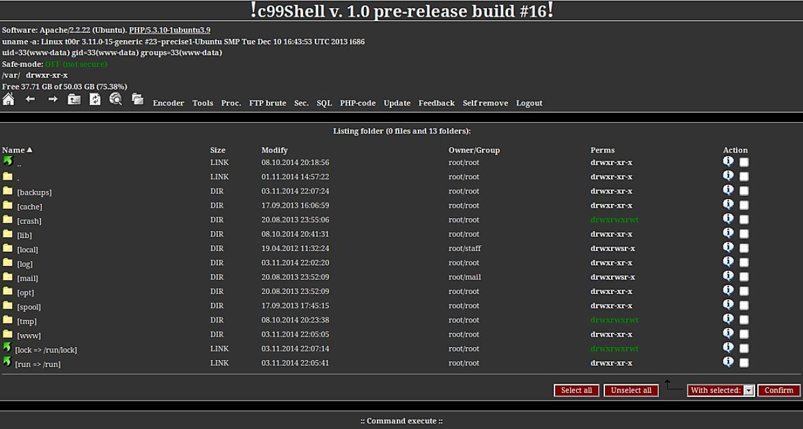

R57:

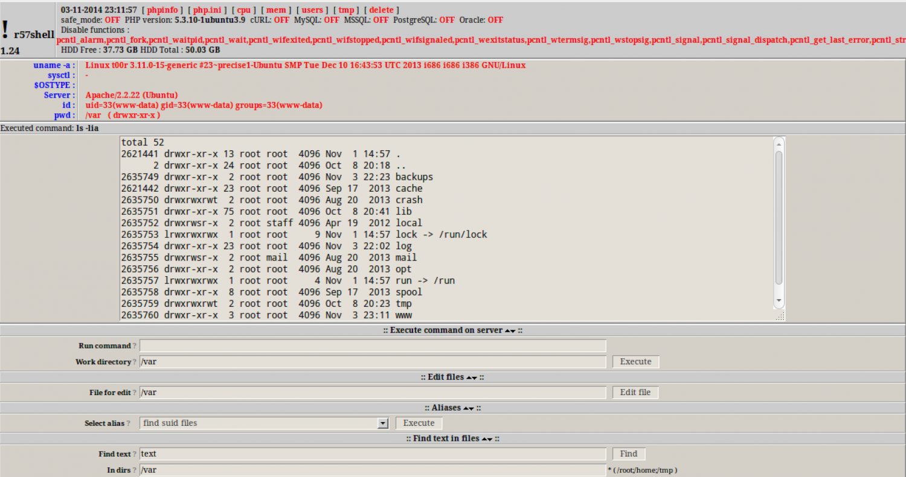

## How then can we search web servers for web shells?

In addition to the two web shells presented in the previous pictures, a large number of web shells are available for download on the web. There are numerous shells where an individual or group can easily alter or obfuscate the code to make the web shell difficult to detect with antivirus software.

This screenshot demonstrates that anti-virus software was unable to detect this web shell:

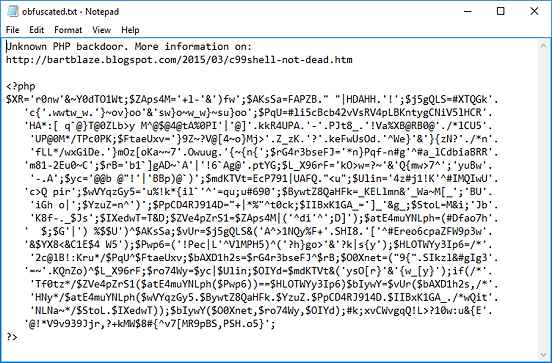

This is because it is obfuscated and lacks a signature, which is required for AV to flag it as malicious.

## Hunting tools

**LOKI** - LOKI is a straightforward and free IOC scanner. Some of LOKI's most effective rules were borrowed from the rule sets of an additional tool called THOR APT Scanner:

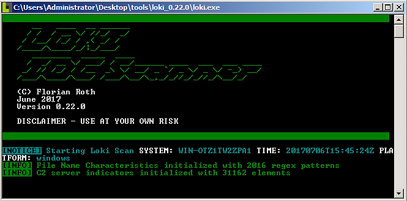

The more feature-rich THOR APT Scanner includes a greater number of web shell rules than LOKI.

The tool is available for download from [GitHub](https://github.com/Neo23x0/Loki).

LOKI provides a straightforward method to scan your systems for known IOCs.

It supports the following varieties of indicators:

- MD5, SHA1, and SHA256 hashing
- Yara Rules (applied to file data and process memory)
- Regular Expression-Based Filenames for Hard Indicator
- Regular Expression-Based Soft-Indicator Filenames

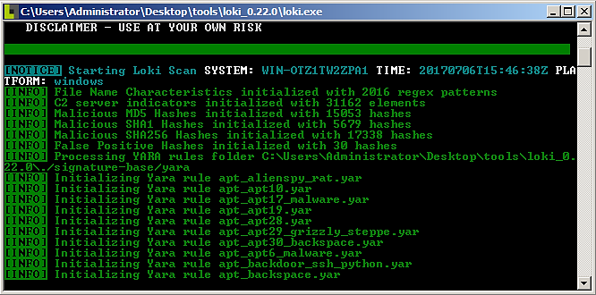

This sample screenshot demonstrates LOKI scanning the specified folder and returning clean system results:

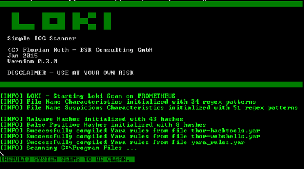

The system appears to be clean.

This sample screenshot would depict LOKI scanning the specified folder and returning suspicious object detection results:

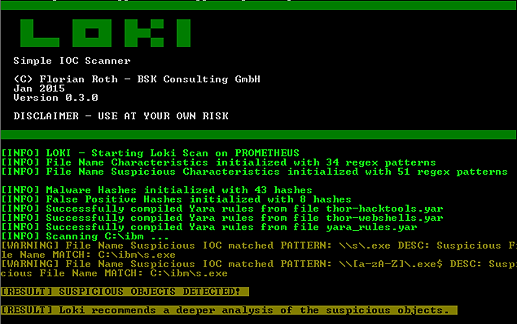

This example screenshot would depict LOKI scanning the specified folder and returning the results as detected indicators:

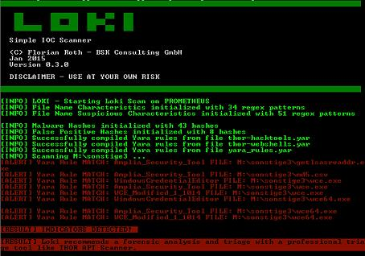

\*_NeoPI_ - NeoPI is a Python script that employs a variety of statistical techniques to identify obfuscated and encrypted text/script file content.

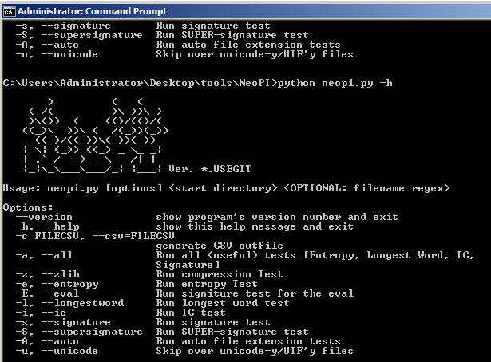

NeoPI is designed to assist in the detection of hidden web shell code.

NeoPI will rank files based on the results of a number of tests after performing a recursive file system scan from a specified directory.

In addition, it provides a "global" score derived from file rankings within individual tests. The tool can be downloaded from [GitHub](https://github.com/Neohapsis/NeoPI).

Sample output from scan of `/var/www/html`:

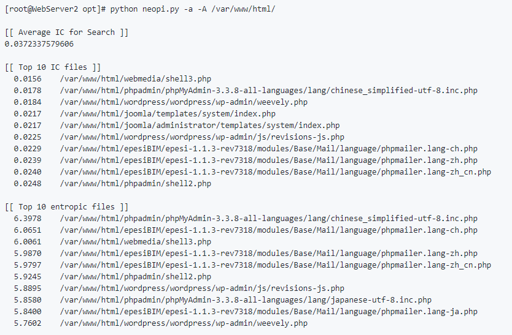

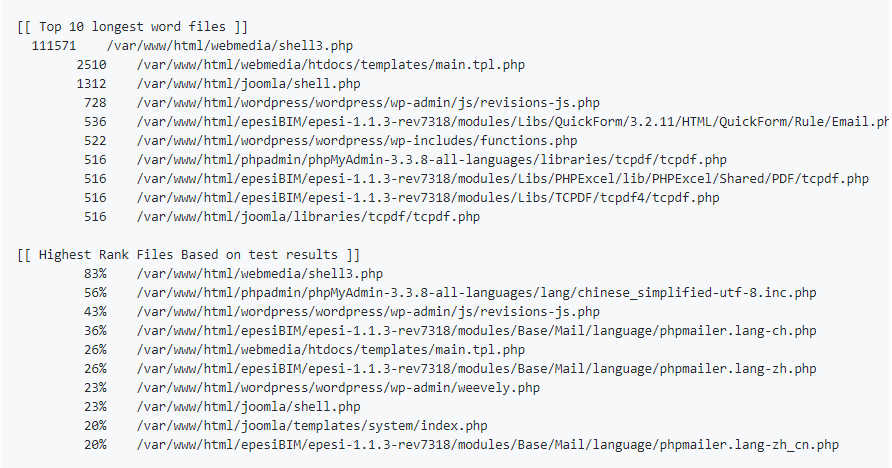

**BackdoorMan** - BackdoorMan is a Python-based toolkit that locates malicious, hidden, and suspicious PHP scripts, including shells, in a specified location.

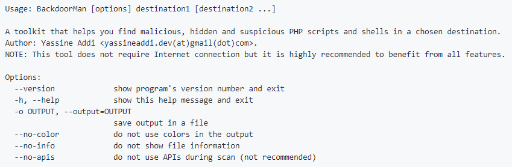

The tool can be downloaded from [GitHub](https://github.com/cys3c/BackdoorMan).

Features:

- Shells detect by filename using shells signature database
- Recognition of web back-doors
- Detect the use of suspicious PHP functions and activities
- Use of external services beside its functionalities
- Use of nimbusec shellray API
- Use of VirusTotal Public API
- Use of UnPHP

**PHP-malware-finder** - PHP-malware-finder is a script used to detect obfuscated code as well as files employing PHP functions that are frequently employed by web shells.

Similar to previously mentioned scripts, detection is performed by crawling the filesystem and testing files against a set of YARA rules.

Can be downloaded from [Github](https://github.com/nbs-system/php-malware-finder)

**unPHP** - Occasionally, PHP web shells are obfuscated using a [Free Online PHP Obfuscator](http://fopo.com.ar/), among other methods.

As hunters, we will need the ability to manually decipher gibberish.

This can be accomplished using [unPHP](http://www.unphp.net/), The Online PHP Decoder.

**Invoke-ExchangeWebShellHunter** - Even though we have not yet discussed PowerShell or any PowerShell scripts (individual scripts or frameworks), it is still important to mention this script. The name of the script is `Invoke-ExchangeWebShellHunter`. This PowerShell script was created to specifically search for web shells on Microsoft Exchange Servers.

This script can be found on [Github](https://github.com/FixTheExchange/Invoke-ExchangeWebShellHunter)

**Web Shell Detector** - Web Shell Detector is a set of scripts (PHP & Python) designed to locate and identify web shells (php, perl, asp, & aspx). Web Shell Detector has a signature database for "web shells" that helps identify them up to 99 percent of the time.

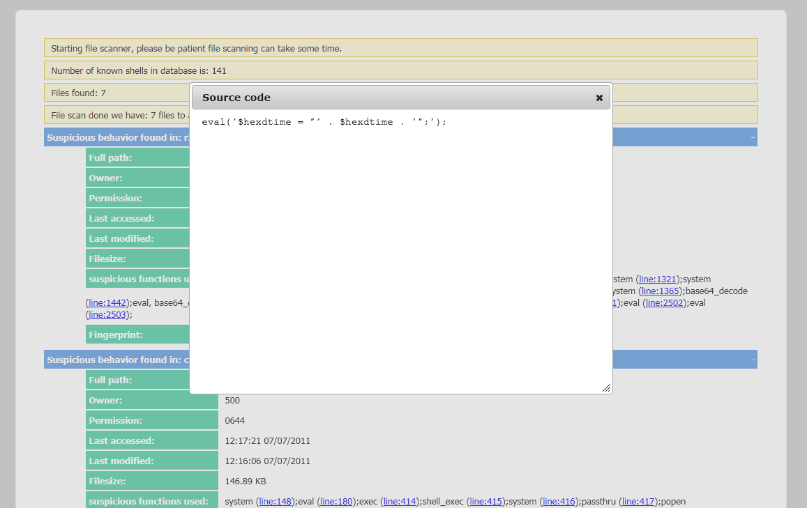

[Here](http://www.shelldetector.com/) you can learn more about this tool.

**LMD** - Linux Malware Detect (LMD) is a malware scanner for Linux that is designed with shared hosted environments' threats in mind.

It uses threat data from network edge intrusion detection systems to extract malware actively used in attacks and generates detection signatures.

Features:

- MD5 file hash detection for quick threat identification
- HEX based pattern matching for identifying threat variants - statistical analysis component for detection of obfuscated threats (e.g., base64)
- integrated detection of ClamAV to use as scanner engine for improved performance
- integrated signature update feature with -u|–update
- integrated version update feature with -d|–update-ver
- scan for obfuscated threats -scan
- recent option to scan only files added/modified in the past X days - scan-all option for complete path-based scanning
- checkout option to upload suspected malware for review / hashing on rfxn.com
- full reporting system to view current and past scan results - quarantine queue that stores threats in a safe manner with no permissions – quarantine batching option to quarantine the results of a current or past scans
- quarantine restore option to restore files to original path, owner, and permissions
- quarantine suspend account option to Cpanel suspend or shell revoke users
- cleaner rules to attempt removal of malware injected strings
- cleaner batching option to attempt removal of malware injected strings in batches
- daily cron based scanning of all changes in the last 24 hours in user homedirs
- daily cron script compatible with stock RH style systems, Cpanel & Ensim
- kernel based inotify real time file scanning of created/modified/moved files
- kernel inotify monitor that can take path data from STDIN or FILE
- kernel inotify monitor convenience feature to monitor system users
- kernel inotify monitor can be restricted to a
- kernel inotify alerting via daily and/or optional weekly reports
- email alert reporting following each scan execution (manual & daily)
- path, extension, and signature dependent ignore options
- background scanner option for unattended scans – verbose logging and output of all actions

[This page](https://www.rfxn.com/projects/linux-malware-detect/) contains additional information about this tool.

## References

[US-CERT Alert (TA15-314A)](https://www.us-cert.gov/ncas/alerts/TA15-314A)
[LOKI](https://github.com/Neo23x0/Loki)
[NeoPI](https://github.com/Neohapsis/NeoPI)
[BackdoorMan](https://github.com/cys3c/BackdoorMan)
[shellray](https://shellray.com/)
[UnPHP](http://www.unphp.net/)
[PHP-malware-finder](https://github.com/nbs-system/php-malware-finder)
[unPHP](http://www.unphp.net/)
[Web Shell Detector](http://www.shelldetector.com/)
[Linux Malware Detect](https://www.rfxn.com/projects/linux-malware-detect/)
[Invoke-ExchangeWebShellHunter](https://github.com/FixTheExchange/Invoke-ExchangeWebShellHunter)

:::{seealso}
Want to learn practical Threat Hunting tactics and strategies? Enrol in [MTH - Certified Threat Hunter Certification](https://www.mosse-institute.com/certifications/mth-certified-threat-hunter.html)
:::
