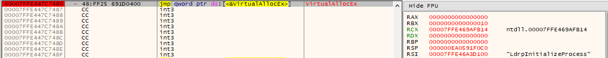

:orphan:
(introduction-to-debuggers-and-disassemblers)=

# Introduction to Debuggers and Disassemblers

Reverse Engineering (RE) has been the leading technique for understanding the structure and operation of malicious programs and what they're programmed to do for a very long time.

As sophisticated malware is developed, reverse engineering tools mature and become more accessible.

Malware Reverse Engineering includes disassembling (and, in some cases, decompiling) malicious programs. During RE, the binary instructions of the program are converted into code mnemonics (or higher-level constructs) so that analysts can understand what the program does and what systems it affects.

By knowing and comprehending its operations, engineers are able to develop countermeasures against its harmful effects.

By reverse engineering the WannaCry ransomware, the _"kill switch"_ technique was discovered, which halted its spread.

Multiple tools exist for reversing malicious programs.
We can categorize them based on their functions as follows:

- Disassemblers
- Debuggers
- Decompilers

## Why do we need debuggers and disassemblers?

Used to comprehend the functionality of malicious programs lacking source code.

- They simplify the process of code analysis.
- They are used to determine the nature and purpose of malware.
- For instance, is this malware a data stealer, keylogger, rootkit, etc.?
- Aids in comprehending how the system was infected and its effects.
- Identify host-based signature-generating indicators, such as filenames and registry keys.
- Extraction of network indicators associated with the malware. This can be utilized by network monitoring tools to identify similar infections. For instance, if the analysis reveals that malware is contacting a particular `IP` address, we can use this `IP` address as a signature to detect other hosts that are contacting the same `IP` address.

### Disassemblers

Convert the application's machine code to assembly code. Used in static analysis. The static analysis is a code interpretation technique that enables understanding of the program's behavior without running it.
[IDA Pro](https://www.hex-rays.com/ida-pro/) is an example of a disassembler.

### Decompilers

Utilized to convert binary code to high-level code (pseudocode). Generate high-level code that is shorter and simpler to read and comprehend.

### Debuggers

In addition to code disassembly, debuggers enable the reverser to execute the target program in a controlled manner, i.e., rather than executing the entire binary, the reverser can execute a specific instruction or function. While a program is running, you can view and modify its execution flow to gain insight into its functionality.

Permits the reverser to conduct a dynamic analysis by controlling specific aspects of the program, such as memory areas, during its execution. This assists in comprehending the program's functionality and its effects on a system or network.

Examples of debuggers are Ollydbg, Immunity Debugger, x64dbg, GDB and Windbg.

### PE Viewers

PE (Windows Portable Executable) viewers are used to extract useful information from executables. They offer features such as dependency viewing.

CFF Explorer, PE Explorer, PE Bear, and Pestudio are examples of PE Viewers.

### Network Analyzers

Network analyzers are used to investigate how a program communicates with other machines, such as revealing the program's connections and the data it is attempting to send.

Wireshark is an example of a network analyzer. Although network analyzers are not debuggers, they aid in the debugging process.

Let's go back to **Debuggers and Disassembly**.

Disassembler reveals the state of the program prior to execution. The program's low-level assembly instructions are presented.

During execution, the debugger displays memory locations, registers, and function arguments. Additionally, it enables the reverser to modify them while the program is running.

Debuggers allow program execution to be altered.
This consists of:

- Changing a control flag
- Modify a directive pointer
- And even alter the code instructions

_e.g. Skipping a function:_ You can avoid a call to a specific function by setting a breakpoint on the function call and then modifying the instruction pointer to point after the function call. Note: this may result in a program crash.

You can either launch a new process or attach it to an existing process to begin using a debugger.

A program is launched using a debugger. The running program is halted immediately prior to the execution of its main entry point, after which the reverser assumes control of the paused program.

Attach means to bind a debugger to a program that is already running. Typically used to debug malware-infected processes by pausing all threads of the program. Note that you will miss the initial process actions that occur before attaching the debugger.

### Debugging DLLs

To debug a DLL, its entry point must be located. This can be achieved by taking the following steps:

Utilize a debugger to launch the process or attach it to the host process. When a DLL is loaded with `x64dbg`, the debugger will place an executable file in the same folder as the DLL. This executable will execute the DLL as the host process.

Debuggers allow the reverser to control or modify the behavior of a running process. Using debuggers, you can:

- Control the execution of the program.
- Interrupt the execution of the program using breakpoints

Debuggers provide the following execution control capabilities:

- Continue (Run) execution
- Execute until Return/Run until return
- Step into and Step over
- Run to the cursor / Run until the selection is reached

Let's examine these functionalities in greater detail.

### Continue (Run)

Using the Continue option, a debugger will execute program instructions until a breakpoint is reached or an exception is generated.

If you select this option without a breakpoint, the debugger will execute all instructions without allowing you to exercise fine-grained control. Consequently, this option is used in conjunction with breakpoints to halt the program's execution when a breakpoint is reached.

### Stepping on instruction

Single Stepping. Execute one instruction. Very slow. May get bogged with unimportant details.

### Step Over

If the instruction is a function call, it completes the call and pauses before continuing with the instruction following the call. Reduce the amount of code that must be analyzed by "skipping" certain functions. Be careful not to overlook important functionality, especially if the omitted function is null (does not return anything).

After step over, you can check the program's resources, such as the CPU register's current values.

### Step into

Similar to step over, step into executes a single command.

When step into is encountered, however, a function call is executed and control is transferred to the first instruction within the called function. Helps to comprehend the inner workings of a function, as opposed to simply its return values (as step over does).

### Breakpoints

This feature of the Debugger interrupts the execution of the program at a specific location.

- The program is broken if it is paused at the breakpoint.

For example, if you are unable to determine where a call instruction is redirecting the flaw, place a breakpoint on the call and examine the register `EAX`, which will contain the memory address.

A breakpoint can be set at:

- Particular instruction
- Function/API call
- Access to memory address ( reads, writes, or executes)

Example: setting a breakpoint at a call to [VirtualAllocEx](https://docs.microsoft.com/en-us/windows/win32/api/memoryapi/nf-memoryapi-virtualallocex) and then reading the return value from `EAX|RAX`. Or adding a breakpoint to other functions such as [WriteProcessMemory](https://docs.microsoft.com/en-us/windows/win32/api/memoryapi/nf-memoryapi-writeprocessmemory), etc.

We have several types of breakpoints, which are:

- Software breakpoint
- Hardware breakpoint
- Memory breakpoint
- Conditional breakpoint

## Debugging 32-bit/64-bit Malware

The primary distinction is that `64-bit` malware employs extended registers, `64-bit` memory addresses/pointers, and slightly different API calling conventions.

When arguments are pushed to a `32-bit` function, the stack grows, and when they are popped, the stack shrinks. For `64-bit` functions, stack space is allocated at the beginning of the function and is not modified until the function's conclusion. This area holds function parameters and local variables.

We perform analysis on malicious binary because its source code is not available.
On high-level languages, source-level debugging is performed, and this feature is typically available in integrated development environments (IDEs). Both allow the execution of program instructions and the setting of breakpoints to inspect memory values.

Analysis of source code is dependent on the programming language used. The analysis of source code is significantly simpler than that of compiled binaries. Reverse engineering and low-level programming abilities are required for binary debugging.

### Debugger vs Assembler

A debugger is utilized to inspect and manipulate the execution and internal state of another program. Therefore, it provides a dynamic view of the running program.
Using debuggers, we can gain insight into the functionality of a running program. Debuggers provide more information about a program's functionality than disassemblers.

Debuggers allow us to inspect the contents of memory locations, registers, and function arguments. Provide the ability to alter the program's execution. Disassemblers provide a snapshot of the program before its first instruction is executed.

## References

[IDA Pro](https://www.hex-rays.com/ida-pro/)

[CFF explorer](https://ntcore.com/?page_id=388)

[PE-bear](https://github.com/hasherezade/pe-bear-releases)

[Pestudio](https://www.winitor.com/)

[Decompiler vs Disassembler](https://www.hex-rays.com/products/decompiler/compare_vs_disassembly/)

:::{seealso}
Want to learn practical Malware Analysis? Enrol in [MCSI's MRE - Certified Reverse Engineer Certification Programme](https://www.mosse-institute.com/certifications/mre-certified-reverse-engineer.html)
:::
