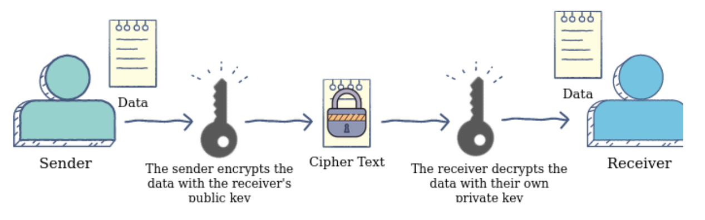

:orphan:
(introduction-to-rsa-encryption)=
# Introduction to RSA encryption
 

Asymmetric encryption is possible using RSA, which is an acronym of the authors' names (Rivest–Shamir–Adleman). Asymmetric cryptosystems are sometimes known as "public-key cryptography," since they employ a public key to encrypt data and only a hidden, private key to decode it. For security considerations, a code is appended to the standard message in this algorithm. The approach is based on huge number factorization. Because vast numbers are hard to ascertain, getting into the text for invaders is challenging. We'll go through the basics of how the RSA algorithm works in this blog.

## How it works

The diagram below illustrates how asymmetric cryptography works:

## RSA's Characteristics

- It's a way of encrypting data using a public key.
- Data sharing via the internet is secure.
- It protects the data's secrecy.
- Because interceptors have a difficult time cracking into the keys, RSA has high resilience.

## Advantages of RSA

- No Private Key Communicating: Because the RSA algorithm relies on the recipient's key pair, you don't need to disclose any private keys in obtaining messages from someone else.

- Evidence of Truthfulness: Because the key pairs are connected, a receiver will be unable to capture the message because they will lack the right secret key to decode the data.

- Encryption Method is Quicker: The encryption process is more efficient than the DSA method.

- Data cannot be changed: Information will be tamper-proof in transport because tampering with the data will change how the keys are used. Furthermore, the private key will be unable to decode the data, notifying the recipient of the alteration.

## What makes RSA secure?

- The RSA algorithm is a public-key encryption method that is commonly used in the security sector to encrypt messages and data transmissions. It may also be used to create digital signatures.

- The RSA algorithm is built on Euler's theorem reasoning, which involves huge numbers and prime testing. The security of encrypted communication improves as the complexity of factorization of big integers grows because it becomes more difficult for the other person to decipher it.

- From this security perspective, the RSA algorithm is regarded as a secure algorithm that is extensively employed at an industrial level to protect sensitive data.