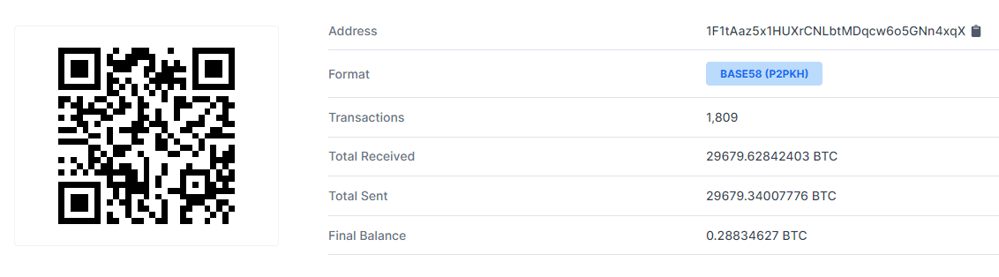
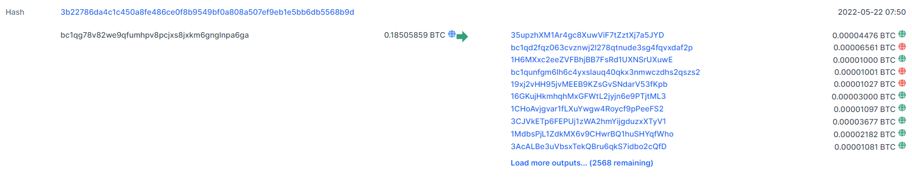
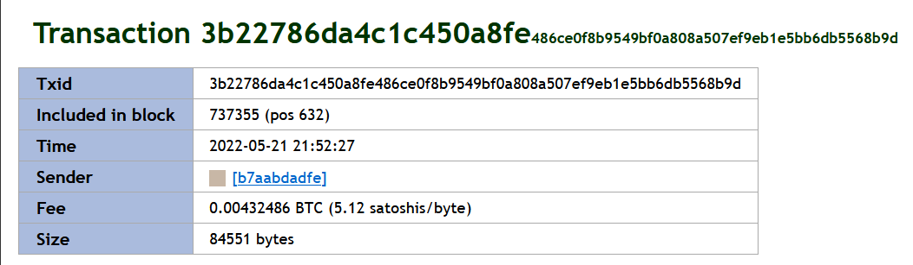

:orphan:
(investigating-crypto-crimes-an-introduction)=

# Investigating Crypto Crimes: An Introduction

Illicit actors operating anonymously within the blockchain ecosystem have fostered newer methods of money laundering. There has been a gradual increase in ransomware attacks where cyber infiltrators get into your systems and block your access to the data and the system. Attackers then threaten to leak sensitive information to the public forum unless negotiated with a ransom. This ransom is paid using cryptocurrency, particularly Bitcoins!

## Cryptocurrencies

Cryptocurrencies are preferred because they are anonymous vehicles operated by criminals to transport money from one point to the other without any formal setting like a bank. They are borderless and more secure than traditional methods of banking. Blockchain stores the transactions protected with cryptographic methods therefore making it difficult to anybody to hack or attack without consumption of power.

At the time of writing this, there are around 18,465 cryptocurrencies in the world including the active (10,363) and the dead ones. Cryptocurrencies allow users to engage in P2P (peer-to-peer) financial contracts without the use of a bank or any financial authority. Bitcoin has been the trendsetter for crypto since its inception in 2009. It continues to lead the crypto world along side its alternatives Ethereum (ETH), Litecoin (LTC), Polkadot (DOT), Bitcoin Cash (BCH), Stellar (XLM), Dogecoin (DOGE), Tron (TRX) and Tether (USDT).

Crypto transactions are recorded on public ledgers, it is permanently documented and a record of all transactions from one node to the other is available online. The transactions are traceable subject to the case. There are ways to bypass anonymity, hold non-KYC accounts, mask transaction trail by adopting to various hops which will be discussed in another article.

A bitcoin wallet address acts as your bank account number where users deposit funds. This address is made up of a combination of alpha-numeric digits. It is a public key that users can send and receive funds. The addresses use an asymmetric hash algorithm adding an extra layer of security. Private keys are secret, users share the public key to receive funds but in order to use those funds one needs a private key. They are very difficult to reverse engineer because of the underlying cryptography. It is like your password that gives access to your funds.

## OSINT tools

OSINT tools are the preferred choice for understanding the money trail that took place in a crypto transaction. The complexities and challenges the pseudo-anonymous nature of blockchain transactions create for law-enforcement is overwhelming. Non-KYC services, Fake accounts, disposable wallets, chain hopping are some of the challenges that have emerged lately.

The following steps must be undertaken while analyzing crypto wallets (For demonstration purposes, let us consider 1F1tAaz5x1HUXrCNLbtMDqcw6o5GNn4xqX wallet address as a starting point):

### Blockchain.com

[Blockchain.com](https://www.blockchain.com/btc/address/1F1tAaz5x1HUXrCNLbtMDqcw6o5GNn4xqX) is a great tool to study flow of transactions.

This wallet address has transacted 1,809 times on the BTC blockchain network. It has received a total of 29676.62 BTC and has sent 29679.34 BTC. Current balance is 0.288 BTC.

Similarly, exploring another wallet address who has transacted with the BTC address.

Every transaction has a time stamp and a transaction hash or a unique id tagging that transfer from one wallet to the other. In figure 2, bc1qg wallet has 2578 outputs with a collective amount of 0.185 BTC. Transaction hash is 3b227..... Time stamp is in UTC 2022-05-21 21:52:27, therefore do no forget to convert it to local time during investigation.

### Wallet Explorer

This transaction can be further analyzed on other open source tools like [Wallet Explorer](https://www.walletexplorer.com/txid/3b22786da4c1c450a8fe486ce0f8b9549bf0a808a507ef9eb1e5bb6db5568b9d).

### Additional tools

Other tools that provide similar information are [Block Explorer](https://blockexplorer.com/) , [Intelligence X](https://intelx.io/). Similarly, to track transactions for Ethereum, [Ether Scan](https://etherscan.io/) can be used.

For law enforcement: once a transaction of interest is identified, copy the transaction ID, sender, and receiver’s wallet address, and share it with the exchange service like Binance, Zebpay, WazirX, Coinbase etc. for KYC associated with this wallet.

:::{seealso}
Want to learn practical OSINT skills? Enrol in [MCSI's MOIS - Certified OSINT Expert Certification Programme](https://www.mosse-institute.com/certifications/mois-certified-osint-expert.html)
:::
