:orphan:
(linux-command-line-101-basic-file-and-directory-operations)=

# Linux Command Line 101: Basic File and Directory Operations

The ability to use the Linux terminal is a valuable skill for a cybersecurity professional. Many tasks in cybersecurity domains like penetration testing, digital forensics, cloud security involve using Linux commands on a regular basis. Knowing how to use simple commands will help you easily interpret and use complex commands. This blog post introduces you to some basic commands to manage files and directories. The following operations were performed on Ubuntu. The commands discussed in this blog post would be the same across all Linux distributions.

## What’s on the GUI?

User _spark_ is logged into the computer. Within the _/home_ directory of user _spark_ there is a folder called _/test_. __ post gives you an idea about the directory structure on Linux.

On Windows machines, you can view the full path leading to the current folder in the address bar. To view the same on Ubuntu, use the Ctrl +l (lower-case L) keystroke within a folder. You can view the path leading to the current folder as shown in the following screenshot. Notice that forward slashes (/) are used in Linux, whereas in Windows backward slashes (\\) would be used.

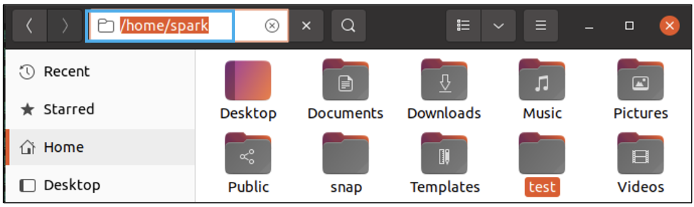

Within the _/test_ directory there are two other directories: _/one_ and _/two_, and a file _file3.txt_.

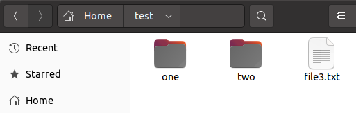

You can view the path of this current folder using the Ctrl +l (lower-case L) keystroke. The terms folder and directory can be used interchangeably.

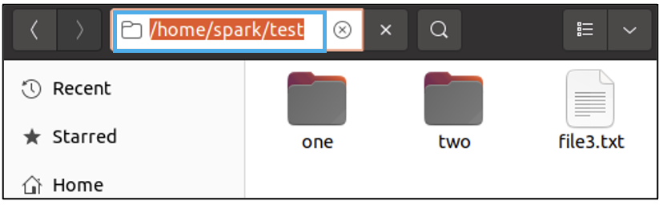

Within directory _/one_ there is one file _file1.txt_.

Within directory _/two_ there is one file _file2.txt_.

## Using the Terminal

Let us perform some basic file and directory operations in the command line using the _Terminal_ application. While in the _/test_ folder in the GUI, right click anywhere on the screen and select _Open in Terminal_. This will bring up the _Terminal_ application with a prompt like this one.

`spark@workstation: ~/test$`

## Listing the contents of a directory

To view the contents of the _/test_ folder, type `ls`, which means to ‘list’ the contents of a folder. You can see the names of the two folders (directories) and one file. Note the different colours used to represent the file and folder names. The colour combinations used will depend on the theme used by the _Terminal_ application.

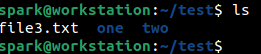

## Changing between directories

Command `cd` means to ‘change directories’. It is used to navigate between directories on the command line. We know that directory _/one_ has one file _file1.txt_. Let us navigate to directory _/one_ and list its contents.

The command syntax to change directories is:

`cd <directory-to-change-into>`

The following screenshot shows the command used to navigate into directory _/one_. Directory _/test_ is referred to as the parent directory of _/one_.

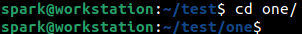

Do you want to guess which command can be used to view the contents of directory _/one_? Yes, it is `ls`. The following screenshot represents the contents of directory _/one_.

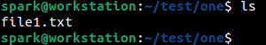

Now we will use `cd` command to head back into _/test_ folder. Currently we are in _/home/spark/test/one_. To navigate into the parent directory _/home/spark/test_, `cd` command is used again. The directory to change into, which is the parent directory, is represented by two dots (..) In Linux, the parent directory of any directory is always represented by two dots. The following screenshot shows how a user can navigate to a parent directory.

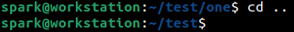

Now let’s assume you are in directory _/one_ again.

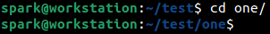

To navigate to directory _/two_ from directory _/one_, `cd` command can be used. But we cannot jump between directories. We must first land in the common directory, here the parent directory _/test_ and then navigate into _/two_. This operation can be combined into one command as shown in the following screenshot.

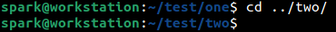

## Copying files

Now let’s head back into _/test_. Let us attempt to copy _file3.txt_ into directory _/two_. This simple operation can be performed using `cp` command, which stands for copy. Its syntax is:

`cp <source> <destination>`

The result of copy command is similar to the copy+paste operation. The following screenshot shows how `cp` command is used to copy _file3.txt_ into directory _/two_. Now a copy of _file3.txt_ exists in _/test_ directory and in _/test/two_ directory.

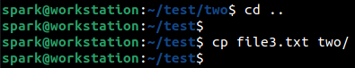

Directory _/two_ has two files now.

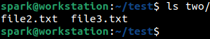

A file can also be copied with a different name. Do you want to guess what the command shown in the following screenshot does?

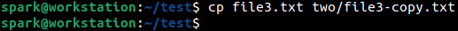

It makes a copy of _file3.txt_ in directory _/two_ with the name _file3-copy.txt_.

You guessed right! Now directory _/two_ has three files.

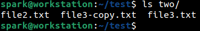

## Moving files

Now we are back to _/test_ directory. Let’s attempt to move _file1.txt_ in directory _/one_ to directory _/two_. `mv` command can be used for this task. Its syntax is:

`mv <file to be moved> <new location of the file>`

The following screenshot shows how `mv` command is used to move _file1.txt_ in directory _/one_ to directory _/two_. Move is similar to a cut+paste operation.

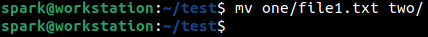

This means that directory _/one_ is empty. This can be verified using `ls`.

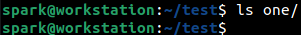

Now directory _/two_ has four files in total.

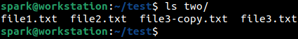

When a file is moved, it can also have a new name in the new location. It can be done using the following syntax:

`mv <file to be moved> <new location of the file/new name>`

## Deleting files

Now what if we want to delete a file? `rm` command is used to ‘remove’ a file. Its syntax is:

`rm <name of file to be removed>`

From within the _/test_ directory, the following command shows how `rm` command is used to delete the file _file3.copy.txt_ within directory _/two_.

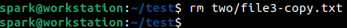

Now directory _/two_ has only three files.

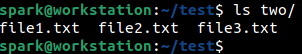

## Deleting directories

Now let’s delete directory _one_ which is empty. `rmdir` command is used to delete a directory. Its syntax is:

`rmdir <name of directory to be removed>`

A directory must be empty before it can be deleted.

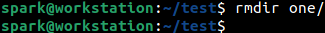

Within _/test_ directory, we have only _/two_ and _file3.txt_.

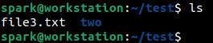

## Creating directories

Let’s create a new directory called _/four_ within _/test_. `mkdir` command is used to make or create a directory. Its syntax is:

`mkdir <name of directory to be created>`

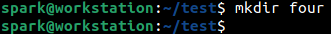

Now we can see that _/test_ has two directories: _/two_ and _/four_, and one file _file3.txt_

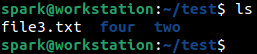

## Wrapping up

In this blog post, we have seen how to:

- List the contents of a directory
- Navigate between directories
- Copy, move and delete files
- Create and delete directories

## A word on file/directory paths

Let’s assume we are in directory _/one_. The path of _/one_ with respect to only its parent directory _/test_ will be _/test/one_. This path is referred to as its **relative path**. The complete path of _/one_ within the _/home_ directory of user _spark_ is _/home/spark/test/one_, which is formally referred to as **absolute path**.

Relative path is always relative to one level up in the directory hierarchy. Absolute path refers to the complete chain of directories in a path.

Within _/test_, the relative path of _file3.txt_ is _/test/file3.txt_

The absolute path of _file3.txt_ is _/home/spark/test/file3.txt_

## What’s the next step?

Are you wondering when and where you will use all these commands?

- During a penetration testing engagement, you may have to list the contents of the directory
- During a digital forensic investigation, you may have to create a directory to hold the evidence
- While working with cloud infrastructure, you may have to navigate between directories

This is just a small list of Linux command-line operations you can do for cybersecurity.

Here is a project idea for you:

- Research what `pwd` command does
- Set up an Ubuntu virtual machine and set up the directory structure we discussed here, with the _/test_ directory
- Navigate to _/test_ directory in the terminal and observe what `pwd` command displays
- Navigate to _/test/one_ directory in the terminal and observe what `pwd` command displays
- Navigate to _/test/two_ directory in the terminal and observe what `pwd` command displays

On all Linux systems, once you open the _Terminal_ application, you can navigate to a directory of your choice using the `cd` command to perform various activities.
