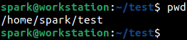

:orphan:
(linux-command-line-101-basic-redirection-and-pipes)=

# Linux Command Line 101: Basic Redirection and Pipes

When using the Linux command line, you may need to save the output of a command to a file. In some cases, you may need process the output of one command using another one. In these situations some special command-line operators prove to be useful. This blog post gives you a brief introduction to how redirection and pipe operators can be used in the Linux command line.

## Using Redirection Operator (>)

The following demo has been performed on Ubuntu. User _spark_ has been logged into the computer. Currently, the user is within the _test_ folder in the _/home_ directory. Take a look at this _[post](linux-command-line-101-basic-file-and-directory-operations)_ for an introduction to commands to perform basic file and directory operations.

`pwd` command refers to _path of the working directory_. It prints the absolute path of the directory the user is currently in.

_test_ directory is now empty, which is verified using `ls` command.

This is also verified on the GUI.

Let us create a file within the _test_ directory. `touch` command can be used to create a file using the syntax:

`touch <name of file to be created>`

Here a file called _sample.txt_ has been created within the _test_ directory.

This can be verified using `ls` command

And also on the GUI.

The contents of _sample.txt_ can be viewed using `cat` command. Currently the file is empty.

We will add a line of text to the file using the redirection operator (>).

`echo` command is used to simply print some text on the screen. The text to be printed is presented to the command in quotes.

In the following screenshot, the output of `echo` has been redirected into _sample.txt_ using the redirection operator (>). In this case, output of `echo` is not displayed on the screen. The syntax for redirection is:

`[command 1] > [filename to direct results to]`

Let us review the contents of _sample.txt_ using `cat` command. We can see that the text ‘good morning’ has been successfully written into it.

Let us attempt to write another phrase into _sample.txt_. We expect to see ‘good morning’ and ‘good afternoon’ written into the text file one after the other.

When we view the contents of _sample.txt_, we can see that the results of the latest echo and redirection has overwritten the results of the previous task. This is because when a single redirection operator has been used, it will overwrite the existing contents of the file.

To append contents to the file, the redirection operator must be used two times as shown in the following screenshot.

Now, as expected, we can find two lines of text within _sample.txt_.

The redirection operator can be used to direct the output of any command to a file.

## Using Pipe Operator (|)

Now let us consider a CSV file _test-data.csv_. The ID, name and location of 30 people are stored in this file. There are 31 lines in this file in total: the first line that has the field names and 30 lines having user information.

The following screenshot shows how `cut` command is used to display only the ID and location fields for all lines in the CSV file. __ post gives you can introduction to how `cut` command can be used to view specific fields of information.

This output of `cut` command will have 31 lines of output – one line for the field headings and 30 lines for user-specific information. Let’s assume we want to search for one location ‘Japan’ within this output. If the output of `cut` command is small, we can search for it manually. To quickly search through 31 lines of output, we can use pipe operator (|).

Pipe operator is used to pipe the output of one command as input to the next command. In the following screenshot, the output of `cut` if piped to `grep` command which is used to search for the string ‘Japan’. Since the string exists in the output of `cut`, that line appears in the output.

To find out the line number in which ‘Japan’ appears in the output, the results of `cut` command are piped to `grep` command which is used with the _-n_ switch. From the following screenshot, we can see that ‘Japan’ appears in the 13th line in `cut` command’s output. 12 is the ID associated with the person.

Let’s take a look at another command `wc`. This one is used to count the number of lines and number of words in a file, using _-l_ and *-w*switches respectively. There are other switches for `wc` to print the number of characters in a file and even to print the number of empty lines in a file.

The following screenshot shows how `wc` command been used to identify the number of lines in the output of `cut` command. Pipe operator has passed the output of `cut` to `wc`. As expected, we can see that there are 31 lines in the output of `cut` command.

Let’s try another one. _sample.txt_ discussed earlier had two lines in it: ‘good afternoon’ and ‘good evening’; which accounts for 4 words. Let us use `cat` to display the contents of _sample.txt_ and pipe that output to `wc` to count the number of words it.

From the following screenshot, we can see that `wc` has identified the number of words in _sample.txt_ to be 4, as expected.

## How will redirection and pipe operators be useful for a cybersecurity professional?

As a penetration tester and red teamer, you will need to use pipe operator to combine many powerful commands to achieve a suitable result. When a digital forensic professional needs to find the list of users on a Linux system, the result can be identified using a single command. Results of that command can be redirected into a text file to be stored as evidence. Even in malware analysis and reverse engineering, many powerful Linux command-line tools will help to process malicious binaries, for which usage of pipe operator becomes a regular task. Knowing how these operators work, will help you utilise the available commands to their fullest benefit.
