:orphan:
(linux-command-line-101-viewing-file-contents)=

# Linux Command Line 101: Viewing File Contents

Most files on Linux are flat files storing text data, comma-separated values (CSV), tab-separated values (TSV), configuration information, etc. In some situations, you may need to view and process the contents of files. Although it can be done using text editor applications, there are some powerful command-line tools that can be used over the terminal. This blog post discusses some of the basic commands used to process the contents of a file.

## Processing a CSV File

We will be processing the contents of a CSV file _test-data.csv_ in this blog post. This file has 31 lines of content. The first line indicates the names of various fields within the file. The remaining lines represent the contents of the file. The first few lines of the file are shown in the following screenshot – the file has been opened in a text editor application in Ubuntu. There are three fields of information in each line. The first field has an ID value, the second field has a name and the third field has a location name.

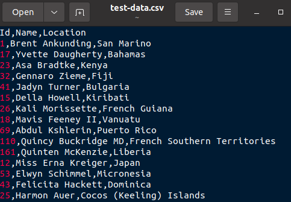

## Viewing all the contents

Now we will process the contents of the file using some commands in the _terminal_.

To view all the contents of a file in the _terminal_, `cat` command can be used as:

`cat <filename>`

The following screenshot shows the first few lines displayed in the terminal.

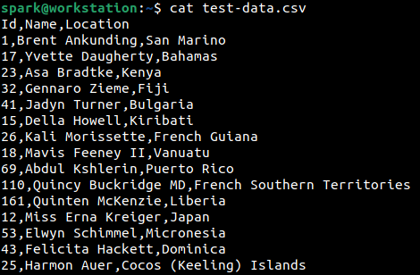

To view all the contents of the file in reverse, i.e to read numbers 1,2,3,4,5 as 5,4,3,2,1; `tac` command can be used as:

`tac <filename>`

The following screenshot shows how `tac` displays the file contents in reverse order. Only the first few lines of output are shown here.

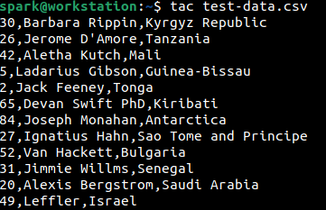

## Viewing only the first few and last few lines of the file

To view only the first 10 lines from the beginning of the file, `head` command can be used as:

`head <filename>`

The following screenshot shows how `head` command is used to view the first 10 lines of the file.

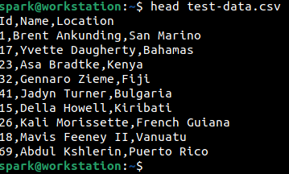

What if we want to view only the first 3 lines or first 5 lines of a file? `head` command can be used again, with a switch _-n_:

`head -n <filename>`

Where _n_ represents the number of lines to print. Note the hyphen before the number. The following screenshot shows how the first 3 lines of the file can be viewed using `head`.

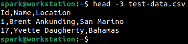

What if we want to view only the last few lines of a file? For this, `tail` command can be used. By default, without any switches, `tail` displays the last 10 lines of a file. It works similar to `head`.

The following screenshot shows how `tail` has been used to view the last 10 lines of _test-data.csv_.

`tail <filename>`

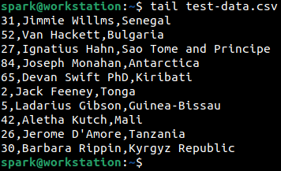

Compare this output with the output of `tac`.

`tail` displays the last 10 lines in the order they appear in the file. `tac` displays all the lines of the file in reverse order.

The following screenshot shows how `tail` has been used to view only the last 3 lines of the file.

`tail -n <filename>` where _n_ is the number of lines to print.

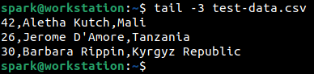

## Viewing specific fields in the file

We know that this file has a list of comma-separated values. The first field has an ID value, the second field has a name and the third field has a location name. Let us attempt to view only the ID and name fields in the terminal. `cut` command can be used for this task.

The syntax of the command used in the following screenshot is:

`cut -d <delimiter> -f <fields to display> <filename>`

_-d_ switch specifies the delimiter used to separate the various fields in the file. Since this is a CSV file the delimiter is a comma. In case of a TSV file the delimiter used would be a tab. Each field in the file is assigned a number starting from 1. _-f_ switch uses the field number to specify which fields must be displayed in the output.

The following command shows how `cut` command has been used to display only the first two field of the CSV file – ID and name. Only the first few lines of output are shown here.

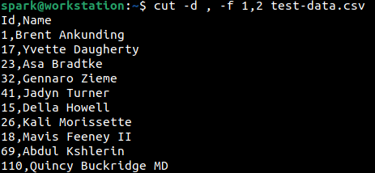

Likewise, the ID and location fields alone can be displayed by specifying the field numbers 1 and 3. This is represented in the following screenshot.

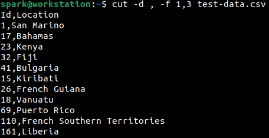

## Searching for a word/string within the file

What if you want to search for a particular word or string within a file? It can be done using `grep` command. The syntax for it is as follows:

`grep <word or string to search for> <file to search within>`

The following screenshot shows how the word ‘Nicole’ has been searched for within _test-data.csv_. If the string has been found, the line in the file where the string has been found will be displayed and the string would be highlighted in a different colour, here red.

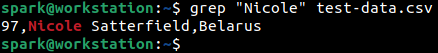

If the string is not present within the file, then no output would be displayed.

What if we want to find out the line number in which the word or string has been found? The line number can be found by passing _-n_ switch to the `grep` command. The following screenshot shows that the string ‘Nicole’ has been found in line 18.

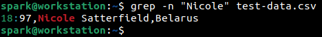

Passing _-n_ switch tells `grep` to _print the line number that the word/string appears in_.

`grep` is a very powerful command that can be used to search for a specific word or string or expression even across an entire hard disk.

## How will these commands be useful for a cybersecurity professional?

Most of the commands discussed above will be used by cybersecurity professionals on a regular basis. Penetration testers can use `cat`, `head` and `tail` to view and modify configuration files. A digital forensic examiner can use `grep` to search for a specific keyword within an entire hard disk. `tail` can be used to display most recent log entries within a file. A cloud security specialist can utilize `cat` and `grep` to view the configuration of cloud infrastructure. Threat hunters can use `cut` command to display only relevant fields of information.

As you practice and get used to the simple commands, you can head over to studying about more complex usages of each command.
