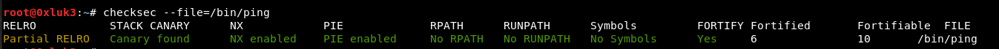

:orphan:
(linux-exploitation-evading-exploit-protection)=
# Linux Exploitation: Evading Exploit Protection
 

On a modern system, it is uncommon to find a binary that can be exploited so easily. In order to make exploitation more difficult, numerous methods have been developed as a countermeasure. This article discusses a few possibilities on how to circumvent these protections.

In one of the [previous](linux-exploitation-abusing-eip) posts, we took advantage of a stack-based buffer overflow.

Stack-based buffer overflows are still possible on real-world systems (e.g., suid binaries), but they are protected by popular countermeasures. 

The most prevalent methods to make exploitation more difficult, which have been developed in recent years include: 

- making the stack non-executable
- Randomizing addresses for every program execution 

During the reconnaissance phase, where we attempt to determine what the target binary is doing, we can use another tool to detect the existence of exploit protections.

The [checksec](https://github.com/slimm609/checksec.sh) script can be used to examine an executable and display the exploit mitigation it employs.

You can use the script in following way:

```bash
ln -s /full/path/checksec.sh/checksec /usr/bin/checksec
checksec --file=/bin/ping
```



The output reveals all protections utilized by the target executable. 

Each of these mechanisms can make life more difficult for exploit developers. Together, they necessitate a profound understanding of exploitation techniques to be circumvented.

EIP control is the foundation for all exploitation endeavors. If you can set the EIP to any value, you are halfway to creating a working exploit. 

On the path from the EIP control to shellcode, countermeasures become significant. During the fundamental overflow examples, it was possible to simply jump to a buffer address. When appropriate safeguards are in place, the buffer's address may be unknown and it may not be executable at all. 

Let's go to introduce the most common exploit protections in Linux

## No Execute

The No eXecute bit is the most common countermeasure found in the majority of modern software. The concept is that stack data is not executable.

This countermeasure is also known as *DEP - Data Execution Prevention*. 

No eXecute was developed in [2004](https://0x00sec.org/t/exploit-mitigation-techniques-data-execution-prevention-dep/4634), and it utilizes the No eXecute (`NX`) bit in `AMD` processors and the Execute Disable Bit (`XD`) in `Intel` processors with 32-bit and 64-bit architectures.

If you attempt to execute any stack data, such as after moving the execution flow back to the stack following a buffer overflow, the program will terminate with a `SIGSEGV`. 

### NX bypass

NX alone is easily circumvented. As you already know, when a function call is made in the x86 architecture, the arguments are pushed onto the stack, and then a function is called.

NX prohibits the execution of data on the stack, but it is acceptable to have function arguments on the stack. 

Using a custom buffer, we manage the data pushed onto the stack as it becomes overflowing during a stack overflow. So as to bypass the NX protection, we can include function arguments within the buffer and then point the EIP to a function that will utilize them.

Numerous functions may be reused for this purpose. They may reside in either the executable or any library utilized by it. 

## ASLR

*Address Space Layout Randomization (ASLR)* is an operating system-level countermeasure against exploits. When ASLR is enabled, the core memory regions of a newly launched process will be loaded at a different address each time.

The ASLR configuration is stored in a file: 

`/proc/sys/kernel/randomize_va_space`

This file is only accessible to the superuser and can contain the following data:

- `0` - ASLR is disabled
- `1` - ASLR is enabled and the stack, virtual dynamic shared object page, and shared memory regions are randomized
- `2` - ASLR is enabled and in addition to `1`, the data segments are also randomized 

In order to change the ASLR settings on the system, you
can type the following from the root account:

```bash
echo 0 > /proc/sys/kernel/randomize_va_space
```

### ASLR bypass

However, ASLR is defeatable. Utilizing low ASLR entropy, which is likely to work on older kernels, will be the first bypass method we will discuss.

If we are attempting to exploit a local binary that can be executed multiple times, a brute force attack may be an option if addresses are randomized. 

Only one byte in the middle of the four-byte long address varies over the course of binary execution. Since the byte's value could be between `0` and `0xFF`, there is a `1/256` chance of hitting a valid address when guessing, for instance, the libc base for a ret2libc-based attack.
Additionally, brute-forcing the address of the stack where the shellcode resides is considerably easier in this scenario.

From the perspective of a brute-force attack, a probability of `1/256` equals guaranteed success. This method has limited compatibility with contemporary operating systems. 

On modern systems, bypassing ASLR requires a more complex strategy. As it is typically coupled with a non-executable stack, more sophisticated exploits are required. 

## Stack Cookie

On Linux systems, *stack cookie*, also known as *"stack canary"*, *"stack protector"*, *"stack guard"*, and *SSP*, is used as an exploit mitigation.

When a function is called, a 4-byte value called the stack canary is pushed onto the stack. When the function completes its task and the stack frame is cleared, the value of the stack cookie is compared to the value that was previously pushed. If it's different, the *__stack_chk_fail* function is called to terminate the program. 

The stack cookie may be of the following varieties:

- *Random Canary* - a `4-byte` value generated by `/dev/random`, for instance.

- *Random XOR Canary* - additionally, the random canary is `XOR`'d with the stored control data.

- *Null canary* - the canary has a value of `0x00000000`; as it is a null terminator for strings, delivering zeroes to the stack should be impossible.

- *Terminator canary* - the canary is set to a combination of string terminators, such as `0x00`, `0xff`, `0x0a`, and `0x0d`. 

Custom implementations are possible, but they are not likely to be more effective.

On a custom implementation, for instance, the cookie value may be hardcoded in a variable. This value is easily obtainable during reverse engineering of the binary target. 

### Stack Cookie bypass

No universal method exists to bypass the stack canary protection. A crash that cannot be exploited can sometimes be transformed into code execution and a stack canary bypass through the use of creativity. 

## RELRO

*RELRO* is an abbreviation for *RELocation Read Only*.

It is an exploit mitigation that prevents the overwriting of data sections of a process during an exploit. 

A dynamically linked ELF binary contains the *Global Offset Table* (GOT) in order to dynamically resolve functions located in shared libraries.

The procedure for resolving the function address resembles the following:

- Function calls actually point to the *Procedure Linkage Table (PLT)* in the `.plt` section.

- PLT indicates an address for a function in GOT. GOT is actually located in the `.plt.got` section.

- GOT contains pointers to PLT, where the function's final address is stored.

Resolving symbols that are about to be used is intended to improve performance. We only resolve runtime-used functions, because not all functions (`.got` and `.got.plt`) should be writable.

If the attacker is able to perform an arbitrary write of just `4 bytes`, he can hijack the global offset table and change the address of a resolved function (such as `exit`) to point to the shellcode's storage location.

What role does RELRO play in all of this? RELRO has two stages: partial and complete.

- Partial RELRO that maps a read-only `.got` section
- `.got.plt` is still writable 

With Partial RELRO, arbitrary write exploitation is still possible.

You can force partial RELRO during compilation using the `gcc` arguments listed below:

```bash
gcc -Wl, -z,relro
```

Full RELRO provides the same protections as partial, plus the following:

- The linker will conduct all symbol lookups at link time (prior to execution) and will then remove write permissions from the GOT.

- `.got.plt` becomes part of `.got`. 

In order to force full RELRO, additional arguments have to be
supplied to gcc, as follows:

```bash
gcc -Wl, -z,relro, -z,now
```

With full RELRO, arbitrary writes cannot be exploited, at least not by overwriting GOT entries. There may be additional conditions in the target binary that can be exploited in an unorthodox and inventive manner!

### RELRO bypass

In addition, no direct RELRO bypass exists. However, the decreased performance often prevents developers from implementing FULL RELRO in binaries. Full RELRO, once detected, indicates that GOT/PLT entries cannot be overwritten. 

## Other methods and tricks

Linux systems employ additional protections against exploits that are not covered in this post. Some of them require sophisticated and complex exploits to be circumvented.

However, we will soon describe these safeguards without providing a detailed technical explanation. 

**RPATH** is an executable's attribute, not a protection against exploits; however, it is checked by checksec.sh, so it is worth mentioning.

If `RPATH` is set, a path from which a library can be included can be specified. The path is hardcoded, and the included libraries do not drop possible `SUID` privileges. If the location specified by RPATH is writable, we can attempt to place a malicious shared library (such as `libc`) there and then wait for the program to load it. Such a library may subvert legitimate functionality, for instance, by implementing `strcmp()` as a shell. 

**Position Independent Executable (PIE)**, also known as Position Independent Code, is a more robust form of ASLR. In contrast to ASLR, PIE randomizes the Code and GOT/PLT segments. 

**ASCII Armor** - maps Library addresses to memory addresses that contain null bytes.

## Conclusion

Most protections against exploits are ineffective on their own, but when combined, they make exploitation difficult.

On the other hand, implementing exploit protections frequently reduces a program's performance or increases its complexity. Consequently, numerous applications remain vulnerable. 

## References

[checksec.sh](https://github.com/slimm609/checksec.sh)
[Data Execution Prevention (DEP)](https://0x00sec.org/t/exploit-mitigation-techniques-data-execution-prevention-dep/4634)
[Linux and ASLR: kernel/randomize_va_space](https://linux-audit.com/linux-aslr-and-kernelrandomize_va_space-setting/)

> **Looking to expand your knowledge of vulnerability research and exploitation? Check out our online course, [MVRE - Certified Vulnerability Researcher and Exploitation Specialist](https://www.mosse-institute.com/certifications/mvre-vulnerability-researcher-and-exploitation-specialist.html). In this course, you'll learn about the different aspects of software exploitation and how to put them into practice.**