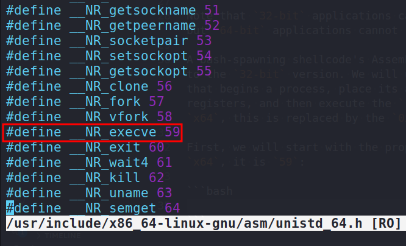
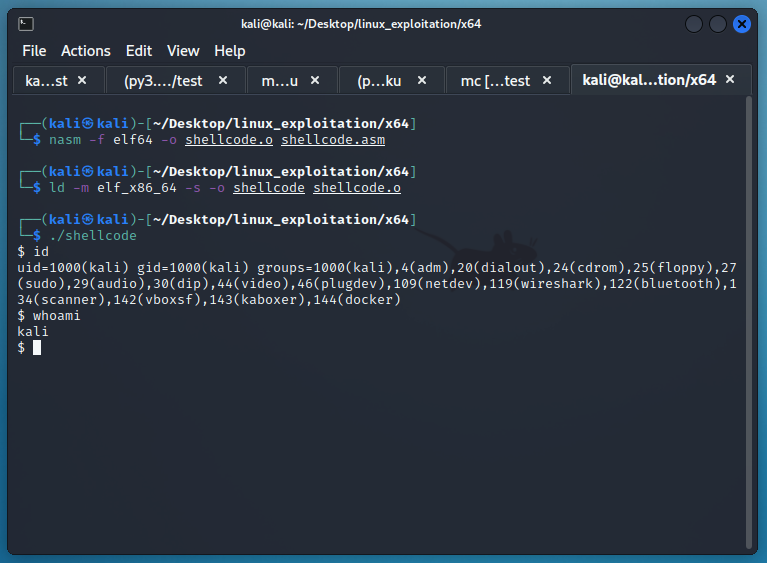
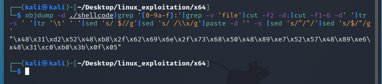
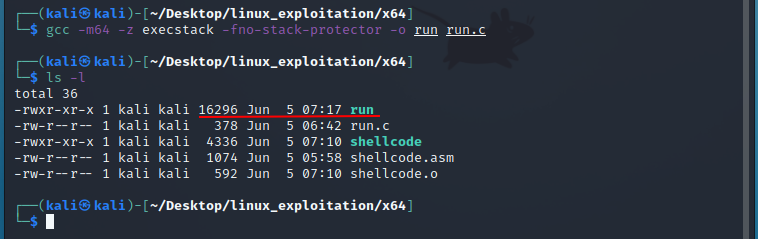
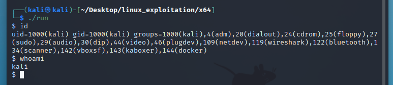

:orphan:
(linux-exploitation-x64-shellcode)=

# Linux Exploitation: x64 shellcode

Let's try to write a `64-bit` Linux shellcode.

Before we can do that, let's lay the groundwork for the distinctions between the `x86` and `x64` architectures.

## x64 Architecture

The `64-bit` architecture is the result of hardware advancements to which software had to adapt.

The `32-bit` architecture provides registers and addresses with a size of `32 bits` (`4 bytes`).
In this manner, the address space is constrained by the `8-bit` value.

The amount of memory accessible with `64-bit` is significantly greater. As `64-bits` are equivalent to `8 bytes`, all registers and addresses on a `64-bit` architecture are double the size.

In addition, the number of registers in `64-bit` processors has grown.

As they are also larger, they have been given a new naming convention; their names all begin with `"R"`

Thus, in place of `EAX`, `EBX`, and `ECX`, there are `RAX`, `RBX`, and `RCX`. They are all `64 bits` (`8 bytes`) wide.

The individual sections of a register are directly accessible. On `64-bit` architectures, you can refer to `EAX` of `RAX` in the same way that you could access `AH` or `AX` of `EAX` on `32-bit` architectures.

In addition, a number of new general-purpose registers were added to facilitate more complex operations.

In x64, the following registers exist:

```nasm
rax ; register a extended
rbx ; register b extended
rcx ; register c extended
rdx ; register d extended
rbp ; register base pointer
rsp ; register stack pointer
rsi ; register source index
rdi ; register destination index
```

And the new registers are:

```nasm
r8 ; register 8
r9 ; register 9
r10 ; register 10
r11 ; register 11
r12 ; register 12
r13 ; register 13
r14 ; register 14
r15 ; register 15
```

The existence of new registers also influences the manner in which functions are called. No additional arguments are added to the stack.

Instead, the first six arguments are passed to a function as follows:

- `rdi, rsi, rdx, rcx, r8d, r9d`
- The remainder of the arguments are passed through the stack.

From the perspective of exploit development, all these changes present a new obstacle:

- A vast address space makes brute-force attacks difficult, if not impossible.

- As function arguments are not taken from the stack, `Ret2Libc` and similar attacks are limited. Before calling a function, the attacker must execute code that loads the parameters into the appropriate registers.

When dealing with buffer overflows on `x64` systems, you may also encounter instances in which the mapped address space is constrained by a `6-byte` hex number. This indicates that you cannot overwrite the `EIP` with `0x4141414142424242`.

The only address available will be `0x0000414243444546`, so exploit buffers must terminate after overwriting the `EIP`.

Exploiting `64-bit` systems is commonly associated with Return Oriented Programming and is regarded as a complex topic. In [this course](https://www.mosse-institute.com/certifications/mvre-vulnerability-researcher-and-exploitation-specialist.html), you will practice exploitation techniques against both insecure and secure `x64` Linux systems.

While `x64` itself is difficult to exploit, `x64` shellcoding is significantly simpler.

## Writing x64 shellcode

On a 64-bit platform, we will continue to use `nasm`, `gcc`, and `binutils` to build shellcode:

```bash
sudo apt-get install nasm binutils gcc
```

Additionally, we will utilize the same shellcode tester application:

```cpp
#include <stdio.h>
#include <string.h>

unsigned char code[] = "\x48\x31\xd2\x52....";

int main() {
    printf("shellcode length: %d\n", strlen(code));
    int (*ret)() = (int(*)())code;
    ret();
}
```

This time, we will create `64-bit` Assembly code.

Note that `32-bit` applications can run on `64-bit` systems, but `64-bit` applications cannot run on `32-bit` systems.

A bash-spawning shellcode's Assembly code will be comparable to the `32-bit` version. We will use the `execve` system call that begins a process, place its arguments in the appropriate registers, and then execute the `syscall` instruction (on `x64`, this is replaced by the `0x80` instruction).

First, we will start with the proper syscall. For `execve` on `x64`, it is `59`:

```bash
vim /usr/include/x86_64-linux-gnu/asm/unistd_64.h
```



On `x64`, the arguments did not change. Still, the first argument is the program to be executed, the second is the program's arguments, and the third is the program's environment variables.

As with `32-bit` shellcode, we need only point the first argument to `"/bin/bash"` and leave the remaining two arguments blank (`NULL`).

Before executing the syscall, the syscall number must be placed in `RAX`, while `RDI`, `RSI`, and `RDX` contain the arguments to execute.

Therefore, `RDI` will contain a pointer to `"/bin/sh"` and `RSI` will contain a pointer to an array of strings (arguments).

In this instance, we will not pass any arguments or environment variables to the program we wish to launch, so the only element of that array will be a nested pointer to the `/bin/sh` address (pointer to pointer).

`RDX`, the final argument, can be null.

Let's begin writing Assembly code. You will notice that it differs little from the `x86` version:

```nasm
section .text
  global _start               ; we inform the system where the program begins

_start:
  xor rdx, rdx                ; zero out rdx
  push rdx                    ; push it onto the stack
  mov rax, 0x68732f2f6e69622f ; we can push „hs//nib/” as one value, after all it is 64-bit
  push rax                    ; we push it onto the stack, so it lands at some address on the stack
  mov rdi, rsp                ; that address is where esp points to, so we store it in rdi => pointer to „/bin/sh”
  push rdx                    ; we push 0, as it will be the null termination of the array
push rdi                      ; the address of „/bin/sh” is pushed onto the stack, it lands under another stack address
mov rsi, rsp                  ; we store that address into rsi. So rsi contains a pointer to a pointer to „/bin/sh”
xor rax, rax                  ; zero out eax to keep it clean
mov al, 0x3b                  ; 59 DEC, we move it to the lowest eax part to avoid nulls.
syscall                       ; all arguments are set up, syscall time
```

Compilation is similar to what we did for `x86`, with the exception that we will instruct the compiler to generate an `x64` executable:

```bash
nasm -f elf64 -o shellcode.o shellcode.asm
ld -m elf_x86_64 -s -o shellcode shellcode.o
```



Let's extract the opcodes from the executable using the `extractor.sh` script:

```bash
#!/bin/bash
if [ -z "$1" ]
then
    echo "Usage: $0 <path to executable>"
    exit
fi

objdump -d $1|grep '[0-9a-f]:'|grep -v 'file'|cut -f2 -d:|cut -f1-6 -d' '|tr -s ' '|tr '\t' ' '|sed 's/ $//g'|sed 's/ /\\x/g'|paste -d '' -s |sed 's/^/"/'|sed 's/$/"/g'
```

or just command:

```bash
objdump -d ./shellcode|grep '[0-9a-f]:'|grep -v 'file'|cut -f2 -d:|cut -f1-6 -d' '|tr -s ' '|tr '\t' ' '|sed 's/ $//g'|sed 's/ /\\x/g'|paste -d '' -s |sed 's/^/"/'|sed 's/$/"/g'
```



Then, we will copy and paste them into the shellcode tester application. Here is the complete shellcode tester program's source code:

```cpp
#include <stdio.h>
#include <string.h>

unsigned char code[] = "\x48\x31\xd2\x52\x48\xb8\x2f\x62\x69\x6e\x2f\x73\x68\x50\x48\x89\xe7\x52\x57\x48\x89\xe6\x48\x31\xc0\xb0\x3b\x0f\x05";

int main() {
    printf("shellcode length: %d\n", strlen(code));
    int (*ret)() = (int(*)())code;
    ret();
}
```

Now, we compile it to test whether the shellcode works:

```bash
gcc -m64 -z execstack -fno-stack-protector -o run run.c
```



Then, run:

```bash
./run
```



As you can see, shellcoding in `x86` and `x64` is comparable. However, the Assembly code must be modified according to the rules enforced by the underlying architecture.

It boils down to calling the appropriate syscalls and setting their arguments in the correct order.

[x64 syscalls](https://x64.syscall.sh/)

[x86 syscalls](https://x86.syscall.sh/)

:::{seealso}
Looking to expand your knowledge of vulnerability research and exploitation? Check out our online course, [MVRE - Certified Vulnerability Researcher and Exploitation Specialist](https://www.mosse-institute.com/certifications/mvre-vulnerability-researcher-and-exploitation-specialist.html)
::: In this course, you'll learn about the different aspects of software exploitation and how to put them into practice.**
