:orphan:
(linux-resource-monitoring-commands)=

# Linux Resource Monitoring Commands

As security professionals, we must continually take a look at how processes, individuals, or items utilize system resources. This blog post will present you with fundamental Linux commands that you may use in your everyday security duties.

## Basic commands to analyze resources

`$ free --help`: With the help of this command, you can check the current memory usage of the system.

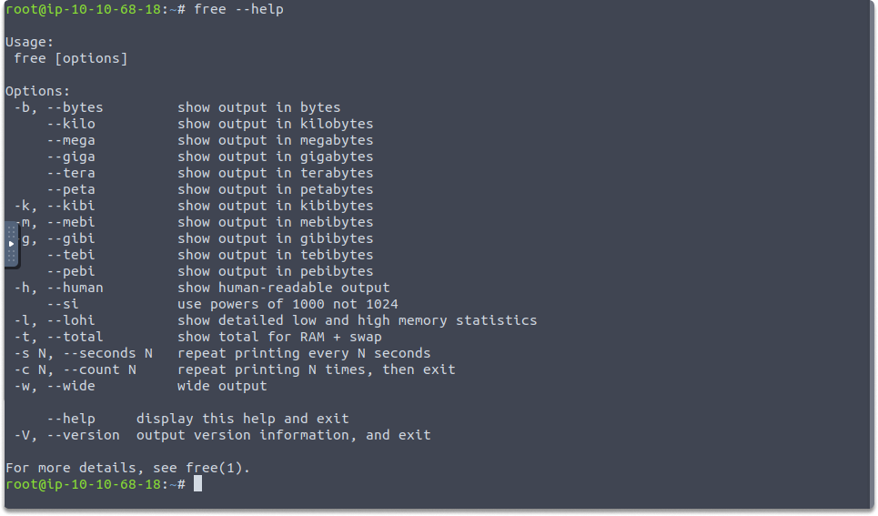

The result, as seen in the image, contains free, used, and swap (virtual) memory spaces.
You may also display it in MBs by using the following command:

`$ free -m`

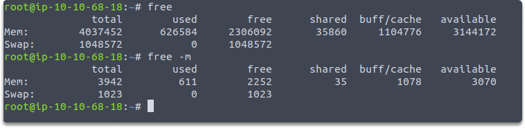

`df`: This command allows you to inspect available/consumed disk space across many storage devices.

`$ df `

As seen in the figure, the result provides free and utilized disk space as well as inodes. In `df` the default value is KB.

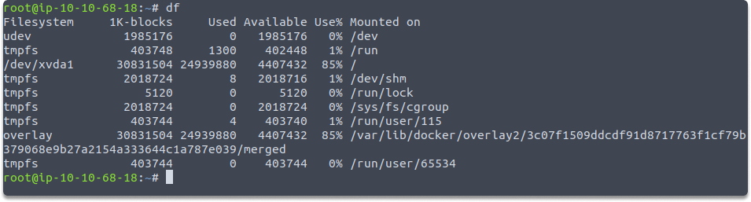

`du`: Use this tool to determine the size of all folders in the root directory. 'du' adds up the sizes of all files in a directory.

`$ du -sh *`

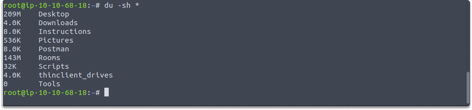

`top`: This command allows you to monitor process memory, CPU, and swap use in real-time. The panel refreshes every 1–2 seconds in default, based on the machine. The most CPU-intensive tasks are at the top.

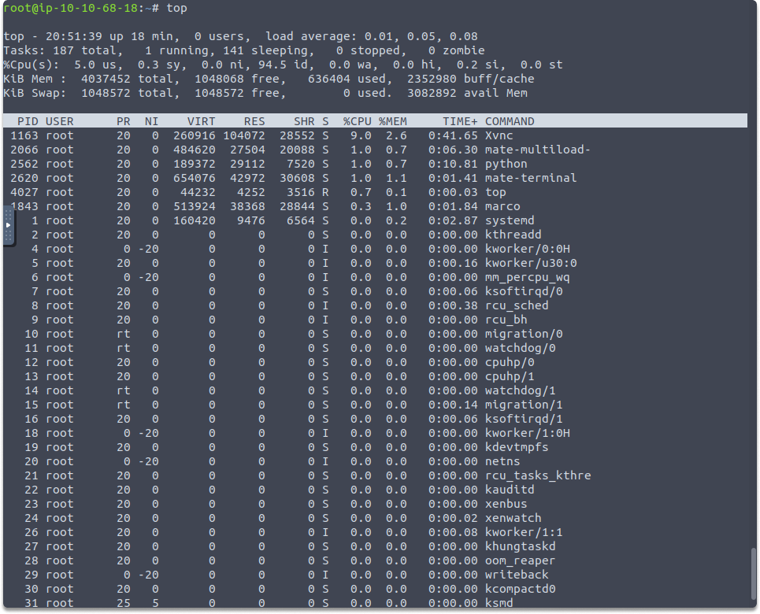

`htop`: This command allows us to track process memory, CPU, and swap utilization in real-time. Its dynamic process monitor GUI is more powerful than `top`.

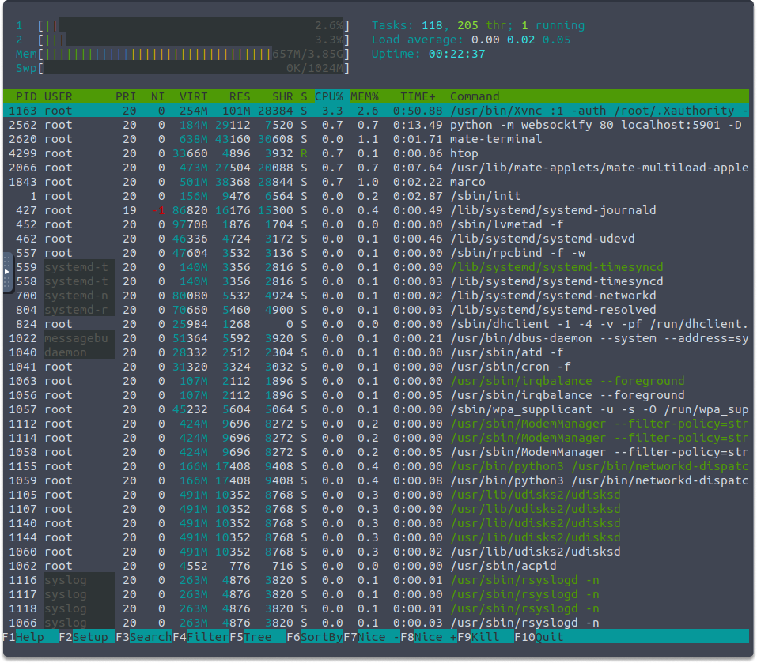

`atop`: You may also use 'atop' to observe real-time memory, CPU, and swap utilization of programs.

In the screenshots below, we first installed 'atop' using apt and then ran the 'atop' tool.

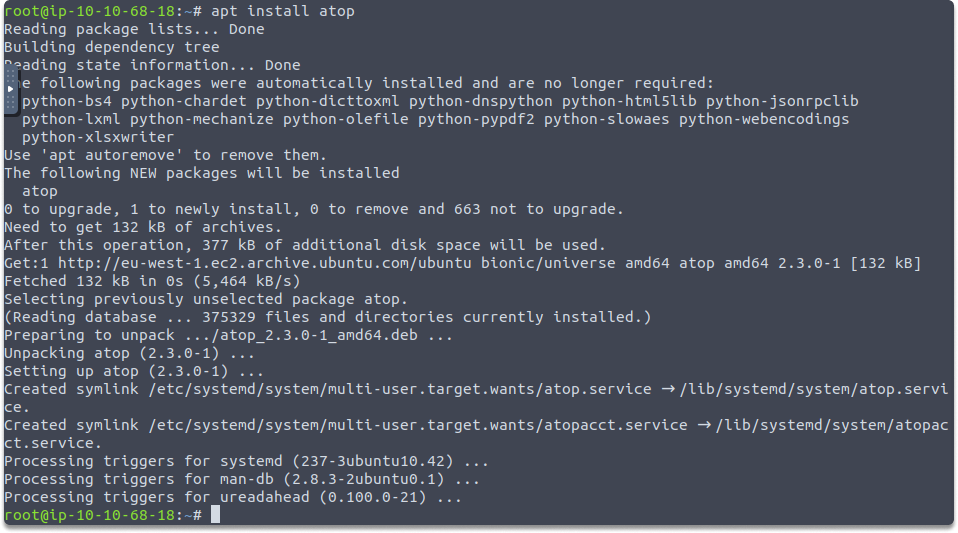

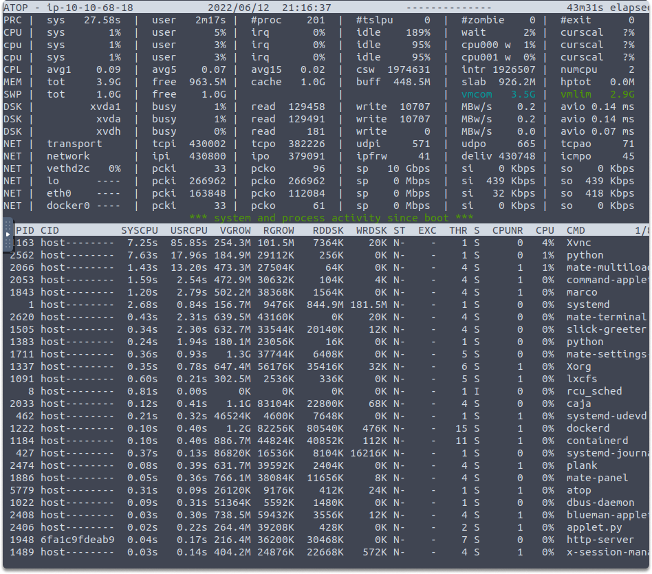

`iostat`: The 'iostat' tool may also be used to examine disk efficiency. It accepts additional inputs to indicate a time interval in seconds and a number of repetitions, and its first line of output is a recap since startup.

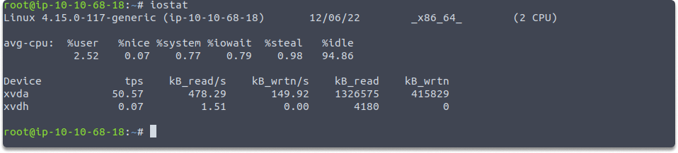

`mpstat`: This command outputs information for every single CPU. The -P switch allows you to choose the processor to check on. The following image is an illustration of each of the two processors' status:

`$ mpstat -P ALL`

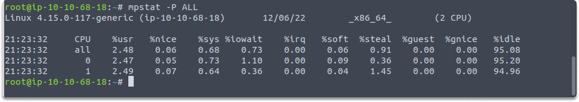

`vmstat`: Another handy command for displaying process, CPU, and memory metrics. You may also define how long the system should be monitored for each line of output and how many reports to print.

## Summary

In this blog post, we discovered some commands for systems monitoring for various reasons such as identifying free and used disk space, directory sizes, virtual memory, disk performance, CPU, and memory statistics.

## Quick system monitoring task

- Can you analyze available and consumed disk space across storage devices in GB?
- What command do you need to run?

Hopefully, this image will provide a clue.

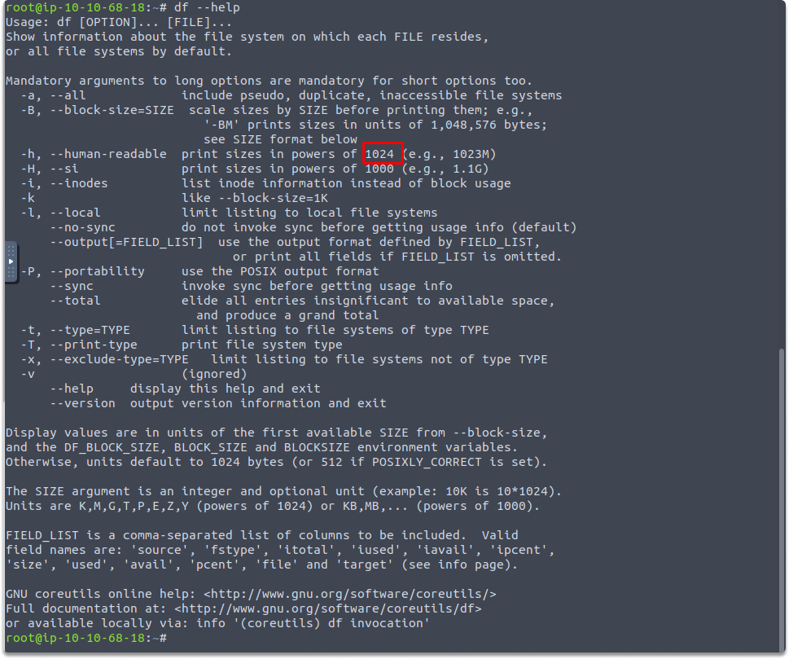

Good luck!
