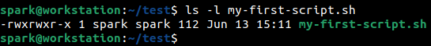

:orphan:
(linux-shell-scripts-automate-your-command-line-tasks)=

# Linux Shell Scripts: Automate Your Command Line Tasks

Have you tried using powerful Linux commands to _[view](linux-command-line-101-viewing-file-contents)_ the contents of a file, _[perform](linux-command-line-101-basic-file-and-directory-operations)_ basic file and directory operations or even to view the _[permissions](file-permissions-in-linux)_ assigned to a file? Assume there is a scenario where you are required to run a particular set of commands, many times. It will be nice to have a solution that can run multiple commands in one go, without having to type out the commands repeatedly. One solution is to use shell scripts. Or say you want to perform some tasks based on the results of one command – scripts come in handy then. This blog posts introduces you to the power of shell scripts in Linux systems.

## What is a Shell Script?

A Shell Script is a sequence of commands grouped together in one file. When the file/script is executed, all the commands mentioned in the file would be executed one after the other.

The script can contain various Linux shell commands. Various program constructs like if/else, for and while can be incorporated into shell scripts. Shell scripts can also be used to automate regular tasks like taking scheduled backups.

Scripts are executed in the _Terminal_ application.

## Example of a Shell Script

Here is the example of a simple shell script that prints the number of files and folders within a directory. From the following screenshot, notice how the `pwd`, `ls` and `wc` commands have been used. If you need a quick refresher about those commands, take a look at _[this](https://blog.mosse-institute.com/2022/06/02/linux-command-line-101-basic-redirection-and-pipes.html)_ post.

The script has been executed within _/home/spark/test_ directory.

Notice the permission string of the script. The ‘execute’ permissions have been enabled for the user, group and others. Only if this permission is set, then a script can be executed. `chmod` command can be used to modify the permissions of a file.

## How are Shell Scripts useful in cybersecurity?

Linux shell scripts are used in every cybersecurity domain.

- Pentesters and red teamers utilise scripts to identify information about the system and run various exploits.
- System administrators use scripts to take regular backups of the system and even enforce security mechanisms
- Digital forensic examiners write scripts to collect evidence from a machine and to also process the acquired log files
- Scripts can also be utilised to hunt for threats on Linux systems
- Shell scripts are also useful in reverse engineering activities

## How do I begin writing Shell Scripts?

The best way to begin writing shell scripts is by

- Understanding how basic Linux commands work
- Understand basic programming constructs like if/else, while, for
- Use the two concepts to write scripts that can perform complex tasks

Scripts written for the Linux shell usually end with the extension _.sh_. Scripts can be written in other languages like Python, Perl, PHP too.

## Project Idea

Here is a simple project idea for you:

- Write a simple bash script that prints the list of users on a system, along with the path of their home directories
- Ensure that the script has executable permissions
- Run the script and verify that it prints the list of users along with the absolute path of their home directories
