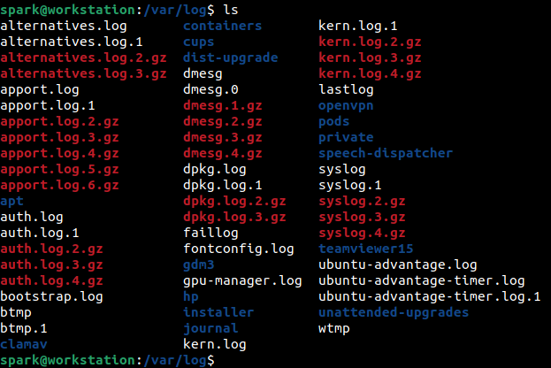

:orphan:
(log-sources-in-linux-systems)=

# Log Sources in Linux Systems

Every Linux system generates numerous logs by default, as it is being used. A DFIR professional is in a better position to handle an incident involving a Linux system, if they are aware of the various sources of logs, their locations and how the logs can be processed. This blog post highlights the various sources of logs in Linux systems.

## Log Sources

The main log store in Linux systems is within the _var/_ _[directory](a-note-on-linux-directory-structure-for-dfir)_. In this section, we will review the types of logs in _/var_ and across other locations on the system.

The following screenshot shows the various logs present within _var/_ directory on an Ubuntu system. Note that the names of some files vary across Debian and Red-Hat _[systems](a-gentle-introduction-to-digital-forensics-on-linux)_ – the variations will be covered in the following sections.

All the logs store the timestamps relevant to the time zone the device is operating in. It would be good idea to begin the investigation by _[identifying the time zone](collecting-linux-system-information-for-dfir)_ settings on the computer.

The log files are present as text files or binary files. The text files can be viewed in a text editor or in the terminal using _[file-processing commands](linux-command-line-101-viewing-file-contents)_ like head, tail, cat and tac. Binary files can be viewed using specific tools that is mentioned in the following sections.

## 1. System logs

On Debian-based distros, logs relevant to global system activity, since system startup can be found at `/var/log/syslog`. It typically stores generic information and non-critical log messages. On Red-Hat based distros, the equivalent log file is `/var/log/messages`.

Given the amount of data this file collects, it gets very large fairly quickly. To retain the logs, a process called _logrotation_ is performed. It is where logs present in `syslog` file are moved to `syslog.1` and newly generated logs would be stored in `/var/log/syslog`. Depending on the configuration of logrotation at `/etc/logrotation.conf`, the rotation is done weekly or monthly. Older logs can also be configured to be stored in compressed form. This is why you see files like `syslog.2.gz` and `syslog.3.gz` in the screenshot above. You can also configure how many rotated files must be stored at any given time.

## 2. User login logs

Information about users who have logged into the system, root user actions and SSH logins can be found within `/var/log/auth.log` on Debian-based systems and on `/var/log/secure` on Red-Hat based systems. This log file undergoes rotation. In the screenshot shown above, notice how many rotated files are present for this log.

Information about users currently logged into the system can be found in the binary file `/var/log/utmp`. The output of this file can be viewed using `who` command.

Information about users who have logged into the system at any time in the past can be found in the binary file `/var/log/wtmp`. Timestamps relevant to login and logout can be found. The output of this file can be viewed using `last` command.

Information about failed login attempts can be found in the binary file `/var/log/btmp`. The output of this file can be viewed using `lastb` command.

## 3. Kernel logs

Logs relevant to kernel events can be found at `/var/log/kern.log`.

Logs from kernel ring buffers and relevant to device drivers can be found at `/var/log/dmesg`, which can be viewed using `dmesg` command. It is typically used to troubleshoot hardware issues.

Both the files containing kernel logs are quite large and logrotation are typically configured for them. In the screenshot shown at the beginning of this blog post, do you find multiple logs for these two files?

## 4. Package Manager logs

A user may install additional software on their systems using _[package managers](installing-software-on-linux-distributions-with-package-managers)_. In some cases, installation of one software many install other malicious or suspicious dependencies. On an Ubuntu system, to find information about packages installed using _apt_, one can look at `/var/log/apt/`. This directory has a collection of rotated logs. To find information about packages installed using _dpkg_, one can look at `/var/log/dpkg.log` file.

On Red-Hat systems, `/var/log/yum.log` provides information about packages installed by _yum_.

Once you identify the package manager used on a Linux system, you can look for its relevant logs within `/var/log` directory. Some package managers store logs in a dedicated directory, while others store logs in files itself.

## 5. Service logs

If services like Apache or FTP had been installed on a system, logs for the same can be found within `/var/log`. For example: Apache web server’s access logs can be found within `/var/log/apache2/access.log`.

Logs generated by Cups print server can be found at `/var/log/cups/`. Logs generated by the mail server can be found at `/var/log/mail.log`.

## 6. Shell History

The _Terminal_ application is used quite often to interact with the system – to install packages, create/modify files, run scripts, etc. Various Linux shells like bash, csh (C shell), zsh (Z shell) or ksh (Korn Shell) serve as the back end for the terminal.

Every command typed by the user is stored by default within a hidden file in that user’s _home/_ directory. For example: bash shell history can be found in `/home/<user>/.bash_history`

There is a configuration file which controls how many entries can be stored within the shell history file, whether the timestamp at which a command was executed is stored or whether to not even store the shell history.

A forensic examiner can look for the shell history and also its relevant configuration file. However, one must remember that the shell history file can easily be manipulated by the user – by deleting it or removing specific entries.

## 7. Application Logs

Multiple applications like web browsers, integrated development environments, etc. are used on a regular basis. User-specific logs for such applications can be found within _[hidden](dont-be-tricked-by-hidden-files-viewing-hidden-files-and-directories-in-linux)_ folders in a user’s _home/_ directory.

For examples, say user _spark_ was using Firefox web browser, you can find browser history, cookies, bookmarks, etc. within files at `/home/spark/.mozilla/` directory.

Some applications store their logs in `/var/log` directory. Look at the screenshot at the beginning of this post. What applications had user _spark_ been using that may have logs within `/var/log`?

## Another Potential Log Source

The Linux Audit Log framework is a feature of the kernel that is capable of logging events on file access, command execution, network connection creation, etc. But it is not enabled by default. If a system administrator had enabled audit logging, then you will find the relevant logs at `/var/log/audit`.

Rules must be configured to define which events must be logged. A good pre-incident preparation step would be to enable audit logging on a Linux system.

## Project Idea

Now that you are aware about the various log sources on Linux systems, here is a project idea for you:

- Use a Linux host or virtual machine for this task. Any Linux distribution will work
- Identify the users who are currently logged in to the system
- Identify when the system was last rebooted
- Identify the packages that had been installed on the system recently
- Identify the commands that had been typed in the shell recently
- Review the latest log entries relevant to system activity. There are various fields of information in a single log entry. Identify what each field represents. Which field represents the severity level of a log entry?

> **Looking to expand your knowledge of incident response? Check out our online course, [MDFIR - Certified DFIR Specialist](https://www.mosse-institute.com/certifications/mdfir-certified-dfir-specialist.html). In this course, you'll learn about the different aspects of incident response and how to put them into practice.**
