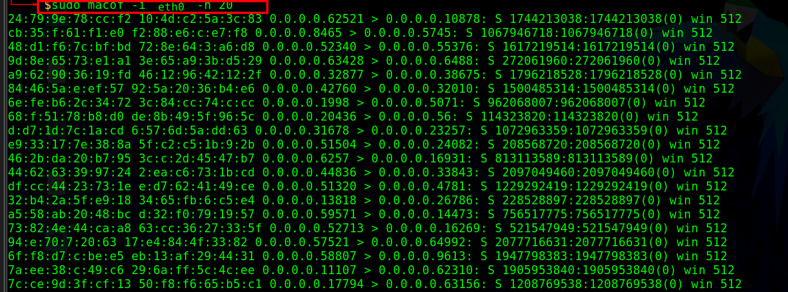

:orphan:
(mac-flooding-attack)=

# MAC flooding attack

Sniffing techniques like MAC attacks, DHCP attacks, ARP poisoning, and DNS poisoning are used by attackers to collect and modify sensitive data. These techniques are used by attackers to obtain control of a target network by reading captured data packets and then exploiting that information to break into the network.

## Media access control (MAC address)

A MAC address is a unique identifier assigned to a network interface controller (NIC) for use as a network address in communications within a network segment. MAC addresses are 48 bits long and are typically represented as 12 hexadecimal digits (0-9, A-F). The first six digits represent the manufacturer's identifier, and the last six digits represent the device's identifier.
Consider the MAC address D4-BE-D9-19-C9-29 as an example. The first six numbers, D4BED9, represent the manufacturer (Dell, Inc.), and the following six digits, 19C929, represent the adapter's serial number.

## Content Addressable Memory (CAM)

A CAM table is a fixed-size dynamic table. It saves data such as MAC addresses available on physical ports as well as VLAN characteristics linked with them. When one machine delivers data to another in a network, the data is routed through the switch. The switch searches its CAM table for the destination MAC address (contained in the Ethernet frame), and once found, it passes data to the computer via the port to which the MAC address is linked.
However, the size of CAM table is limited. If the CAM table becomes overloaded with MAC addresses, the switch will become a hub. This is done by the CAM table to ensure that data is delivered to the intended host.
If the CAM table becomes overloaded with MAC addresses, the switch will become a hub. This is done by the CAM table to ensure that data is delivered to the intended host.

## What is MAC flooding attack

MAC flooding is a technique of compromising the security of network switches that connect devices. Attackers exploit the MAC flooding technique to make a switch and act as a hub, allowing them to easily sniff traffic.
An Ethernet switch in a switched network contains a CAM table that holds all of the MAC addresses of devices in the network. A switch is a device that connects one or more computers in a network. The switch looks for Ethernet frames with the destination MAC address, compares it to the MAC address in its CAM table, and then directs the communication to the intended computer.

However, the size of the CAM table is restricted, and because it can only contain a limited number of MAC addresses, an attacker can send many fake MAC addresses to the switch. If the MAC address table becomes full, any more requests may cause the switch to enter fail-open mode.
In fail-open mode, the switch behaves like a hub, broadcasting incoming traffic via all network ports. The attacker then switches his or her machine's NIC to promiscuous mode, allowing the system to accept all traffic that comes in. As a result, attackers can easily sniff the traffic and steal sensitive information.

macof is a Unix/Linux tool that is used for flooding the local network with random mac MAC and IP addresses, causing some switches to fail and open in repeating mode, thereby facilitating sniffing.

`macof -i <interface> -n <times>`

Once the MAC table is full and the switch switches to hub mode, an attacker can monitor and capture the data being broadcasted.

## Conclusion

The outcome of a MAC flooding attack depends on how it is carried out. It may expose the user's sensitive personal information, which could be exploited for malicious purposes. Place the server behind the router to prevent MAC address spoofing. Modifying the port-security interface configuration is another technique for preventing MAC spoofing attacks.

> **Looking to expand your knowledge of penetration testing? Check out our online course, [MPT - Certified Penetration Tester](https://www.mosse-institute.com/certifications/mpt-certified-penetration-tester.html)**
