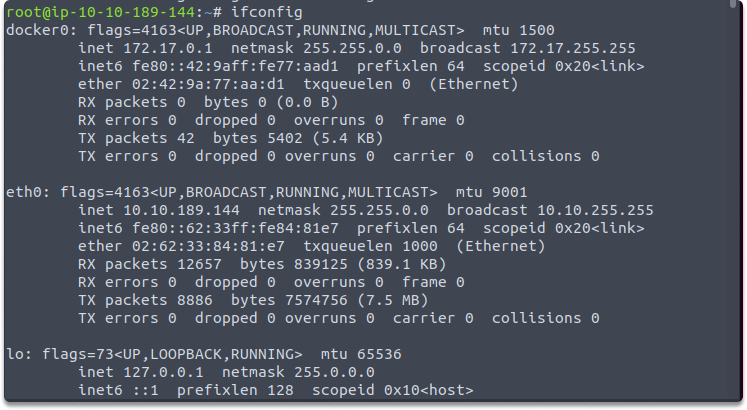
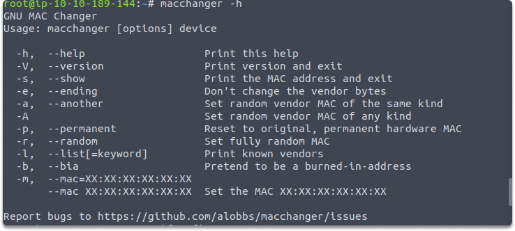
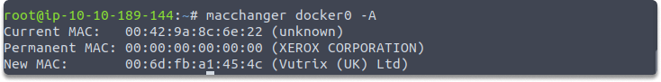
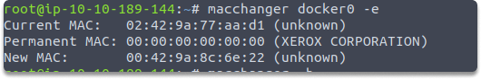
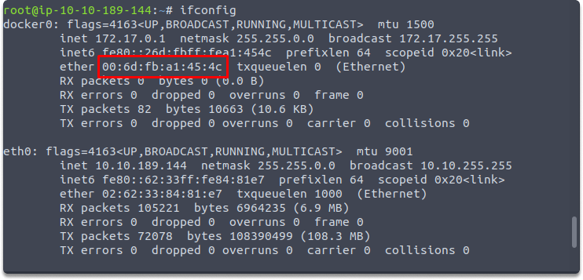

:orphan:
(mac-spoofing-made-easy-with-mac-changer)=

# Mac Spoofing Made Easy With Mac Changer

In this blog post, we will explain what mac spoofing is and demonstrate how a MAC address can be spoofed using "MAC Changer".

## What is MAC spoofing?

MAC spoofing is simply altering the MAC address of a device to falsify its origin. Since many security devices and systems depend on MAC addresses to control access to network resources, it is a typical spoofing approach.

Although MAC addresses were initially designed to be persistent and distinctive identities for network adapters, there are tools available to alter mac addresses easily.

## Network Interface Card (NIC)

When you access to a wired or wireless network, you can see that your Network Interface Card (NIC) has a pre-defined address known as a Media Access Control (MAC) address. This address is specific to every machine.
As your NIC delivers network data, your MAC address is included in the frame header, and this information may be used to distinguish your device on the network. However, you may modify the MAC address on both your Ethernet and wireless network adapters by utilizing a program called MAC Changer.

## MAC spoofing use cases

MAC spoofing has several applications. Let's look at some of them:

- Modifying your MAC address enables you to masquerade as another node on the internet.
- Mac spoofing technique can also be used to protect the identity of your attack machine.
- You may also employ this method to trick the network administrators into thinking your machine is one of their existing end devices.

## MAC spoofing with MAC changer

Before altering the MAC address, you must turn down the wireless interface. On you Kali Linux, open the Terminal and use the `ifconfig` command to determine the number of network interfaces, as shown here:

`$ ifconfig`

We will change docker0 interface but you can replace it with your interface such as eth0, wlan0.

`ifconfig docker0 down`

Next, use the macchanger -h command to view a list of available options:

`macchanger -h`

We are going to set a fully random MAC address on the docker0 interface by using the following command:

`macchanger -A docker0`

As an alternative we can also change the MAC address to keep the vendor bytes, using the following command :

`macchanger docker0 -e`

The output shows that macchanger assigns new mac address to our interface.

And lastly, run the following command to update the status of the docker0 interface from down to up:

`ifconfig docker0 up`

You can also run ifconfig to verify the changes again

`ifconfig`.

## Conclusion

This page shows us that changing a mac address is a quite easy technique to hide an attacker's real identity.

## Test your knowledge

Which macchanger command alters the current burnt-in address to a fully arbitrary one?

> **Looking to expand your knowledge of penetration testing? Check out our online course, [MPT - Certified Penetration Tester](https://www.mosse-institute.com/certifications/mpt-certified-penetration-tester.html)**
