:orphan:
(malware-hunting-detection-tools)=

# Malware hunting: Detection tools

Malware will not disappear anytime soon. To remain undetected as long as possible, malware authors employ a variety of tools and methods. We also require a variety of tools and techniques to locate them. Whether we're searching for a Meterpreter session or a DLL injection, we should have an abundance of tools available. In this article, we will examine a variety of tools that aid in the search for malware on networks.

We are on the lookout for malware in numerous locations:

- Injected into other processes
- In memory (known as fileless malware)
- Hiding in plain sight
- In files (for instance, macros)
- In email attachments, etc.

## PE Capture

The **PE Capture** tool from NoVirusThanks captures PE files, executables, DLLs, and drivers loaded into the operating system. Any loaded executable (PE, EXE, etc.) is displayed in the graphical user interface and a copy is saved in the intercepted folder for further analysis.

The name of the copied file is the file's hash value. Additionally, the tool logs execution events to make it easier to locate a previously captured PE file.

[Here](http://www.novirusthanks.org/products/pe-capture/) you can download the tool.

PE Capture is also available as a service-only version, which enables installation on multiple computers. It lacks a graphical user interface (GUI). The software is free for individual use only.

[Here](http://www.novirusthanks.org/products/pe-capture-service/) you can learn more about the tool.

Observing the screenshot at the bottom, the suspect DLL is loaded in memory. The GUI displays both the DLL's path and its hash.

We can now examine the Intercepted or Logs folders to determine what information has been saved for us.

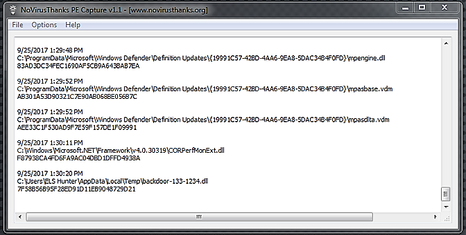

In the File menu, we can select either Open "Intercepted" Folder or New Folder:

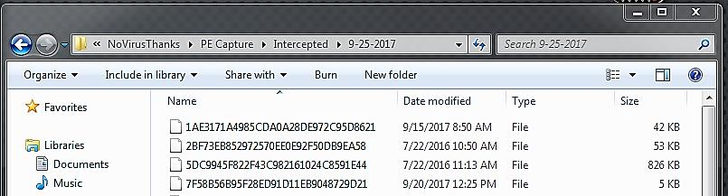

You can now analyze the exported file to see if it is benign or malicious.

We can already confirm based on the indicators shown below that this is malicious.

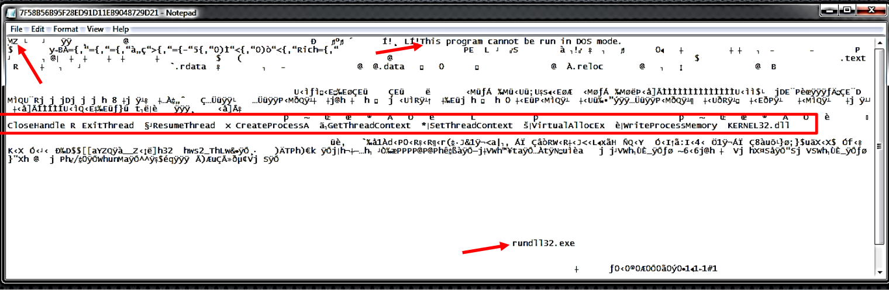

It is possible to determine what was loaded onto the system earlier that day by reviewing the logs. Since the GUI displays information in real time, you may discover something that you were unaware was loaded.

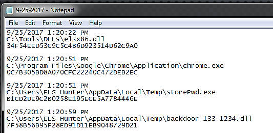

## ProcScan.rb

Ruby's `ProcScan` can be used to search for code injection in the process memory. Unfortunately, it is only compatible with 32-bit systems and lacks support for 64-bit systems and applications. [Here](https://github.com/abhisek/RandomCode/tree/master/Malware/Process) you can download the tool.

To execute the program, enter the following command:

```bash
ruby ProcScan.rb
```

Here is the output of the command if code injection is detected:

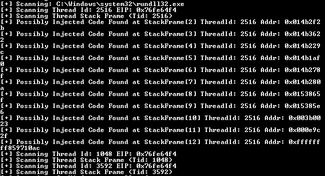

The tool has detected a potential code injection vulnerability within thread id `2516` of the `rundll32` process.

Sadly, the tool does not provide the PID in the same output, but it is simple to obtain using PowerShell.

Simply enter `get-process` or `ps` (alias) to obtain a list of the system's running processes.

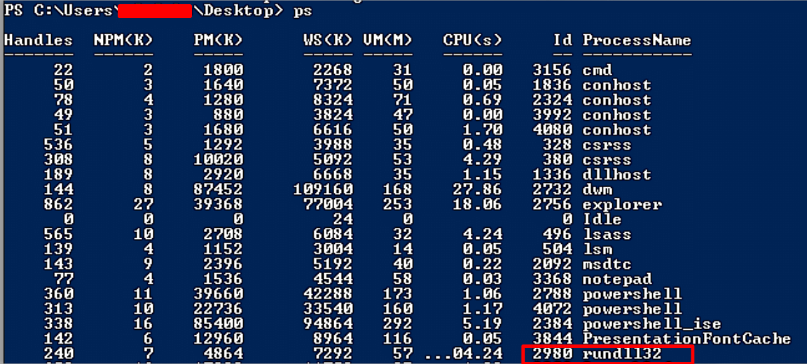

You can also confirm the thread id of the process using PowerShell.

You can use the following command:

```powershell
ps | % {$_.Name ; $_.Threads} | % {"`t{0}" -f $_.ID}}
```

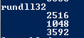

## Meterpreter Payload Detection

The following tool is known as Meterpreter Payload Detection. As its name suggests, the tool will examine all running processes on the system to identify Meterpreter. [Here](https://github.com/DamonMohammadbagher/Meterpreter_Payload_Detection) you can download the tool:

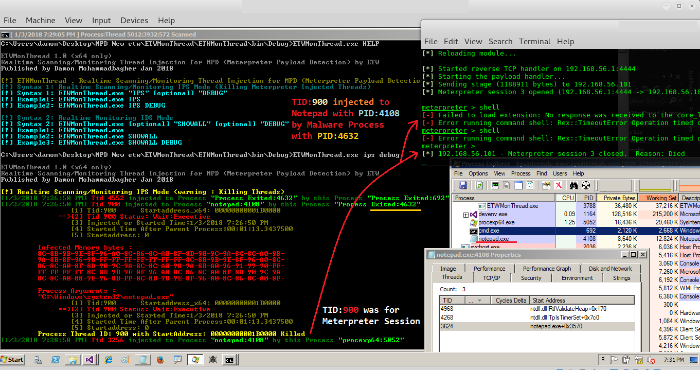

Simply execute the tool's binary executable from a command prompt with elevated privileges to use it:

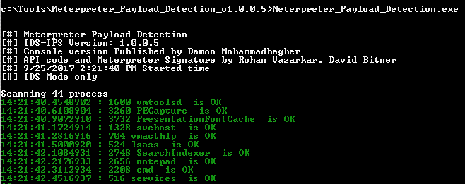

Similar to PE Capture, it is a live capture, so the tool will continuously run and notify you of an active Meterpreter session in memory.

If the tool detects a running Meterpreter session in memory, this is the output:

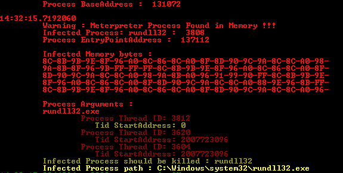

> NOTE: The Thread ID displayed in the output should not be misinterpreted. This process is distinct from the one depicted in the PE Capture screenshots.

## Reflective Injection Detection

By searching for a PE header, this tool can detect reflective DLL injections running in memory. Additionally, the program dumps information regarding the injected process and other unlinked executable pages to the root folder.

[Here](https://github.com/papadp/reflective-injection-detection) you can download the tool.

Simply run the binary executable from an elevated command prompt to launch the tool:

```powershell
reflective-injection-detection.exe
```

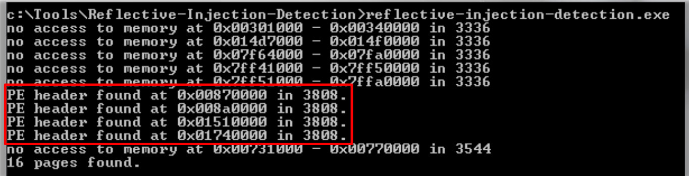

You may recall from the output of Meterpreter Payload Detection that `PID 3808` corresponds to the process running a Meterpreter session.

This `rundll32` process is successfully flagged by the Reflection Injection Detection tool.

If we navigate to the root folder of the Tool, we will find all of the artifacts that the tool dumped for us, allowing us to analyze them further. Each file's name corresponds to the PID. This will facilitate an easy correlation between the file and its process.

You may also observe that the files dumped by process `3808` indicate that `MZ` was discovered by including this information in the filename:

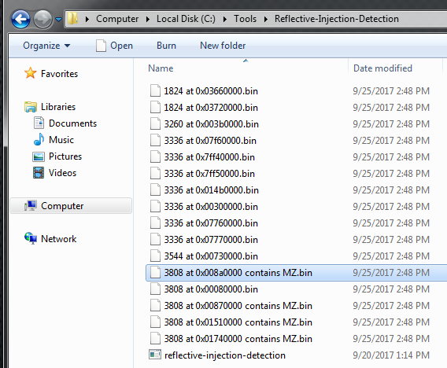

## PowerShellArsenal

The _PowerShellArsenal_ module is used to assist a reverse engineer. The module can be used to disassemble managed and unmanaged code, to analyze `.NET` malware, to analyze/scrape memory, to parse file formats and memory structures, to obtain internal system information, etc.

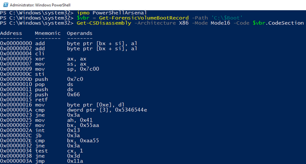

Remember that the output of the previous tool, Reflective Injection Detection, contained the base address and `PID`.

To link this tool's output with that of PowerShell Arsenal, we will rerun Reflective Injection Detection and record the output. Then, we will execute the `Find-ProcessPEs` cmdlet from PowerShell Arsenal.


The suspicious process has a PID of `3624`, and the output contains four base addresses. Now, let's compare the results of running `Find-ProcessPEs`.

In this case, the syntax is:

```powershell
Find-ProcessPEs -ProcessID 3624
```

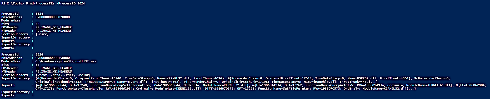

`Find-ProcessPEs` provides the same information regarding the base address, but this cmdlet provides additional information:

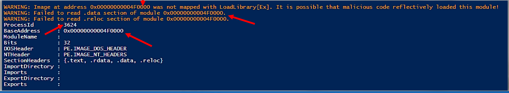

Here we can see detailed output for the next detected PE:

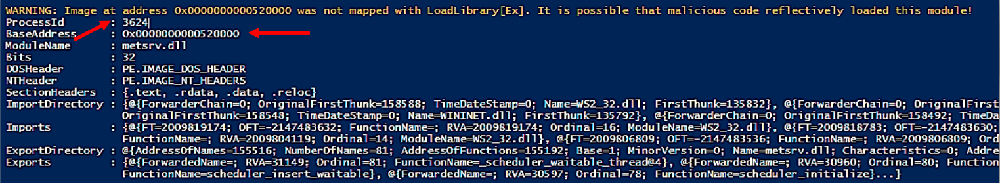

Next one:

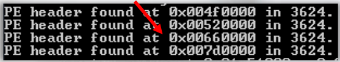

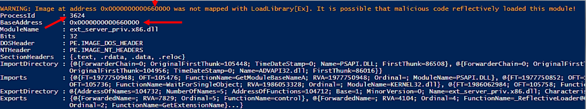

## Get-InjectedThread.ps1

This PowerShell utility can aid in the detection of code injection. This tool will examine the system's active threads. It will retrieve the starting address of particular functions, such as `NTQueryInformationThread`, and if executable code is discovered, it will be marked as injected.

[Here](https://gist.github.com/jaredcatkinson/23905d34537ce4b5b1818c3e6405c1d2) you can download the script.

This tool will be employed against the same suspect process, `rundll32` (`PID 3624`):

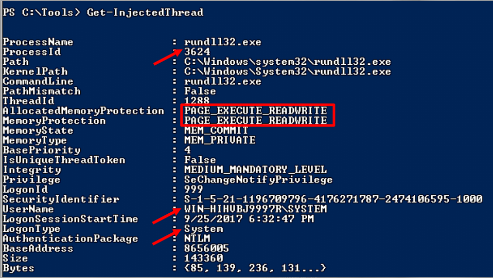

We recommend that you conduct your own research to fully comprehend the results of this tool.

## References

[PE Capture](http://www.novirusthanks.org/products/pe-capture/)

[PE Capture Service](http://www.novirusthanks.org/products/pe-capture-service/)

[Meterpreter Payload Detection](https://github.com/DamonMohammadbagher/Meterpreter_Payload_Detection)

[Reflective Injection Detection](https://github.com/papadp/reflective-injection-detection)

[PowerShellArsenal](https://github.com/mattifestation/PowerShellArsenal)

[Get-InjectedThread.ps1](https://gist.github.com/jaredcatkinson/23905d34537ce4b5b1818c3e6405c1d2)

> **Want to learn practical Threat Hunting tactics and strategies? Enrol in [MTH - Certified Threat Hunter Certification](https://www.mosse-institute.com/certifications/mth-certified-threat-hunter.html).**
