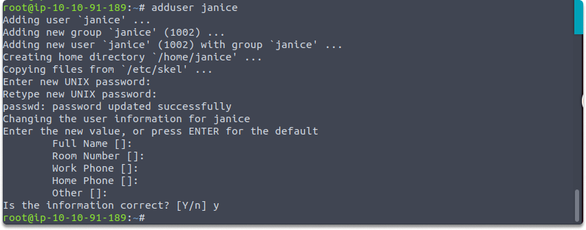

:orphan:
(managing-linux-user-accounts)=

# Managing Linux User Accounts

In a previous article we discussed [Linux Account Types](https://blog.mosse-institute.com/2022/06/06/user-accouts-on-linux-systems.html). In this blog article, we will discuss managing Linux user accounts.

## List current users

First, let’s list all users with this command. With the help of `awk` we will display only the user names on the console.

` awk –F: ‘{ print $1}’ /etc/passwd`

## Add new users

To add a new user account, you can run the `adduser` or `useradd` command, as root user.

`$ adduser elya`

And you can hit enter all the rest after specifying and retyping the password

Let’s run this command again to verify that we have successfully created a new user named elya.

## Delete users

Let’s delete _elya_ account. You can delete an account by using the`userdel` command with the -r option.

`$ userdel elya`

Let’s run the previous command to verify the deleting action.

## Switch users

Let's have a look at how to shift an account from root to a regular user. The'su' command, which stands for switch user, is used to switch users.

Switch from root to regular user:

`$ su <regular_username>`

Let’s switch from root to elya. Run this command: `su elya`
Now let’s go back to root again. You just need to run this command.

`$ exit`

Now let’s create another use named janice. And let’s switch from root to elya and then to janice.

`adduser janice`
`su elya`
`su janice`
`exit`

## Quick project: Applying add, delete, switch user commands in terminal

_Time estimated: 5 minutes_

- Open your terminal and list all current users
- List current users with this command: `$ awk –F: ‘{ print $1}’ /etc/passwd`
- Create the accounts provided in the chart.

- After creating these accounts verify by running the list current user command you learned.
- Before deleting the users, switch from Roy to Quinn by utilizing `$ su <name>`
- And complete the task with the following delete user action.

Congratulations. Now you know the basics of the user account system on Linux and you are capable of listing current users, changing users and performing adding/deleting actions.
