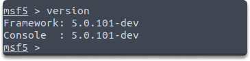
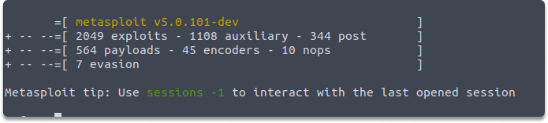
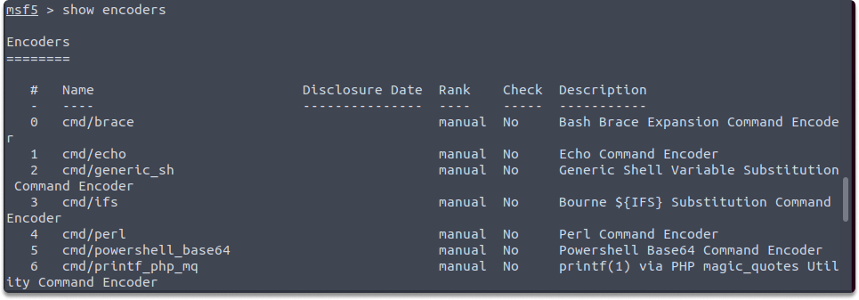
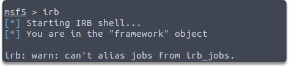
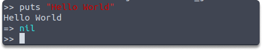
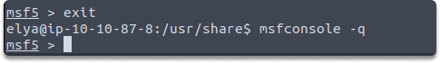
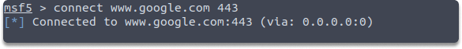
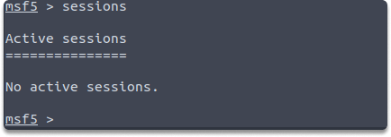
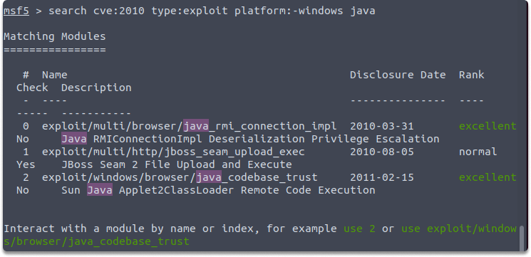

:orphan:
(metasploit-hands-on-with-basic-commands)=

# Metasploit: Hands-on with Basic Commands

In this blog post, we are going to get started with the essential utilities of Metasploit by performing tasks.

## Hands-on with `msfconsole`

**Task 1:** Check the version of your current Metasploit framework installation.

_Answer:_
We can check the current version of our Metasploit framework with the following command:

`version`

**Task 2:** How many payloads are available in your current Metasploit framework?

_Answer_: We can display the number of available payloads with the following command:

`banner`

**Task 3:** What is the name of the encoder with the index number [3]?

_Answer_: We can display all available modules by running the following command.

`show encoders`

In our case, cmd/ifs is the encoder with index number 3 in the encoders list in our Metasploit framework.

**Task 4:** Print “Hello World” to the console in Ruby.

_Answer_: We can achieve this by invoking Ruby within the Metasploit Framework. It is especially useful when you need to write customized scripts during the post-exploitation phase. Run the following command to call Ruby:

`irb`

Now let’s print out the string specified for this task with the following command:

`puts “Hello World”`

**Task 5:** Exit from Metasploit and start it without banner.

_Answer_: When you first open Metasploit, you can also display the banner info with msfconsole, however, if you don’t want to see banner details you can use the following command:

msfconsole -q

**Task 6:** How do you scan port 443 on www.google.com in the Metasploit?

_Answer_: You can use the following command to perform a quick port scan:

`connect www.google.com 443`

**Task 7:** How many active sessions do you have?

_Answer_: We can check how many sessions we acquired by running the following command:

`sessions`

**Task 8:** Check what exploits are currently available in your Metasploit for Eternal Romance.

_Answer_: There are a vast amount of packages of exploits and payloads in Metasploit. While searching for modules we can check what exploits are available for a specific tag. We can run the following command to search available exploits for Eternal Romance by running the following command:

`search eternalromance`

**Task 9:** Search for windows-based 2010 CVE java exploits by utilizing the search command in Metasploit.

_Answer_: It is possible to search specifying certain parameters such as author, CVE date, platform, and so on. Now let’s make our search a bit more narrow and reduce it to one type of exploit.

`search type:exploit platform:-windows cve:2010 java`

**Quick Excercise**

- Open your Kali terminal.
- Start Metasploit and update your framework to the newest available version.
- Search for CVE 2009 nagios3 exploits in Windows with an excellent ranking score for CVE. What is the name of the exploit?
- And lastly, think about how you can achieve this output in Metasploit. What is the proper use of command?

:::{seealso}
Looking to expand your knowledge of penetration testing? Check out our online course, [MPT - Certified Penetration Tester](https://www.mosse-institute.com/certifications/mpt-certified-penetration-tester.html)
:::
