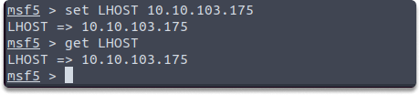

:orphan:
(metasploit-hands-on-with-variables)=

# Metasploit: Hands-on with Variables

While working with Metasploit, most vulnerabilities in the Metasploit Framework require us to specify settings for some of the variables. This blog post will provide you with hands-on experience with exploit and payload modules global and local variables. It would be more effective if you follow along with us in your Kali terminal. Let’s dive right in...

## Common variables in Metasploit Framework

Let’s have a look at the most important variables in the Metasploit Framework:

- RHOST: This variable is simply The IP address of the remote target device.
- RHOSTS: By modifying this variable you can set or feed multiple RHOSTS.
- RPORT: This variable holds the value of the remote target system such as 445 for SMB.
- LHOST: This variable stores the value of your attack machine's IP address.
- LPORT: This variable holds the value of your attack machine port number. You can set it in some situations such as waiting for a reverse shell from the target system.

After deciding on what module to use, we need to check the requirements in Metasploit. While working with exploit and payload modules you can run the following command to see which parameters you need to adjust to make the exploit work.

`show options`

As you can see, there are some required variables for our current session. If you don’t set these parameters modules may not work properly. So let’s learn how to modify them.

## Modifying variables

After looking at a variety of variables, let's take a look at some of the most common methods for assigning variable values.

### How to get the current value of the variables?

In these situations, you can use the following command to retrieve the value stored in a certain Metasploit Framework local variable.

`get`

The get command is used follwd by a variable name. Let’s check the current LHOST value.

There is another command similar to get but it returns the global variable:

`getg`

Since they are empty right now, you might be asking how can we assign a value to these variables. Let's learn how to achieve this.

### How to assign a value to a variable?

You can use the following command to assign a value temporarily (which is valid for your current session or instance):

`set`

You can use the following command to assign a value permanently:

`setg`

### How to change the current value of a variable in Metasploit?

Well you can use the following commands to change the previous value of a variable with the newly assigned one. You can use unset for local and unsetg for global variables.

`unsetg`

`unset`

## Project tasks

- Open your msfconsole
- Search for Apache Druid service.
- Select the exploit and take a look at the required parameters.
- Set the global LHOST variable as the same as your attack machine.
- Verify the newly assigned LHOST ip address.

:::{seealso}
Looking to expand your knowledge of penetration testing? Check out our online course, [MPT - Certified Penetration Tester](https://www.mosse-institute.com/certifications/mpt-certified-penetration-tester.html)
:::
