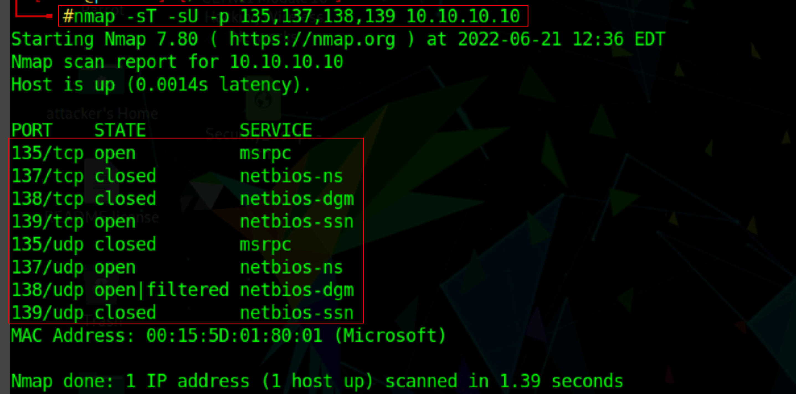
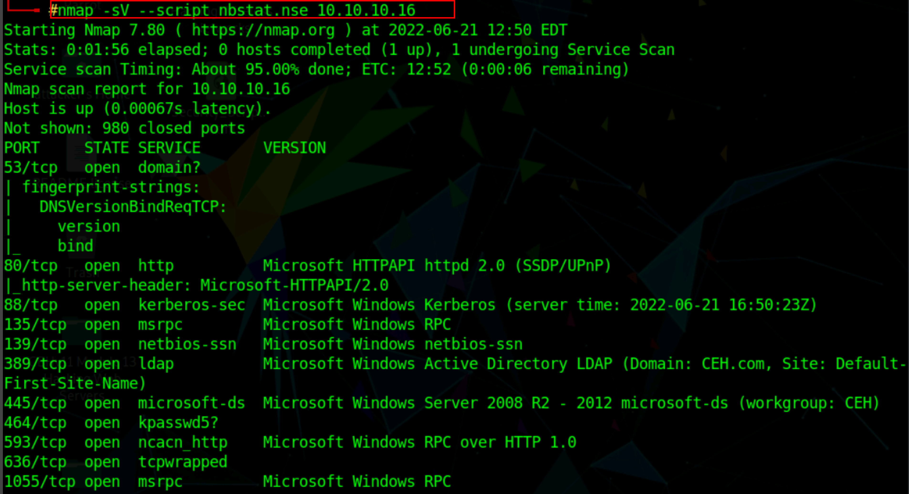
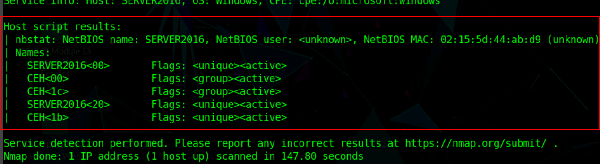
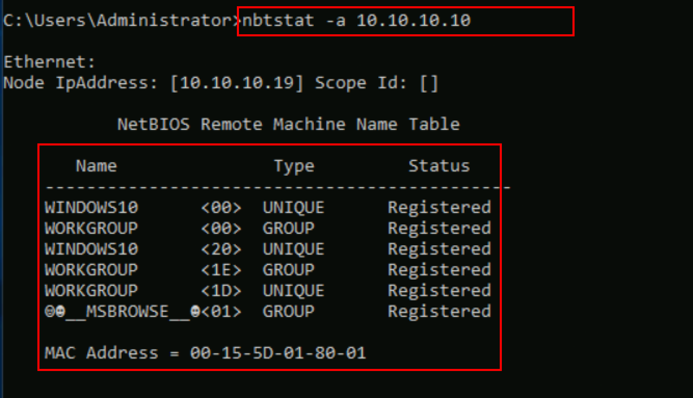
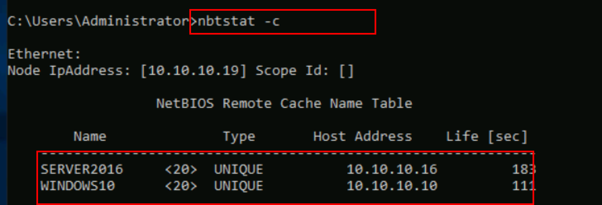

:orphan:
(netbios-enumeration)=

# Netbios Enumeration

Most of the time, security experts/Penetration testers enumerate NetBIOS at the initial phase of the enumeration because it extracts a large amount of sensitive information about the target network, such as users and network shares. NetBIOS, which stands for Network Basic Input/Output System, was created in 1983 by Sytek, Inc. for IBM PC networking. NetBIOS is not a networking protocol but rather another one of the creations in networking that was originally designed to make life easier for us.

NetBIOS is a service that enables the communication between applications in an Ethernet or token ring network, such as a printer or another computer via the NetBIOS name. NetBIOS began as an API for client software to access local area network (LAN) resources.

The NetBIOS name is a unique 16-character ASCII string provided to Windows computers to identify network devices; 15 characters are used for the device name, while the remaining 16 characters are reserved for the service or record type.

NetBIOS uses `UDP port 137` (name services), `UDP port 138` (datagram services), and `TCP port 139` (session services).

_NetBIOS offers three different services:_

1. Name service (`NetBIOS-NS`) for name registration and resolution via `port 137`.
2. Datagram distribution service (`NetBIOS-DGM`) for connection less communication via `port 138`.
3. Session service (`NetBIOS-SSN`) for connection-oriented communication via `port 139`.

## Scanning for Open port for Netbios enumeration :

Nmap tool can be used to scan for TCP and UDP open ports and protocols. Use the following command to scan for open ports.
`nmap -sT -sU -p 135,138,137,139 <target Ip address>`

The scan results show that `port 137` is **open** for NetBIOS name services, and the scan findings also show the **MAC address** of the target machine.

Nmap Scripting Engine (NSE) is used by attackers to discover NetBIOS shares on a network. Attackers can retrieve the target's NetBIOS names and MAC addresses using the NSE nbtstat script. By default, the script displays the computer's name and the currently logged-in user.
`nmap -sV -v --script nbstat.nse <target IP address>`

### Nbtstat Enumeration

Nbtstat is a Windows tool that helps in the troubleshooting of NETBIOS name resolution issues. Using multiple case-sensitive switches, the nbtstat command removes and corrects preloaded items. Nbtstat is used by attackers to collect data such as NetBIOS over TCP/IP (NetBT) protocol statistics, NetBIOS name tables for both local and remote machines, and the NetBIOS name cache.

The following command can be used to execute to obtain the NetBIOS table name of the remote computer.
`nbtstat –a <IP address of the remote machine>`

The result appears, displaying the NetBIOS name table of a remote computer (in this case, as shown in the screenshot.

`Nbtstat -c`
Nbtstat -c command can be used to get the contents of the NetBIOS name cache, the table of NetBIOS names, and their resolved IP addresses.

### Conclusion:

Enumeration is vital in penetration testing because it uncovers hidden information from a victim's machine. The remote system must have allowed file and printer sharing to enumerate the NetBIOS names. NetBIOS enumeration could allow an attacker to access the data of a remote system and shares present on that system or launch a DoS attack.

:::{seealso}
Looking to expand your knowledge of penetration testing? Check out our online course, [MPT - Certified Penetration Tester](https://www.mosse-institute.com/certifications/mpt-certified-penetration-tester.html)
:::
