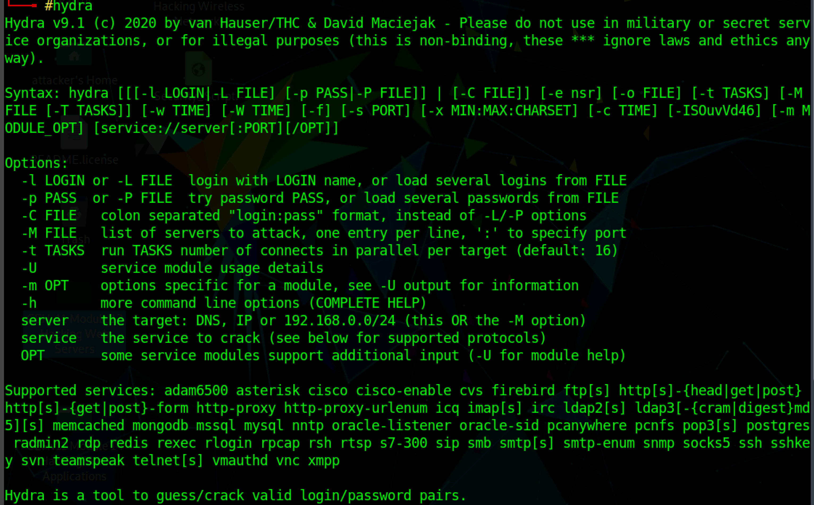

:orphan:
(password-spraying-with-hydra)=
# Password Spraying with Hydra
 
In a brute force attack, an attacker tries to guess a password by trial and error method to try and break into the device, network, or website. 
Let’s say an attacker is trying to hack into the account called `victim_user`. Initially, the attacker will first generate a list of passwords to use based on the passwords he found online or based on the interests of the user. Then, the attacker writes or uses a script or a tool and continuously tries to login into the service or device using that script.

Applications are getting smarter these days. Account lockout restrictions are now used by the vast majority of web apps. The application will prevent additional login attempts for an account if it notices that there have been a number of unsuccessful attempts to log in within a short period of time.

Attackers will need to spread out their password guesses in order to prevent account lockouts. Because of this, brute force takes too long. Because of this, hackers are switching from brute-forcing to **password spraying**.

In a technique known as **password spraying**, the attacker tries the same password on numerous accounts before moving on to a different one and repeating the procedure. This works well because many people use passwords that are obvious and straightforward, such as "password123".

## Using Hydra tool to spray passwords

Hydra is an authentication brute-forcing tool that can be used for many protocols and services. It is a parallel processing logon cracker that supports many attackable protocols. It is flexible and quick, and adding new modules is simple. With the help of this tool, security experts and researchers can demonstrate how simple it would be to hack a system from a distance.

Currently, this tool supports: It supports: Cisco AAA, Cisco auth, Cisco enable, CVS, FTP, HTTP(S)-FORM-GET, HTTP(S)-FORM-POST, HTTP(S)-GET, HTTP(S)-HEAD, HTTP-Proxy, ICQ, IMAP, IRC, LDAP, MS-SQL, MySQL, NNTP, Oracle Listener, Oracle SID, PC-Anywhere, PC-NFS, POP3, PostgreSQL, RDP, Rexec, Rlogin, Rsh, SIP, SMB(NT), SMTP, SMTP Enum, SNMP v1+v2+v3, SOCKS5, SSH (v1 and v2), SSHKEY, Subversion, Teamspeak (TS2), Telnet, VMware-Auth, VNC, and XMPP. 
For more detailed information, read the Kali Hydra tool page: [Click here](https://www.kali.org/tools/hydra/)

Installation of hydra is fairly simple, In Kali Linux, and Parrot OS a version of hydra is already installed. Or you can use the following commands to install.

`sudo apt-get install hydra` 

The basic syntax of the Hydra command is 

`hydra -L <USERNAME_LIST> -P <PASSWORD_LIST> <TARGET_IP> <PROTOCOL>`



```
-l is for a single username 
-L is for the list of usernames
-P is for the list of passwords
```

In the example given below, we are password spraying against the **File transfer protocol (FTP)** whose IP address is `10.10.10.10` and contains multiple users. 


Since it is a password spraying attack, we need to use the `“-u” flag`. The -u flag tells hydra to try each password for every user first and then move on to the next user, instead of trying every password on a single user.

## Conclusion: 

Malicious hackers use the method known as "password spraying" to get around measures like account lockout that prevent brute-force attacks. These types of attacks are simple to execute and yield effective results. Some of the measures to mitigate these attacks are by enabling Multi-factor authentication, Implementing a password policy that prevents using easy-to-guess passwords. 

> **Looking to expand your knowledge of penetration testing? Check out our online course, [MPT - Certified Penetration Tester](https://www.mosse-institute.com/certifications/mpt-certified-penetration-tester.html)**