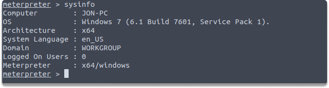
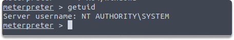
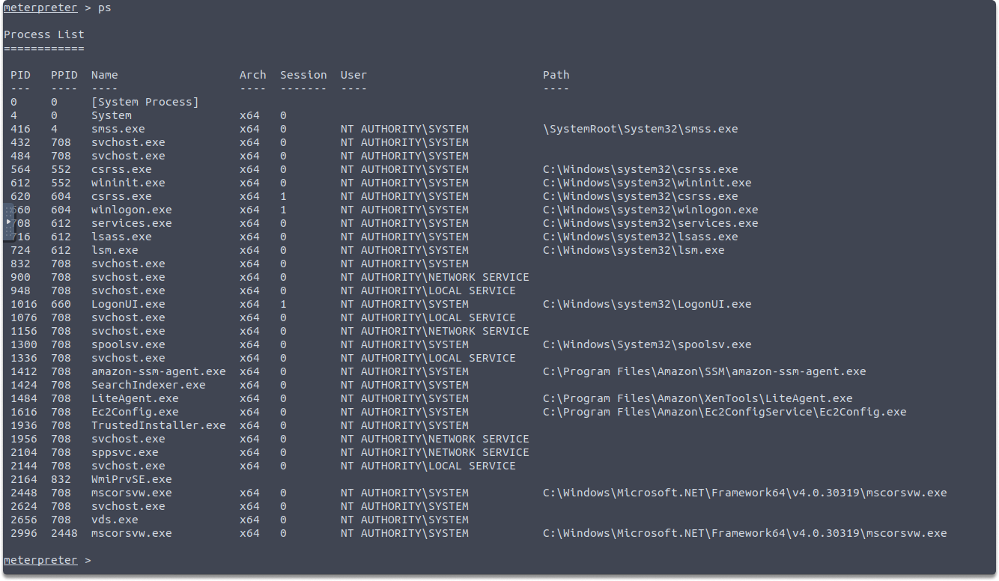
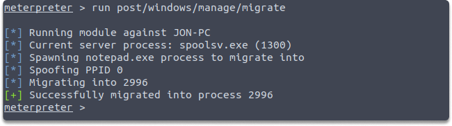

:orphan:
(post-exploitation-information-collection-and-persistance-via-process-migration)=

# Post-Exploitation: Information Collection and Persistance via Process Migration

Once we obtain the Meterpreter session, we can execute various post-exploitation commands. In this blog article, we will perform fundamental command-line actions that allow penetration testers to acquire precise information about the host and we will also learn how to migrate a process for a more reliable connection with the target system.

Assuming that you have acquired access to a vulnerable remote system. The first thing you want is to gather some system information and data such as local user profiles and password hashes.

## Collecting data about the target system

Let’s start with `sysinfo` command. `sysinfo` displays us what platform the target system is functioning on. Following command instructs Meterpreter to get system info about the victim computer, like the hostname, OS, and a number of logged-on users. Sysinfo can also show you who is actively signed in. Run this command on your the Meterpreter session:

`sysinfo`

Let us now examine the kind of rights you have. It's critical to understand who is running the Meterpreter session on the hacked server. Enter the following command to display the user privileges:

`getuid`

The Meterpreter instance is executing with system-level privileges on the remote host computer as indicated in the image above.

Now let us look at the active processes. Monitoring the operations on a compromised system allows the penetration tester to display a list of running programs, the process IDs, the users, and user rights that are operating the process. The `ps` command in Meterpreter shows the following process information on the exploited host:

`ps`

Identifying the users and user privilege information linked with ongoing processes allows penetration testers to assess if the target system has privileged user accounts and session tokens. A malicious actor can also use this information during privilege escalation, token theft, and impersonation attacks.

## Process Migration

Lastly, let’s think about what happens if the target terminates the service while we are exploiting a service? You guessed right. When the target system stops a service, the Meterpreter session is also terminated, and this means that we lose connection with the target host. However, there is a Meterpreter module to avoid this issue which is called `post/windows/manage/migrate`.

We can migrate the process to a memory area that will not lose connection when the target stops it. In this way, we preserve our connection to the system. Use the following command to automatically transfer the Meterpreter process to a less noticeable but more stable process on the target computer:

` run post/windows/manage/migrate`

As shown in the screenshot, the post-module successfully migrated the process to another process ID on the compromised host.

## Conclusion

Upon completion of this blog post, now you have learned how to collect information about a compromised system and transfer the Meterpreter process in the post-exploitation phase.

### Quiz

Which command we can also use in the post-exploitation phase to get hashes of the passwords locally stored in SAM files?

:::{seealso}
Looking to expand your knowledge of penetration testing? Check out our online course, [MPT - Certified Penetration Tester](https://www.mosse-institute.com/certifications/mpt-certified-penetration-tester.html)
:::
