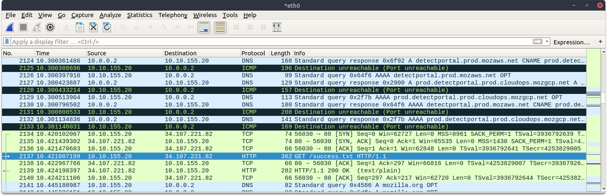
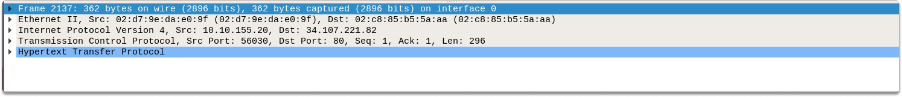
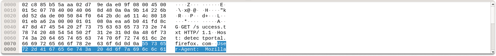
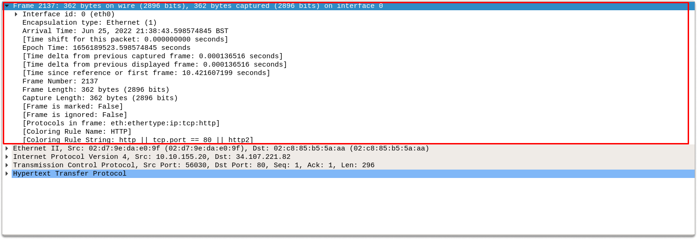
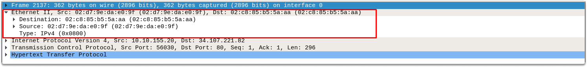
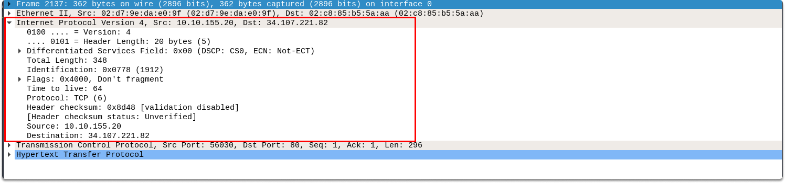
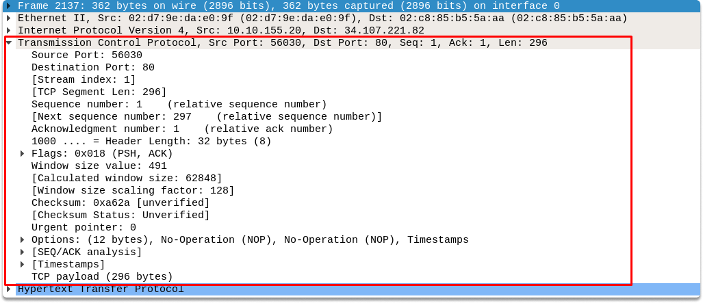
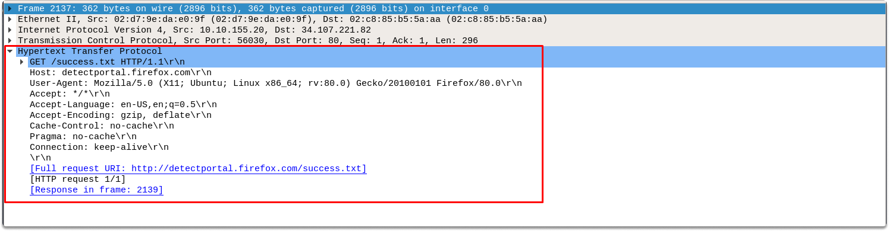

:orphan:
(practical-introduction-to-wireshark)=

# Practical Introduction to Wireshark

A packet-level examination is the best technique to comprehend the dissemination of data in network communications. In this blog post we are going to take a look at the benefits of packet-level analysis, and make a quick introduction to Wireshark GUI referencing their counterparts in Open Systems Interconnection (OSI) model.

On the most general basis, we use Wireshark for observing network activity. However we can also benefit from packet analysis capabilities using a technology of our selection in many cybersecurity applications. For example, we can conduct network inspections and detect and address networking quality problems, make a deep packet inspection for malware analysis or various attacks, and analyze data breaches. Before performing analysis, we need to understand how to read traffic in Wireshark GUI. Now let’s take a quick look at the prominent sections in Wireshark.

## Understanding Wireshark panes

These are the three panes in Wireshark:

- Packet List Pane: This area shows all of the different packets collected by Wireshark.
  It also provides some basic information about the packets that may be impacted by the display filtering.

- Packet Details Pane: This panel displays information about the packet that was specified in the packet list section. The content of the packets is organized into distinct protocol groups, and you can extend each one to acquire additional information about the packet you want to inspect.

- Packet Bytes window: This bar displays the bytes of the chosen message in hex dump format and is impacted by what is chosen in the previous pane.

- The status bar section: This section provides information such as the total number of packets recorded.

## Understanding packet details pane

Wireshark displays the packet divided into subtrees and each subtree corresponds to one OSI layer (or belongs to the preceding one such as protocol errors).

- The first pane in the packet details subtree is **Frame** which corresponds to the physical layer in the OSI model.

- The second pane is **Ethernet II** which displays source/destination (Mac) details. This pane corresponds to layer 2 in the OSI model.

- Then follows the Source/destination (IP) details that correspond to the 3rd(network) layer of the OSI model. We can see the source and destination IPv4 Addresses.

- The protocol section corresponds to the 4th(transport) layer of the OSI model. Here we see what protocol is in use (TCP or UDP) along with its port details.

- Protocol Errors: This section follows the protocol section if there are any packets to reassemble.

- Application Layer Protocol section: This pane displays attributes characteristic to the protocol in use and corresponds to the application layer of the OSI model.

- Application-specific data: This is an extension of the application layer protocol and displays additional data related to the application layer.

## Conclusion

Upon completion of this blog page, now you are familiar with Wireshark GUI and have a fundamental knowledge of how OSI works. You also learned how to read and analyze a live or captured packet on the most fundamental terms.

### Research Task

Wireshark has powerful filters which we will use in future blog posts for network traffic analysis. Research how to narrow down traffic results in the packet list pane only to HTTP requests.

> **Do you want to get practical skills to work in cybersecurity or advance your career? Enrol in [MCSI Bootcamps](https://www.mosse-institute.com/bootcamps.html)!**
