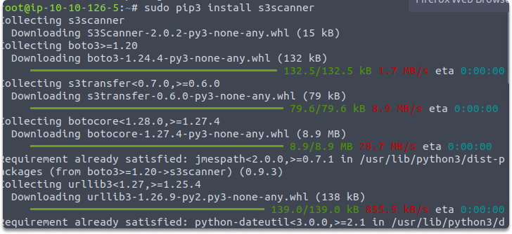
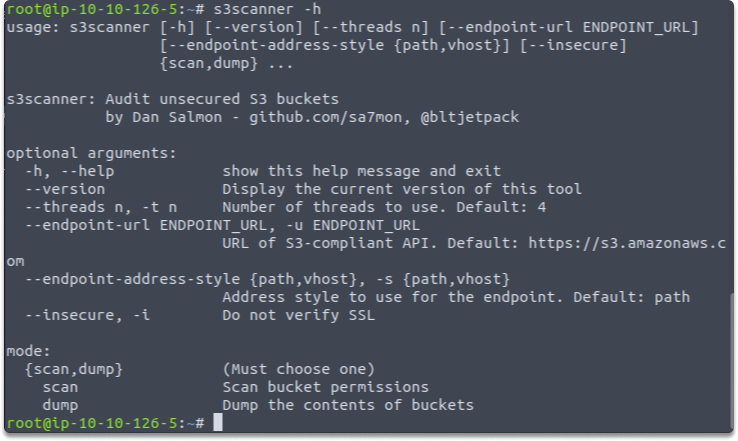
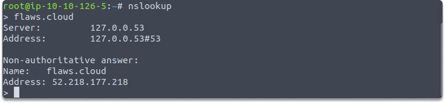
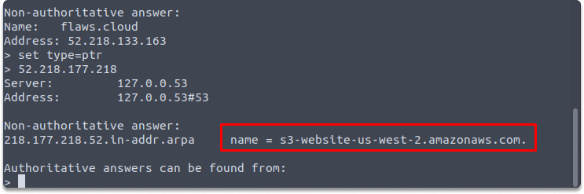

:orphan:
(s3-bucket-url-enumeration)=

# S3 Bucket URL Enumeration

Amazon S3 is a cloud-based file storage service offered by Amazon Web Services (AWS). It is designed to provide high-speed data access and is often used to store and distribute static files such as website images, videos, and documents. In this blog post, we will cover the basics of the Amazon S3 service and how to enumerate S3 Bucket URLs with `flaws.cloud`.

## What is an S3 bucket?

When you enable the S3 service by Amazon, a bucket is produced. A bucket is a storage area inside the AWS platform that allows customers to add and remove and manage data.

## What does an S3 permission structure look like?

There are two permission schemes in S3 buckets.

- The first is access control policies (ACPs), which are mostly utilized by the web interface.
- And the second schema is IAM access policies, which are JSON objects providing a more fine-grained view of privileges.

## Role assignment in S3 buckets

Permissions can be applied to either a whole bucket or an asset or assets inside a bucket. To grant somebody permission to an object, you must first grant them access to a bucket, and afterward to the specific objects themselves.

## What does an S3 URL look like?

If we need to give an provide an imaginary path, an S3 asset URL might look like this:

`s3.amazonaws.com/animals/puppy.png` or `s3.amazonaws.com/animals/puppy.png`

## How to access S3 buckets?

You have two choices to access and manage your buckets.
The WebGUI provides access to S3 bucket objects. Alternatively, the AWS s3 cmdlet in the AWS command-line interface (CLI) can be used to access them. These two tools allow you to upload, download, and remove bucket items.

Now that we have learned some basics let’s make a quick exercise to decide if a website is hosted on the AWS cloud.

### Hands-on with flaws.cloud: Obtaining the URL of an S3 bucket
For this quick exercise, open your Kali and run the following command. This command will install S3Scanner to perform AWS S3 bucket enumeration:

`sudo pip3 install s3scanner`



Let’s get a better idea of the features of S3Scanner. Run this command

`s3scanner -h`



Next, let's use nslookup to obtain the IP addresses of the hosting server for the website:

```
nslookup
>flaws.cloud
```



Now let’s attempt to retrieve the hostname that is mapped to 52.218.133.163

Run this common inside nslookup

```
set type=ptr
>52.218.228.98
```

Now we know that this website is hosted on an AWS S3 bucket.



We have already learned what an S3 bucket looks like in the earlier sections of this blog. This means that the following can be determined:

- What is the bucket name?: `s3-website`
- What is the region?: `us-west-2`

## Summary

In this blog, we covered the very basics of the S3 bucket briefly and obtained the URL of an S3 by utilizing flaws.cloud, s3scanner and nslookup.

:::{seealso}
Looking to expand your knowledge of penetration testing? Check out our online course, [MPT - Certified Penetration Tester](https://www.mosse-institute.com/certifications/mpt-certified-penetration-tester.html)
:::
