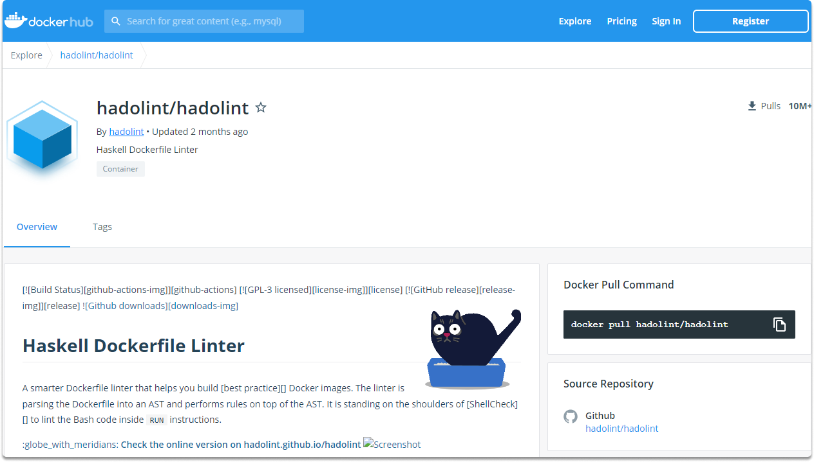

:orphan:
(secure-your-docker-containers-for-peace-of-mind)=

# Secure Your Docker Containers for Peace of Mind

Programmers mostly encapsulate and deliver the source code in containers, often Docker containers. Now that we have learned what is Docker and its benefits let's leverage this with a security focus. In this blog post, we will learn how to harden docker containers.

## Container security best practices

When it comes to utilizing and protecting containers, there are several recommended practices to follow. Let’s look at a few of them.

### Regular monitoring and auditing

First and foremost you should inspect containers on a regular basis to maintain consistency and security. You should maintain this attitude even if the application has achieved a steady-state and updates are done less often or active development has ceased.

### Controlling dependencies

If the program is still running with its underlying containers containing the various application dependencies, these containers must be examined because a new or existing dependency may introduce a new vulnerability.

### Linting

Linting is the process of inspecting code for faults or incorrect syntax. You can utilize linting to perform Static Code Analyzer (which is abbreviated as SCA) of Dockerfiles and ensure that these files keep secure.

Hadolint: Haskell Dockerfile Linter (Hadolint) is a common linting tool for this purpose. It's accessible as a Docker image as shown in the illustration and can be easily run with the following command:

`$ docker run --rm -i hadolint/hadolint`

Hadolint scans the source code and, if all is fine, produces an exit code of 0. It will display a Hadolint error (DL) or SellCheck error (SC) key whenever it detects faults or questionable practices.

You can pull and run hadolint with the following commands:

`$ docker pull hadolint/hadolint`

`$ docker run --rm -i hadolint/hadolint`

Aside from linting, Docker suggests certain best practices for container security. Docker already handles namespaces and network stacks to provide isolation, ensuring that containers do not get privileged access to other containers unless explicitly indicated in the settings. Following that, there are several critical points to consider:

Docker makes use of the Docker daemon. This daemon needs admin rights, which raises security issues. To begin, only trustworthy people should be able to configure the daemon's parameters.

### Reducing the attack surface

Next, you must take steps to limit the daemon's attack surface by assigning access privileges to the Docker host and guest containers.

### Verification of Docker Content Trust Signature

It is highly urged to employ Docker Content Trust Signature Verification. It's a feature offered through the 'dockerd' program which allows you to configure the Docker engine to only process signed packages. You can utilize a Notary for the signature itself.

## Conclusion

In this blog post, we learned basic steps to secure our Docker containers. If we implement these suggestions, we will have validated, persistent images that can be used to install and distribute containers securely.

:::{seealso}
Want to learn practical DevSecOps skills? Enroll in [MDSO - Certified DevSecOps Engineer](https://www.mosse-institute.com/certifications/mdso-certified-devsecops-engineer.html)
:::
