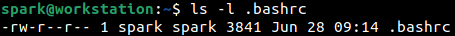
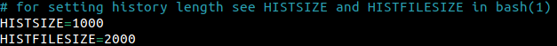

:orphan:
(shell-history-in-linux)=
# Shell History in Linux

We use the *Terminal* application on Linux systems regularly to type powerful commands to interact with the system, alter the behaviour of the system, work with files/directories, etc. The *Terminal* uses Linux shells in the backend to receive commands from the user, interact with the system and display relevant results to the user. Linux systems are configured by default to store a history of the commands typed by the user, also referred to as *shell history*. In this blog post, we will see how shell history is useful in DFIR activities and how this capability can be best tuned for *[pre-incident preparation](pre-incident-preparation-for-a-smoother-incident-response-process)*.

## Bash Shell History

GNU Bourne Again Shell, abbreviated as *bash* shell is used by default on most Linux distributions. To find out which shell is in use on your system, open up the *Terminal* and display the value of the *[environment variable](environment-variables-in-linux)* *SHELL*. From the following screenshot it can be seen that user *spark’s* computer is using bash shell - *bash* is the name of the binary for it, stored in *bin/*.

Within the user’s *home/* directory, there is a file called *.bash_history* that stores a list of the commands typed on the terminal. Note the dot in front of the file name. This is a *[hidden file](dont-be-tricked-by-hidden-files-viewing-hidden-files-and-directories-in-linux)*.

To view the contents of *.bash_history*, the file can be opened in a text editor or `history` command can be used to view the entries. From the following screenshot, we can see the output of `history` command, displaying the shell commands that had been typed by the user. Note that the list of commands is numbered, starting from 1.

There is another hidden file within the user’s *home/* directory called *.bashrc* that stores configuration information for the shell.

Within *.bashrc*, there is a parameter called HISTSIZE which specifies how many commands can be stored in memory for the current shell session. Parameter HISTFILESIZE specifies how many commands would be stored within the *.bash_history* file.

Once 2000 commands have been stored within the shell history file, older entries would be removed as new entries come in.

Usually, shell history is written into *.bash_history* when the current shell session is terminated. This means when you type commands during a session (you may open multiple tabs in the terminal during the session), the commands are written into the history file only when you close the *Terminal*. If the system suddenly crashes when *Terminal* is being used, then shell history for that session is not captures. For commands to be immediately written into the history file as they are typed, the following line can be added to the shell configuration file *.bashrc*

`PROMPT_COMMAND=’history -a’`

Once this line has been added to the shell configuration file, refresh the configuration used by the shell using `source` command as shown below. Here ~ symbol refers to the home directory of the current user. The command can be read as `source /home/spark/.bashrc`. 

Now when you type commands in the terminal and attempt to view the contents of *.bash_history*, you can see that the file is immediately updated. Try it out!

## How is bash shell history useful in DFIR?

Bash shell history is extremely useful during DFIR activities to identify which commands had been typed on the system recently. It is possible to find out if any scripts had been executed, if any services had been started/stopped, if any software programs had been installed, if any commands had been executed, etc.

Timestamps are extremely useful in digital forensics. You may have noticed from the preceding screenshots that within the shell history, timestamps of when the commands had been executed is not stored. However, it is possible to store timestamps of when a command had been typed by simply adding the following line to the *.bashrc* file and refreshing the configuration used by the shell.

`export HISTTIMEFORMAT=”%h %d %H:%M:%S ”`

From the following screenshot you can see how the timestamps appear within the shell history file. Note that the timestamps displayed are relevant to the time zone the device is currently operating in.

When you view the *.bash_history* file in a text editor, you can see that the timestamps are stored in *[epoch time format](timestamp-format-in-windows-linux-mac-os)*. 

## What are some pre-incident preparation steps to be followed with respect to Linux shell history?

We saw that user *spark* was able to modify the configuration of the shell configuration file *.bashrc*. Now let’s assume *spark* had typed a command and wants to erase evidence of having typed it. Then the *.bash_history* file can simply be opened in the text editor and the specific line of interest can be deleted. 

In the following screenshot, it can be seen that user *spark* has removed the second line in the history file that had previously existed. Compare with an earlier screenshot to identify the difference.

If a regular user can do this, then even when a Linux system has been exploited, the cyber adversary can also modify the shell configuration file and also erase evidence of any commands typed, by deleting entries in the *.bash_history* file. There are two steps that can be taken to deal with this situation.

1. The root user must prevent a user from modifying their shell configuration file.
2. The root user must ensure that the shell history file cannot have entries deleted by a user.

How can this be achieved? Using Linux File Attributes. They are special flags attached to every file on a Linux system, that dictate how the file must exist and how it can be used.

There is one file attribute called ‘immutable’. When a file is tagged with this attribute, then the file cannot be modified in any way or be deleted.

There is another file attribute called ‘append only’. When a file is tagged with this attribute, then contents can only be appended to the file – contents cannot be deleted from the file.

Only the root user can modify the attributes assigned to a file using `chattr` command. However all users can view the attributes assigned to a file using `lsattr`.

The root user is now logged into the computer and is currently in *spark’s* *home/* directory. Using `lsattr` the current attributes assigned to *.bashrc* can be seen. Currently an attribute ‘e’ is assigned to the file. It is usually assigned by default to all files on recent Linux systems. It signifies how files are stored on disk. Details of attribute ‘e’ is beyond the scope of this blog post.

Now root user can make the shell configuration file immutable by adding attribute *i* to it as shown in the following screenshot.

We can confirm that attribute *i* is assigned to the file. Any attempts made by *spark* to modify this file will be prevented.

The root user views the current attributes assigned to *.bash_history* using `lsattr`.

Adding ‘append only’ attribute *a* to this file will ensure that no contents can be removed from it.

The newly assigned attributes can be seen using `lsattr`.

Now if *spark* attempts to remove any lines from the shell history file and save it, there will be message saying that permission is denied. The file attributes are in action!

**Caveats**:

1. A user may sometimes require to legitimately modify the shell configuration file. In that case, if the root user had marked it as immutable then the user will not be able to modify it in any way. A request will have to be raised to the system administrator.
2. When the shell history file has the ‘append only’ attribute set, the HISTFILESIZE parameter in the shell configuration file does not have any effect. This means the file size of the shell history file keeps increasing as commands are typed in the *Terminal*. The system administrator must take steps to ensure that the shell history file does not occupy too much space on disk. One option would be to regularly take backups of the shell history file and store it elsewhere on the organization’s storage systems.

## What about other shells?

Like bash shell, there are other shells available – as listed in the following table. You can also see the names of the corresponding history files and shell profiles. You can also see the name of the binaries of each shell. Depending on which shell is being used on a system, the SHELL environment variable will be configured with the path to the binary. For Bourne shell, which is an older version of Bourne-Again shell, the history file did not exist in some distributions and had to be created manually.

| **SHELL TYPE** | **HISTORY FILE** | **SHELL CONFIG FILE** | **BINARY NAME** |
|----------------|------------------|------------------------|-----------------|
|     C shell    |     .history     |         .cshrc         |     /bin/csh    |
|   Korn shell   |    .sh_history   |         .kshrc         |     /bin/ksh    |
|     Z shell    |   .zsh_history   |         .zshenv        |     /bin/zsh    |
|  Bourne shell  |      depends     |          .shrc         |     /bin/sh     |

## What next?

Now that you know about how to view and process shell history, and also its importance in DFIR; go ahead and try this out on your computer or virtual machine. Type some commands into the terminal, view the history of the commands typed. Login as the root user and modify the attributes of critical files and see how it affects a user’s access to those files.

> **Want to learn practical Digital Forensics and Incident Response skills? Enrol in [MDFIR - Certified DFIR Specialist](https://www.mosse-institute.com/certifications/mdfir-certified-dfir-specialist.html).**