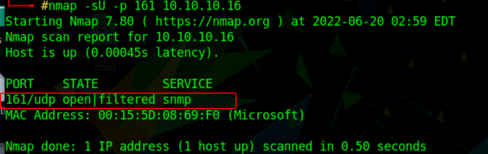
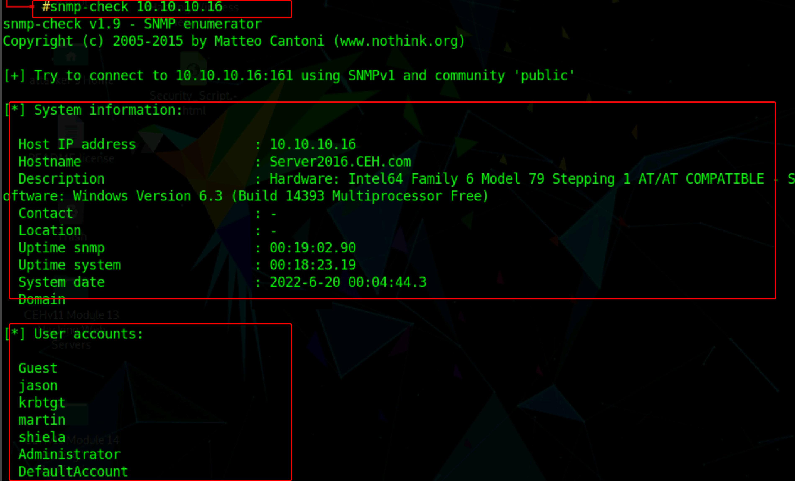
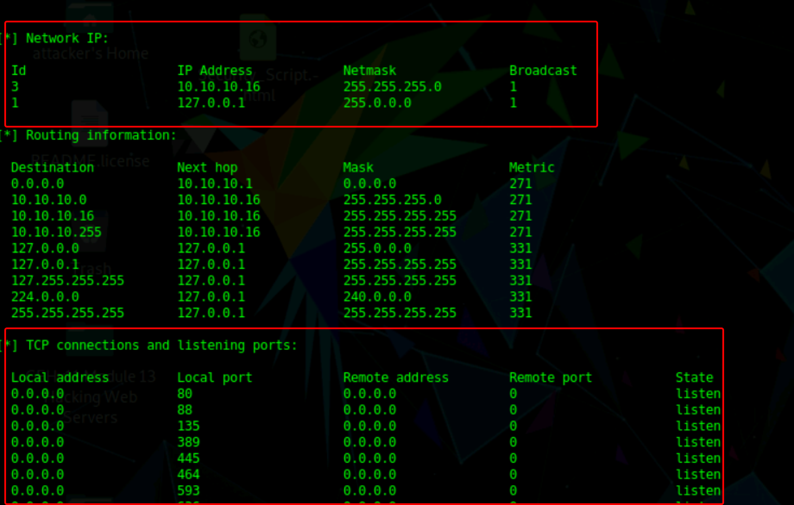

:orphan:
(snmp-enumeration-with-snmp-check)=

# SNMP Enumeration with snmp check

Enumeration occurs after scanning and is the process of gathering and compiling usernames, machine names, network resources, shares, and services.

## SNMP

The Simple Network Management Protocol (SNMP) is a network management protocol that is used to manage networked devices from a remote location. SNMP is an application-layer protocol that operates on UDP and maintains and administers IP network routers, hubs, and switches. However, SNMP has numerous security bugs, such as a lack of monitoring.Usually, attackers take advantage of these vulnerabilities to enumerate accounts and devices connected to the network.

For communication, SNMP makes use of two basic types of software components: the SNMP agent, which is situated on the networking device, and the SNMP management station, which communicates with the agent.SNMP agents run on Windows and Unix networks on networking devices.

Almost all network infrastructure components, such as switches and routers, include an SNMP agent for system or device management. The SNMP management station sends requests to the agent, which responds after receiving the request. Requests and responses are both configuration variables that the agent software can access. SNMP management stations transmit requests to set variables' values.

The agents respond to the requests by going to the virtual database on each device called the **management information base (MIB)**. MIB holds information, and its arranged with numeric identifiers called **object identifiers** or **OIDs**.Traps notify the management station when an odd event occurs on the agent's side, such as a reboot or an interface failure.

SNMP contains two passwords for configuring and accessing the SNMP agent from the management station. **Read community string**, with the help of this password, the configuration of the device can be viewed and these strings are public. **Read/Write community string**, with the help of these strings the device configuration can be changed and these strings are private.
If the community strings are left in the default settings, attackers can take advantage of these default community settings for editing or reading the configuration of the devices or system.

## SNMP Enumeration with SNMP-check tool

Snmpcheck is an open-source tool distributed under the GNU General Public License (GPL). snmpcheck allows you to enumerate SNMP devices and outputs the results in a very human-readable way. It could be beneficial for penetration testing or monitoring systems.

This tool is used by attackers to obtain information about the target, such as contact information, write access, devices, domain, hardware and storage information, hostname, Internet Information Services (IIS) statistics, IP routing, listening UDP ports, and so on.

Before starting the enumeration, we need first to discover whether the SNMP port is open. To check whether the port is open, we can use the Nmap port scan.

Enter the following command in the terminal
`nmap -sU -p 161 <target IP address>`

_Port 161 seems to be open/filtered and used by SNMP service._

Now to obtain information about the target system, type the following command and press Enter
`snmp-check <target IP address>`

The snmp-check command enumerates the target machine and lists information such as system information, user accounts, Network information, network IP, and listening ports.

Scroll down to view detailed information regarding the target network under the following sections: networking IP, routing information and listening ports.

Similarly, scrolling down reveals furthermore sensitive information on storage information, file system information, shares, device information, etc.

## Conclusion

This article talks about what SNMP enumeration is and how security professionals can use the snmp-check tool to enumerate sensitive information that may be useful in penetration engagements.

:::{seealso}
Looking to expand your knowledge of penetration testing? Check out our online course, [MPT - Certified Penetration Tester](https://www.mosse-institute.com/certifications/mpt-certified-penetration-tester.html)
:::
