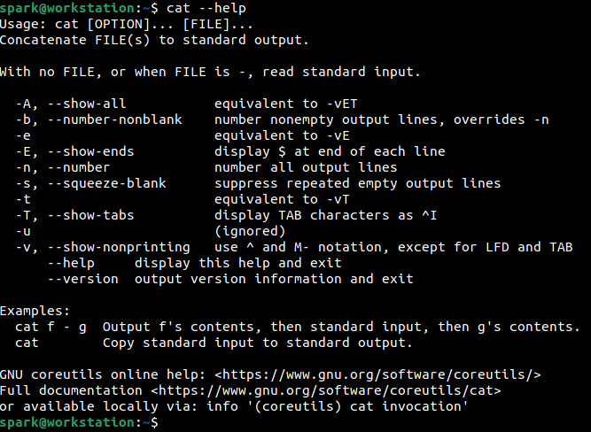
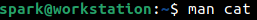
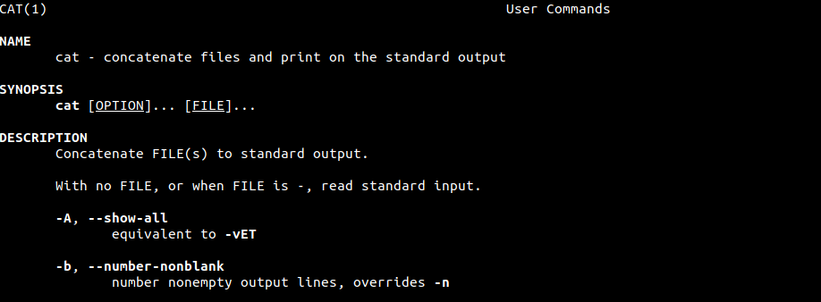
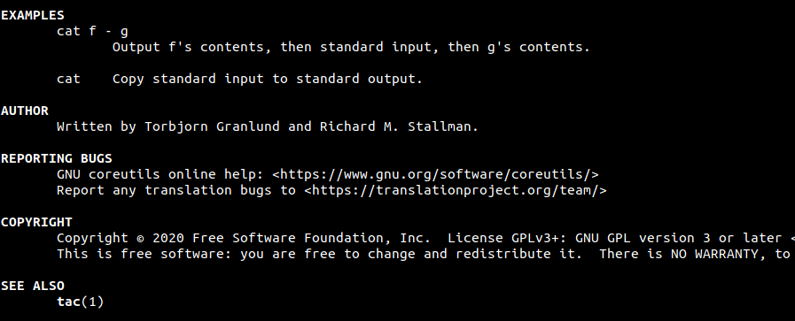
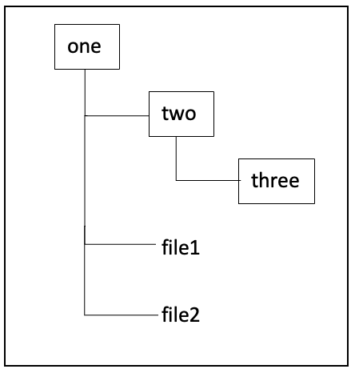

:orphan:
(so-many-linux-commands-and-switches-how-do-i-remember-them-all)=

# So many Linux commands and switches – How do I remember them all?

As a cybersecurity professional, you will encounter and use Linux systems quite often. Most of the time, you will be using the _Terminal_ application to run some commands on your system. There is a long list of commands that can be used on the terminal and each command has numerous switches. It is intimidating to have to remember them all. This blog post tells you how you can work your way around Linux commands and their switches.

## Getting help from the Linux system itself

Do you want to refresh your knowledge about basic Linux commands to _[perform file and directory operations](linux-command-line-101-basic-file-and-directory-operations)_, _[viewing file contents](linux-command-line-101-viewing-file-contents)_ or about _[redirection and pipe operators](linux-command-line-101-basic-redirection-and-pipes)_, before you proceed with the rest of this post? _[This](dont-be-tricked-by-hidden-files-viewing-hidden-files-and-directories-in-linux)_ post introduces you to viewing hidden files and directories on Linux.

## Using --help

`cat` command is typically used to print all the lines of a file to the _Terminal_. If you want to print the lines, but also number each line, then a specific switch must be passed to `cat`. One way to identify what that switch is, is by simply passing _--help_ to `cat` as shown in the following screenshot.

_--help_ is used to display a quick summary of the possible switches that can be used with a command. Can you identify which switch can be used to display the line number in the output?

Yes, it is _-n_. The entire command would look like this:

` cat -n [file]`

Note the second line of output. The ‘Usage’ syntax of a particular command and its switches would be displayed. OPTION refers to the switches that can be used.

## Using manual pages

There is another way to get more detailed information about the switches that can be used for a command. It is by looking through the ‘manual page’ of that command, which can be accessed using `man` command. The syntax to use `man` is as follows:

`man [command to view manual page for]`

The following screenshot shows the command used to view the manual page for `cat`.

Within the manual page, you will find various sections of output, as shown in the following screenshot.

To search within this page, simply type `/[word-to-search-for]` and press _Enter_. If the word is found in the man page, then the entry will be highlighted. Try it out!

Quite often, the manual page of a command will present more information for it than when –help is used.

Towards the end of the manual page, you will also find some usage examples, author of the binary (`cat` in this case), copyright information, link to report bugs and related commands if any – as shown in the following screenshot.

`cat` prints the contents of a file from top to bottom, while `tac` does the same thing in reverse – prints the contents of a file from bottom to top. Try viewing the manual page for `tac`!

## Project Idea

Here are some project ideas for you:

1. A directory has multiple files and folders within it. How will you list the permissions of all those files and folders using a single command?

- We know that `ls` command is used to list the contents of a directory. Using switches, it is possible to view the permissions of all files/folders within that directory and also view all the hidden files in that folder.
- There is another switch, that can be used to ‘recursively’ list all the files/folders within a specific directory. What does recursive listing mean? Say you have the following directory structure: Directory _one_ has a sub-directory _two_ and two files _file1_ and _file2_. _two_ in turn has a sub-directory _three_. To recursively list the contents of _one_ means: to list _two_, _file1_, _file2_ and also _three_.

Recursive listing = Listing files/folders at each sub-level

- Use --help or the man page to identify the switch that can be passed to `ls` command to recursively list the contents of a directory.
- Go one step further, combine some switches and recursively list the permissions of all files/folders within a directory.

2. `date` command is used to print the current date and time on a system. The output is of the format:

[day] [date] [current time in HH:MM:SS AM/PM] [timezone]

It is possible to control the format in which the day, date and times are displayed. Note that the default output is displayed using AM/PM.

- Identify the switch that can display the date in 24-hour time.
- Identify the switch that can print the alphabetic and numeric representations of the timezone the device is operating in.

Now, with an idea about the basic commands and how to extend their use with the help of man pages, you will soon be able to run complex commands in the terminal!
