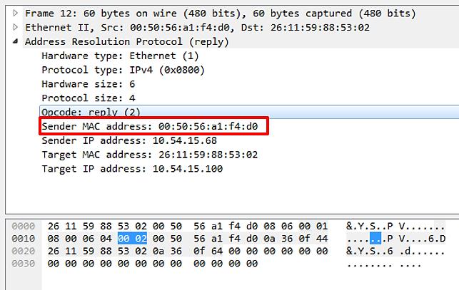

:orphan:
(stay-one-step-ahead-of-the-hackers-by-hunting-suspicious-traffic)=

# Stay One Step Ahead of the Hackers by Hunting Suspicious Traffic

It is essential to understand what is normal in order to recognize what is not normal, such as a connection to port `443` with cleartext traffic. It is not possible to examine hundreds of thousands of packets per day at a workstation. Should malicious traffic traverse our hunting grounds, we should have access to a variety of enterprise products, including open-source software, that will assist us with this task and, ideally, capture a substantial amount of it. In this article, we will discuss how to identify normal network traffic when analyzing packets. The purpose of this article is to train your eye should you ever be required to inspect live or saved network traffic (`PCAP`).

## ARP traffic

Beginning with the `ARP` protocol.

Again, although we should be familiar with these protocols, we will briefly describe each one before analyzing their respective traffic.

_ARP_ is a Layer 2 protocol that `IP` uses to map `IP` addresses to `MAC` addresses.
Typically, `ARP` messages consist of a `REQUEST` message and a `RESPONSE` message. The message header is concluded with one of the operation codes listed below:

- Request (1)
- Reply (2)

In [RFC 826](https://www.ietf.org/rfc/rfc826.txt), you can read more about `ARP`.


Some information to help differentiate between normal and suspicious ARP traffic.

### Normal ARP Traffic

- ARP broadcasts are typical from clients and servers, as well as network devices at a normal rate.
- Typically, `ARP` Request is followed by a response, but this depends on who initiated the request.
  A network device may send numerous `ARP` broadcasts for a variety of reasons.
- Legitimate gratuitous `ARP` packets.

### Suspicious ARP Traffic

- In a short amount of time, tens, hundreds, or even thousands of `ARP` broadcast messages are sent.
- Two identical MAC addresses with distinct IP addresses exist in a network.
- Gratuitous `ARP` packets sent by an attacker.

An attacker can manipulate the `ARP` cache tables of other hosts by sending unnecessary `ARP` replies. _Gratuitous ARP replies_ are `ARP` Reply messages that were not requested.
Thus, an attacker can send an `ARP` Reply without waiting for a host to send an `ARP` Request.
The `ARP` cache table may then contain fictitious data, and the attacker may send `ARP` replies every `30` seconds or so to prevent the poisoned entry from expiring.

Below is a snapshot of 2 packets: 1 ARP Request & 1 ARP Reply:


To view the `MAC` Address for both the source and the destination, we can make the following Wireshark adjustment:
_View -> Name Resolution -> Physical Address Resolution_


This image depicts an ARP Request packet:


The request (1) in the highlighted line indicates that this is an `ARP` Request. The device at `10.54.15.100` requires the `MAC` address for `10.54.15.68` in order to initiate communication with it. If the device at `10.54.15.100` already knew the `10.54.15.100` MAC address, it would be contained in its `ARP` table (`ARP -a` from command line):

```bash
arp -a
```

This packet contains the response to the preceding packet:



This packet contains the `ARP` Reply. We can quickly determine based on the Opcode (2). Within this packet, the Sender `MAC` address contains the `MAC` address of the device located at `10.54.15.68`.

This `MAC` address will be added to `10.54.15.100`'s `ARP` table.

The preceding packets were generated by a virtual machine.

The following packet reflects an `ARP` Request with a broadcast address as the destination within a network.


Using Wireshark, we will now examine an example of suspicious `ARP` traffic.

Remember the following guidelines regarding normal and suspect ARP traffic:

- _Normal_: ARP broadcasts from clients and servers, as well as network devices at a reasonable rate, are normal.

- _Suspicious_: Tens, hundreds, or even thousands of ARP broadcast messages within a brief time frame.

Here is an image of a packet capture.


It displays seven ARP Request packets that were broadcast.
According to physical address name resolution within Wireshark, the source device appears to be a Cisco device that is monitoring the status of various network devices.

:::{seealso}
PCAP from [Wireshark Sample Captures](https://wiki.wireshark.org/SampleCaptures)
:::page

How would we determine whether or not this is suspicious traffic? How do we know it's not an issue with the Cisco device's configuration or its normal behavior? Is Cisco equipment even present on the network?

Depending on your answers to these and other questions, you will determine whether further investigation is necessary. In this case, we will assume it is typical.

How about this traffic? Would it be considered suspicious or normal?


Clearly, this is suspicious traffic.

Even without knowing what legitimate device on your network could have that MAC address, we can tell something is amiss based on the rate and volume of `ARP` Requests. Beginning with packet 15, `IP` addresses increase by one and the time between packets is relatively short, indicating a scan.

Organizations may prohibit pinging machines within the network, but this does not impede the reconnaissance phase. An attacker may use alternative methods, such as an `ARP` scan, to obtain the desired information, a map of the internal network.

If your organization does not implement USB Lockdown procedures, it is very simple to insert a USB drive and launch a variety of tools, such as penetration testing operating systems.

To return to the `MAC` address, it is quite simple to change the `MAC` address of a host to make it appear to be a legitimate device, so we cannot rely on it either.

In order to know when to investigate and when to ignore `ARP` traffic, it is necessary to recall the fundamental behavior of `ARP` from both the client and network device perspectives.

`ARP` can also be employed for nefarious purposes via techniques such as _ARP Poisoning (Person-In-The-Middle Attacks)_.

Refer to the [Wireshark Display Filter Reference for ARP](https://www.wireshark.org/docs/dfref/a/arp.html) for additional information on filtering ARP traffic.

## ICMP traffic

_ICMP (Internet Control Message Protocol)_ provides information about various network nodes. It is commonly employed during troubleshooting. `ICMP` is utilized by utilities such as `ping` and `tracert`.

[Here](https://datatracker.ietf.org/doc/html/rfc792) you can learn more about ICMP.


This packet capture demonstrates Echo (Ping) requests and responses:


Below are the packet details for packet 4, the Echo (Ping) Request packet:


`Type 8` & `Code 0` both indicate that this packet is an echo request. `Data` represents a random text string.

Below we see packet details for the Echo (Ping) Reply packet, packet 5:


Both `Type 0` and `Code 0` indicate that this is an echo reply. `Data` should be the same string of random characters as the echo request. If so, the `ping` utility returns a success message to the command line.

The data field of an `ICMP` can serve as a covert channel or even an exfil channel. Large `ICMP` packet sizes should be a warning sign. Additionally, keep an eye out for uncommon types/codes within `ICMP` packets that are followed by a request, such as a Timestamp request.

The [Wireshark Display Filter Reference for ICMP](https://www.wireshark.org/docs/dfref/i/icmp.html) can be consulted for additional information on techniques for filtering ICMP traffic.

## References

[RFC 826](https://www.ietf.org/rfc/rfc826.txt)
[RFC 792](https://datatracker.ietf.org/doc/html/rfc792)
[Wireshark sample captures](https://wiki.wireshark.org/SampleCaptures)
[Wireshark Display Filter reference for ARP](https://www.wireshark.org/docs/dfref/a/arp.html)
[Wireshark Display Filter Reference for ICMP](https://www.wireshark.org/docs/dfref/i/icmp.html)

:::{seealso}
Want to learn practical Threat Hunting tactics and strategies? Enrol in [MTH - Certified Threat Hunter Certification](https://www.mosse-institute.com/certifications/mth-certified-threat-hunter.html)
:::
