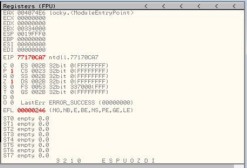
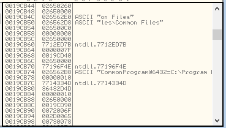

:orphan:
(the-working-environment-of-popular-debuggers-and-disassemblers)=

# The Working Environment of Popular Debuggers and Disassemblers

In a [previous article](introduction-to-debuggers-and-disassemblers) we discussed the basic concepts of debuggers and disassemblers. We will now take a look at the working environment of popular debugging and dissassembling applications. In addition to code disassembly, debuggers enable the reverser to execute the target program in a controlled manner, i.e., rather than executing the entire binary, the reverser can execute a specific instruction or function. While a program is running, you can view and modify its execution flow to gain insight into its functionality. Let's take a closer look at the working environment of popular debuggers...

## Ollydbg

Ollydbg is a GUI-based debugger that only supports user-level debugging. It is extensible through the use of plug-ins.

When launching Ollydbg, choose _"Run as administrator"_:

As a quick reminder, when performing malware analysis, we are interested in determining what the malware could do with administrative privileges.

If the objective is to test the overall security posture of the environment in relation to the debugged sample, you may run it with regular user privileges.

Use Open (to start a new process and attach to it) or Attach (to an already running process) to load an executable into Ollydbg:

When you select a file, Ollydbg will begin analyzing the selected file. This is the default perspective presented to us.

Let's go to consider main windows. The CPU view is located in the upper left corner and displays:

1. The virtual address of the instructions;
2. Opcodes
3. Assembler Memory Aids
4. Information added, such as the names of well-known functions that the debugger can recognize.

On the Upper right is the CPU registers window:

The Memory Dump window is located in the lower left:

The Stack window is in the lower right window

Top bar buttons:

- Restart (Ctrl + F2)
- Stop (Alt + F2)
- Start (F9)
- Pause (F12)
- Step into (F7)
- Step Over (F8)
- Trace into (Ctrl + F11)
- Trace over (Ctrl + F12)
- Execute till return (Ctrl + F9)

The view button in the menu bar allows for various views.
Some views are associated with a hotkey that is preceded by the Alt key. The hotkey for the "patches" view is preceded by the `Ctrl` key.

Additionally, these views correspond to the blue buttons in the upper right corner.

When selecting "Executable modules (Alt+E)" or pressing the blue "E" button, a window containing all the files opened by the loaded executables appears.

This window displays the "base" virtual address, the virtual size of the binary in memory, the virtual address of the Entry Point, the module's name, file version, and file path for each loaded module in the debugged process.

Threads:

The Windows window:

The Handles window:

The debug button in the menu bar contains a variety of debug options:

Setting a Breakpoint:

When a breakpoint is set, the virtual address turns red at the location of the breakpoint.

Using the command line to set a breakpoint:

This will halt execution at each call to the `VirtualAlloc` function.

We can view the comments on ollydbg.
It displays the arguments passed to `VirtualAlloc`:

Through the memory map, you can export the executable from the process's memory to your analyst's machine:

## Immunity Debugger

Immunity Debugger is a GUI-based debugger that can be used for user-mode debugging; extensible via available plug-ins or through the creation of new ones.

You can begin debugging by selecting Open/Attach from the File menu or dragging an executable file into the debugger:

Disassembly window has four columns:

1. The memory address
2. Hex (opcode of the assembly instructions).
   3.The actual, human readable, assembly instruction disassembled from the hex value in 2.
3. Notes added by Immunity, such as functions names.

## IDAPro

Many believe that Ollydbg and other debuggers are easier to use and more powerful than IDA Pro's built-in debugger, but we will leave it to you to decide and form your own opinion.

Many IDA Pro debugging resources can be found [here](https://www.hex-rays.com/products/ida/support/tutorials/debugging/).

IDA Pro is an advanced debugger that supports a variety of application types and architectures.

## WinDbg

The only debugger that supports debugging in kernel mode.

## x64dbg

x64dbg is an open source binary debugger for Windows used for debugging and reverse engineering executable files for which the source code is unavailable. In addition, it is employed for dynamic debugging and malware analysis.

x86dbg has so many features. As listed on their
website:

- Open-source
- Full-featured debugging of DLL and EXE files (TitanEngine Community Edition)
- `32-bit` and `64-bit` Windows support from Windows XP to Windows 10
- Built-in assembler (XEDParse/Keystone/asmjit)
- Fast disassembler (Capstone)
- C-like expression parser
- Logging
- Notes
- Memory map view
- Modules and symbols view
- Source code view
- Thread view
- Content-sensitive register view
- Call stack view
- SEH view
- Symbol view
- Dynamic stack view
- Handles, privileges and TCP connections enumeration.
- Multi-datatype memory dump
- Executable patching
- Dynamically recognize modules and strings
- User database (JSON) for comments, labels, bookmarks, etc.
- Basic debug symbol (PDB) support
- Extendable, debuggable scripting language for automation
- Plugin support with growing API
- Basic anti-debugging
- Fast disassembler (Zydis)
- Yara Pattern Matching
- Has a decompiler (snowman)
- Analysis
- Integrated import reconstructor (Scylla)
- Highly flexible conditional breakpoints and tracing
- Capability to collect data while tracing

x64dbg's default view consists of the windows depicted in the image below.

We can attach the target file to the debugger by dragging and dropping it, selecting `File->Attach`, or pressing `Alt+A`. (then go to its location and open it).

## Disassembly Area

This area is divided into several columns. The first column displays the memory address of the instructions. The second column displays opcodes, an abbreviation for `"Operation CODES."`

The third column contains the assembly instructions, which are the most important to us. In the fourth column, the debugger displays instructions' comments.

### Registers & Flags Area

**Registers** - This window displays CPU Registers, which are utilized for mathematical operations.

**Flags** - In assembly language, flags are used to indicate the current processor state. Individual flag status can be altered in `x64dbg` by double-clicking on them. Flags play an indispensable role during code analysis.

## Dump Area

Displays the program's hex code in memory. Similar to a hex editor, it displays raw data in both hexadecimal and `ASCII/UNICODE` formats. If you wish to make modifications, simply double-click on the portion you wish to modify and edit the bytes.

## Stack Area

The stack is a section of memory used to temporarily store data. It stores data in a specific order - _LIFO (Last In First Out)_ or _FILO (First In Last Out)_.

Everything is described in more detail in the [documentation](https://help.x64dbg.com/en/latest/)

## References

[Ollydbg](http://ollydbg.de/)

[IDAPro](https://www.hex-rays.com/products/ida/debugger)

[x64dbg](https://help.x64dbg.com/en/latest/)

> **Want to learn practical Malware Analysis? Enrol in [MCSI's MRE - Certified Reverse Engineer Certification Programme](https://www.mosse-institute.com/certifications/mre-certified-reverse-engineer.html).**
