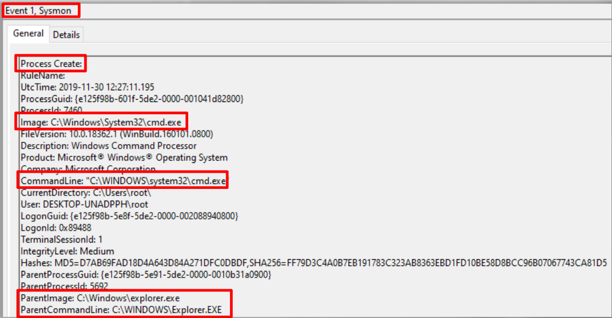
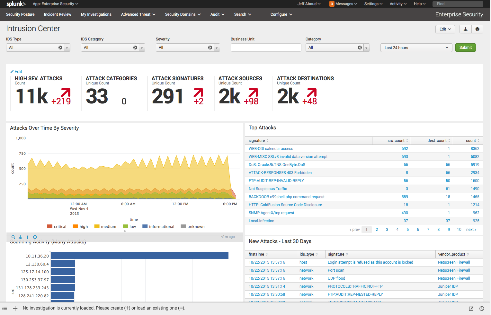

:orphan:
(threat-hunting-siem-elk-stack-splunk)=
# Threat Hunting: SIEM, ELK Stack, Splunk

[Sysmon](https://docs.microsoft.com/en-us/sysinternals/downloads/sysmon) is a tool from Sysinternals that will be examined. System Monitor (Sysmon) is a Windows system service and device driver that remains resident across system reboots in order to monitor and log system activity to the Windows event log. It provides detailed information regarding the creation of processes, network connections, and changes to the time of file creation. By collecting the events it generates using Windows Event Collection or SIEM agents and then analyzing them, you can identify malicious or anomalous activity and understand how network intruders and malware operate. In this article we will discuss common tools used in threat hunting. SIEM, ELK stack and Splunk.

Sysmon collects data for 22 distinct events that can occur on the system, including one that indicates an error within Sysmon:

 - `1` (Event ID) - Process Create (Event description)
 - `2` - File creation time changed
 - `3` - Network connection detected
 - `4` - Sysmon service state change
 - `5` - Process terminated
 - `6` - Driver loaded
 - `7` - Image loaded
 - `8` - CreateRemoteThread detected
 - `9` - RawAccessRead detected
 - `10` - Process accessed
 - `11` - File created
 - `12` - Registry object added or deleted
 - `13` - Registry value set
 - `14` - Registry object renamed
 - `15` - File stream created
 - `16` - Sysmon configuration change
 - `17` - Named pipe created
 - `18` - Named pipe connected
 - `19` - WMI filter
 - `20` - WMI Consumer
 - `21` - WMI consumer filter
 - `22` - DNS query
 - `255` - Error

Sysmon should be installed on all systems to ensure that data from them is accessible for Threat Hunting, digital forensics, and incident response when required (DFIR).

The events should be forwarded to a SIEM (discussed later in the module) to prevent adversaries from deleting them and to detect anomalous activity on single and multiple systems centrally. 

Sysmon requires configuration, which specifies what events to capture and whether or not to exclude "known good" events, for example.

The most popular and recommended base configuration is the [one](https://github.com/SwiftOnSecurity/sysmon-config) provided by SwiftOnSecurity.

It can be used as a starting point, but additional configuration for your unique environment is required and recommended. 

An example of Sysmon log event (ID 1) is shown below:

We can use Sysmon to search for and generate alerts for the following malicious behaviors: 

- Image paths
- Command line arguments
- Process injection
- Process parent-child relationships
- Network connections to certain domain names
- Lateral movement

## SIEM

A SIEM (Security Information and Event Management) platform is another invaluable asset utilized in our hunts.

This appliance will consume logs from a variety of security equipment, including firewalls, intrusion prevention systems (IPS), and threat intelligence feeds.

Then, we can generate alerts, dashboards, and queries to sort through tens of thousands of log entries. 

There are numerous SIEM products available for purchase, including LogRythm, ArcSight, Splunk, QRadar, and USM, to name a few. 

In this post, we'll examine ELK Stack's ability to comb through Windows Event Logs and PowerShell Logs in search of malicious activity.

It's a good choice because we're only examining Windows logs and not logs from firewalls, proxy servers, etc. 

The ELK Stack consists of three open source software applications: **E**lasticsearch, **L**ogstash, and **K**ibana.

Elastic developed all three of these open source products. 

Choosing the incorrect solution can be costly, difficult to maintain, and difficult to staff for constant monitoring, which is why so many SIEM installations end up on the shelf.

In reality, SIEM solutions are optimized for various use cases, and one size does not fit all.

In fact, the evolution of SIEM and Log Management has resulted in a shift from utilizing solutions for merely collecting logs and meeting compliance regulations to becoming an integral component of the network security infrastructure. 

## Splunk

In addition to being a log management and analysis platform, Splunk is advertised as a Security Information and Event Management (SIEM) solution.

It is possible for system operators and infosec professionals to perform higher-order security analyses and assessments of their systems' collective state by unifying logfile data gathered from numerous systems and devices across an IT environment via a single interface by using SIEM, which is basically log management applied to security.

An abundance of SIEM technologies exist on the market, but Splunk reigns top in this category due to its aforementioned Google-esque search capabilities.

Search processing language (SPL) is a platform-proprietary search language that is used to traverse and execute contextual queries on massive data sets. 

## Splunk vs ELK

**Capability set** - There are strong log management and analysis technologies, like Splunk and ELK, that excel at meeting requirements for even the most demanding enterprise use cases.

You'd expect a lot from a competent solution in this category: advanced reporting, robust search, alerting notifications, data visualizations and much more. 

**Easy of use** - Considering the variety of features and capabilities on each platform, both systems are extremely simple to implement and operate.

That said, Splunk's dashboards offer more accessible features and its configuration options are a bit more sophisticated and intuitive than ELK/Elastic Stack's.

Additionally, ELK's user management tools are more complex to utilize than Splunk's.

On the other hand, AWS offers Elasticsearch as a service that removes much of the effort in establishing and managing it. 

**Community Support** - Both companies are market leaders in their respective niches, and they each have a sizable following of customers and fans.

ELK/Elastic Stack, on the other hand, benefits from an active and responsive development and user community and a variety of online resources.

Check out Elastic's library of community-contributed clients for various programming languages. 

**Pricing** - ELK is a free, open source alternative to Splunk, which is a commercial proprietary service with a hefty price tag.

Despite this, ELK/Elastic Stack's expense total cost of ownership may be rather large as well for vast infrastructures: hardware expenditures, price of storage, and professional services can quickly add up (though the aforementioned AWS service can simplify that if cloud-hosting is a realistic option) (though the aforementioned AWS service can simplify that if cloud-hosting is a viable option).

Cloud-based, hosted versions of Splunk and ELK/Elastic Stack are now available for less expensive enterprises. In terms of support, both ELK/Elastic Stack and Splunk's support offerings are great. 

**API and Extensibility** - Splunk has a well-documented RESTful API with over 200 endpoints for accessing every functionality in the product as well as SDKs for common languages.

Using JSON and RESTful APIs, Elasticsearch by ELK/Elastic Stack was built from the ground up to be a distributed search and analytics engine.

It also offers pre-built clients for constructing bespoke apps in languages such as Java, Python, .NET, and more. 

## References

[Sysinternals Sysmon](https://docs.microsoft.com/en-us/sysinternals/downloads/sysmon)   

[https://github.com/SwiftOnSecurity/sysmon-config](https://github.com/SwiftOnSecurity/sysmon-config)    

[https://www.elastic.co/products](https://www.elastic.co/products)    

[Splunk](https://www.splunk.com/)    

> **Want to learn practical Threat Hunting tactics and strategies? Enrol in [MTH - Certified Threat Hunter Certification](https://www.mosse-institute.com/certifications/mth-certified-threat-hunter.html).**