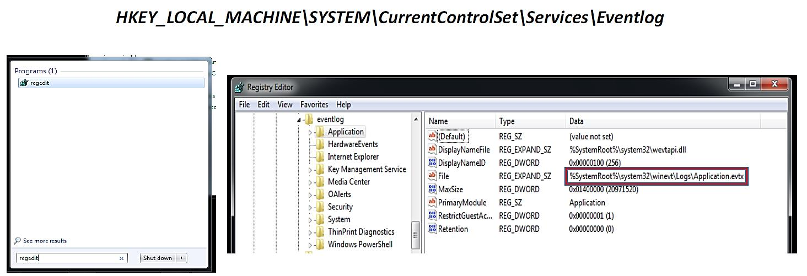
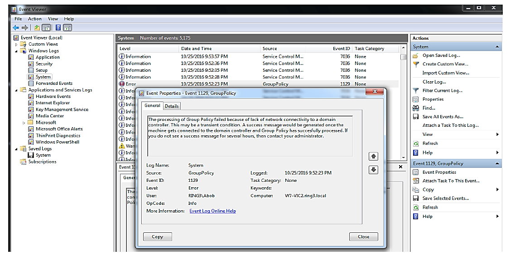
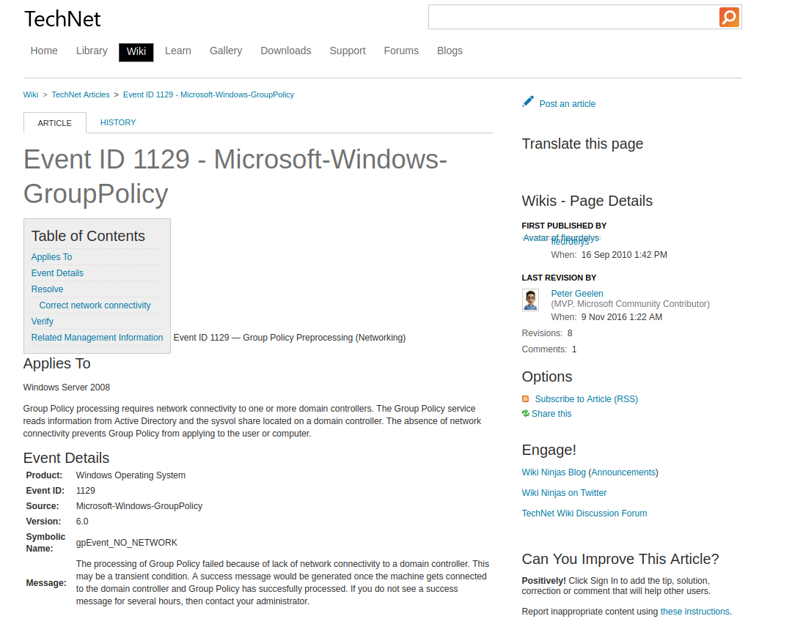
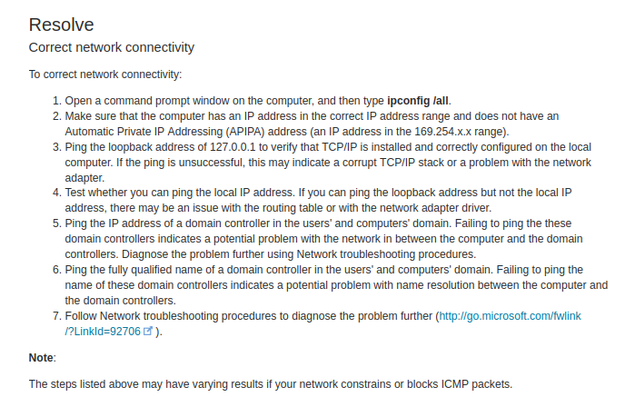
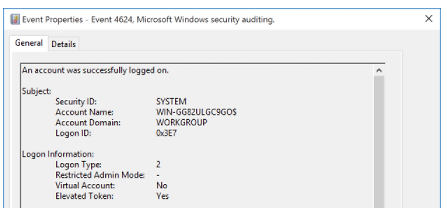
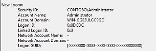
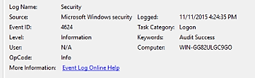
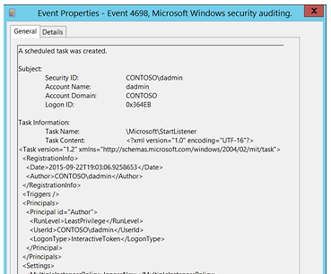
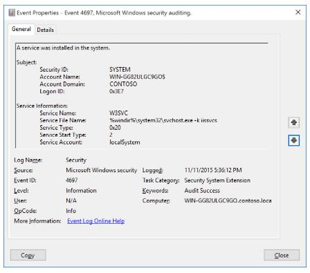
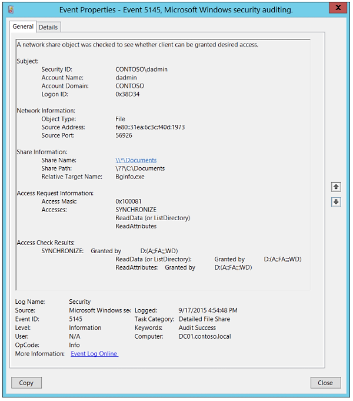

:orphan:
(threat-hunting-windows-event-logs)=
# Threat Hunting: Windows Event Logs
 

Even though we were aware of event logs during the Windows XP era, we rarely referred to them. Users were intimidated by the amount of information they had to sift through to determine the source of a software or hardware issue. As the popularity of incident response grew, so did event logs. The incident response procedure demonstrated that these operating system artifacts were an invaluable source of information for determining what actions occurred on the machine. Therefore, event logs were viewed less as a troubleshooting tool and more for what they were intended to be. Windows Event Logs are a feature of all Windows editions. They allow us to audit and monitor software and hardware events occurring on the system. These events originate from a variety of sources, including applications and the operating system. All of these occurrences are recorded in a collection called the event log.

All Windows versions maintain three core event logs:
- Application
- Security
- System 

The **Application** event log contains events that have been logged by applications and/or user programs. These events include any errors or information designed to be reported by an application.

Antivirus and other host-based security tools frequently report to the Application event log. 

The **System** event log contains events that have been logged by Windows system components. These events may include the loading and unloading of drivers, network configuration changes, Windows service events, etc.

All Windows system component events are predetermined. 

The **Security** event log documents Windows authentication and security processes. These events include valid and invalid logon attempts account creations, changes to user privileges, etc.

Local or Group Policy settings can be used to specify precisely which security events are logged. 

The default event log paths for Windows XP, Windows 2003, and all prior versions of Windows are as follows: 

- Application - `%SYSTEMROOT%\System32\Config\AppEvent.evt`
- System - `%SYSTEMROOT%\System32\Config\SysEvent.evt`
- Security - `%SYSTEMROOT%\System32\Config\SecEvent.evt`

Beginning with Windows Vista and Windows Server 2008, Microsoft made significant changes to the event logging system in modern versions of Windows.

The EVT format was discontinued in favor of an XML-based format with the EVTX extension. Additionally, the location of the event logs was altered. 

- Application - `%SYSTEMROOT%\System32\Winevt\Logs\Application.evtx`
- System - `%SYSTEMROOT%\System32\Winevt\Logs\System.evtx`
- Security - `%SYSTEMROOT%\System32\Winevt\Logs\Security.evtx`

Each event log location exists in the registry as well.

Under Windows Logs, there are two additional log sets:

- *Setup*: logs contain events pertaining to application configuration.

- *Forwarded Events*: logs that are used to store events gathered from remote computers. 

It is also important to note that Microsoft added a new category of event logs, titled Applications and Services. Individual applications or system components utilize these logs. 

These logs are stored in the same location as the previous three core logs.

Windows components that maintain their own logs include User Account Control, Windows Firewall with Advanced Security, AppLocker, Sysmon, Windows Defender, and PowerShell. 

Why are event logs so essential?

- Monitor both successful and unsuccessful logins.
- Monitor the creation, startup, and shutdown of system services.
- Monitor specific application usage.
- Monitor alterations to the audit policy.
- Monitor modifications to user permissions.
- Monitor events generated by installed programs, such as antivirus software. 

You should now understand what event logs are, where they are stored, and their significance; however, how do we access and view them?

The Event Viewer provides the solution. 

Double-clicking the evtx file directly, entering `"evtvwr"` in the Search box, or navigating to *Control Panel > Administrative Tools > Event Viewer* will all lead to the Event Viewer.

Below is a snapshot of the event viewer.

We observed an error in the System event log pertaining to Group Policy.

This particular occurrence had an `ID` of `1129`. We were fortunate enough to find clear information in the event's properties regarding why this error occurred. However, what occurs when the information is unclear?

Microsoft has thankfully documented the Event IDs [here](https://docs.microsoft.com/en-us/windows/security/threat-protection/auditing/advanced-security-auditing-faq). 

Therefore, it is evident that the `EID` (event `ID`) value is useful, and Microsoft has provided a utility to obtain additional information about a particular `EID`. 

Note: If you are familiar with Windows Event Logs and Event IDs, you should know that Microsoft changed some, if not all, of the Event IDs you may recall from Windows XP systems. 

On Windows XP, the `EID` for a successful network login is `540`, whereas on Windows 7 it is `4624`.

Some EIDs remained unchanged between NT Kernels 5 and 6.

Now, let's monitor the Windows Event IDs we should be monitoring during our hunts. 

## Windows Event IDs

**Hunting Suspicious Accounts** - Event IDs unique to account sign-ins: 

- `4624` (successful logon)
- `4625` (failed logon)
- `4634` (successful logoff)
- `4647` (user-initiated logoff)
- `4648` (logon using explicit credentials)
- `4672` (special privileges assigned)
- `4768` (Kerberos ticket (TGT) requested)
- `4769` (Kerberos service ticket requested)
- `4771` (Kerberos pre-auth failed)
- `4776` (attempted to validate credentials)
- `4778` (session reconnected)
- `4779` (session disconnected)

Event IDs unique to account administration: 

- `4720` (account created)
- `4722` (account enabled)
- `4724` (attempt to reset password)
- `4728` (user added to global group)
- `4732` (user added to local group)
- `4756` (user added to universal group)

At this time, it is worthwhile to discuss Logon Types.

In Event Logs, we will find a numeric value indicating the Logon type, which will indicate how the account logged on to the system, such as through an RDP session or interactive logon. 

Type 2 logon is an interactive login (the user is physically logged into the computer). 

- Logon type 2 - Interactive (logon title) - A user physically logged onto this computer.
- Logon type 3 - Network (logon title) - A user or computer logged on from the network.
- Logon type 4 - Batch (logon title) - Used by batch servers where processes may be executing on behalf of a user, like scheduled tasks.
- Logon type 5 - Service (logon title) - A service started by the Service Control Manager.
- Logon type 7 - Unlock (logon title) - The workstation was unlocked.
- Logon type 8 - Network (logon title) - Clear text Network credentials sent in cleartext.
- Logon type 9 - NewCredentials (logon title) - A caller cloned its current token and specified new credentials (runas command).
- Logon type 10 - RemoteInteractive (logon title) - A user logged onto computer using Terminal Services or RDP.
- Logon type 11 - CachedInteractive (logon title) - A user logged onto computer using network credentials which were stored locally on the computer.

The Logon ID is another piece of information to keep in mind regarding account-specific Event IDs.
The Logon ID will let us know which Event ID is part of which logon session. 

Start of session, `Event ID 4624`, and sessions ends, `Event ID 4634` or `4647`.

Using the timestamps at login and logoff and the Logged field, we can determine the duration of the session. 

Another Event ID to look for is `Event ID 4672` (Special privileges assigned to new logon), which was also mentioned previously.

We'd like to determine if there are any unusual accounts logged into machines with admin privileges when they shouldn't have admin privileges, or if privileged local accounts are being used to remotely log into other machines instead of legitimate network accounts. 

Consider that we will need to examine multiple sources to determine logon/session information from event logs.

Some event logs may be stored locally on the workstation, while others may be stored on the server, domain controller, or other machine that was accessed. 

**Hunting Password Attacks** - We will look for `Event ID 4625` (login failure) and Logon Type 3 (network logon).

A Password Spraying/Guessing attack may be indicated by a rapid succession of failed attempts to the same machine or multiple machines, repeated in a short amount of time with each attempt.
We are aware that the attacker can alter the intervals between each attempt to make them appear less suspicious. 

**Hunting Pass The Hash** - The Event ID to hunt for is `Event ID 4624` with Logon Type 3. Additionally, we should verify that the Logon Process is `NtLmSsP` and the key length is `0`.

[Here](https://blog.binarydefense.com/reliably-detecting-pass-the-hash-through-event-log-analysis) you can learn more about this technique. 

**Hunting Golden Tickets** - Attackers frequently utilize native Kerberos functionality.
This is the case, for instance, when a golden ticket is created.

A golden ticket is a counterfeit Ticket-Granting Ticket that grants an attacker access to all network resources. Therefore, you should be familiar with Kerberos-related Event IDs, such as `4768`, when searching for this type of attack.

Detailed information on detecting pass-the-ticket and Golden Tickets is available [here](https://blog.stealthbits.com/detect-pass-the-ticket-attacks).

If your network environment is accustomed to a large number of RDP connections to other machines, it may be challenging to locate this.

**Hunting RDP sessions** - When searching for RDP sessions, Event IDs `4624` and `4778` with `Logon Type 10` are sought (Terminal Services or RDP). Note also the expected Event IDs following successful or unsuccessful authentication attempts. 

**Hunting PsExec** - PsExec, a component of the SysInternals Suite, is a common lateral movement tool that enables the execution of remote commands.
Due to how PsExec operates, we can use the following Event IDs to locate it: 
- `5145` (captures requests to shares, we are interested in ADMIN$ and IPC$)
- `5140` (share successfully accessed)
- `4697` / `7045` (service creation)
- `4688` / Sysmon EID 1

**Hunting Scheduled Tasks** - `Event ID 4698` (a scheduled task was created) is what we'll hunt for. Also, Event IDs `106`, `200`, and `201` all relate to scheduled tasks. Here is an example log entry.

**Hunting Service Creations** - We will search for `Event ID 4697` (a service was installed in the system) to detect the installation of suspicious services. 

**Hunting Network Shares** - The NTLM protocol-specific `Event ID 4776` notifies us of successful or unsuccessful authentication attempts.

We should see either Audit Success or Audit Failure under Keywords. Error Code will also provide details regarding the authentication attempt. 

Other Event IDs specific to network shares are Event IDs
`5140` and `5145`.

## References

[Event ID 4624](https://docs.microsoft.com/en-us/windows/security/threat-protection/auditing/event-4624)    

[Event ID 4672](https://docs.microsoft.com/en-us/windows/security/threat-protection/auditing/event-4672)   

[Detect Pass The Ticket Attacks](https://blog.stealthbits.com/detect-pass-the-ticket-attacks)   

[EID 5145](https://docs.microsoft.com/en-us/windows/security/threat-protection/auditing/event-5145)    

[EID 5140](https://docs.microsoft.com/en-us/windows/security/threat-protection/auditing/event-5140)    

[EID 4697](https://docs.microsoft.com/en-us/windows/security/threat-protection/auditing/event-4697)    

[EID 7045](https://www.manageengine.com/products/active-directory-audit/kb/system-events/event-id-7045.html)    

[EID 4688](https://docs.microsoft.com/en-us/windows/security/threat-protection/auditing/event-4688)    

[EID 4698](https://docs.microsoft.com/en-us/windows/security/threat-protection/auditing/event-4698)    

[EID 4697](https://docs.microsoft.com/en-us/windows/device-security/auditing/event-4697)    

[https://github.com/ThreatHuntingProject/ThreatHunting](https://github.com/ThreatHuntingProject/ThreatHunting)

> **Want to learn practical Threat Hunting tactics and strategies? Enrol in [MTH - Certified Threat Hunter Certification](https://www.mosse-institute.com/certifications/mth-certified-threat-hunter.html).**