:orphan:
(tools-to-get-you-started-in-malware-analysis)=

# Tools to get you Started in Malware Analysis

In this blog post, we will discuss a few additional extremely useful analysis tools. Please note that this is not an exhaustive list of the best available tools, but rather a starting point.

- **Process Hacker**
- **Fiddler** - Intercepting Traffic
- **ProcDOT** - Visualizing Process Activity
- **DependencyWalker**
- **RegShot**

## Process Hacker

[Process Hacker](https://processhacker.sourceforge.io/)

> _"A free, powerful, multi-purpose tool that helps you monitor system resources, debug software and detect malware."_
> -- <cite> Process Hacker </cite>

Process hacker's capabilities are comparable to those of Process Explorer, but it has additional powerful features as well.

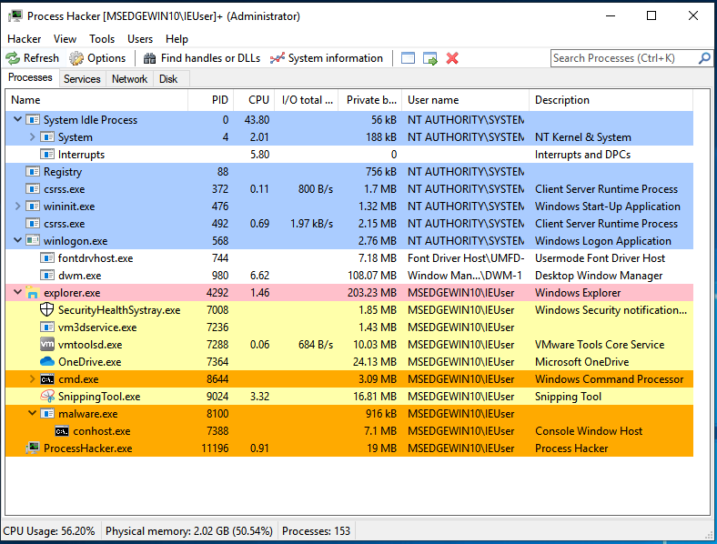

Search for strings and dump specific memory regions of a process that is currently running.

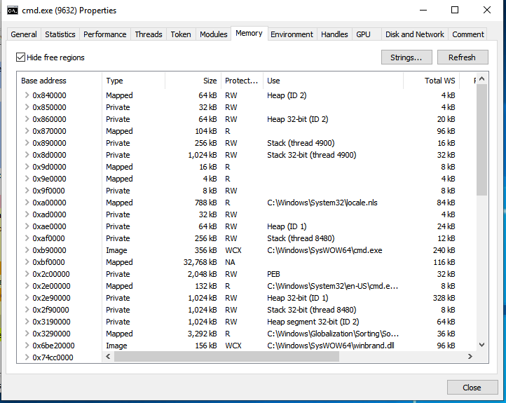

Very useful in dumping shellcode from memory locations.

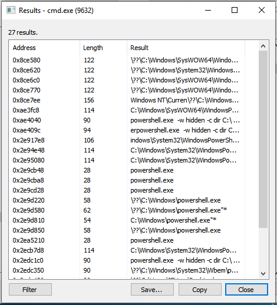

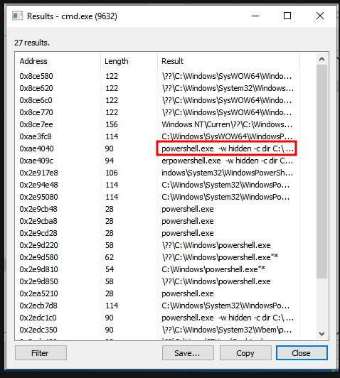

## ProcDOT

[ProcDOT](https://www.procdot.com/) - You should now have a good understanding of what Procmon is and how to use it. Additionally, you should comprehend what traffic capture is and what information can be gleaned from it.

Imagine if you could combine the results of these two tools and use them together to help you visualize the results? That is exactly what ProcDOT does!

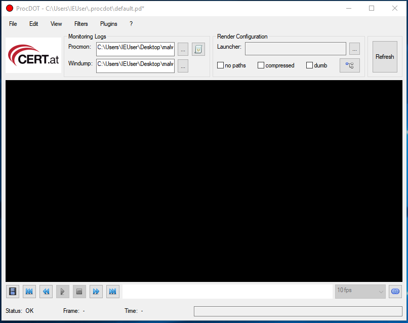

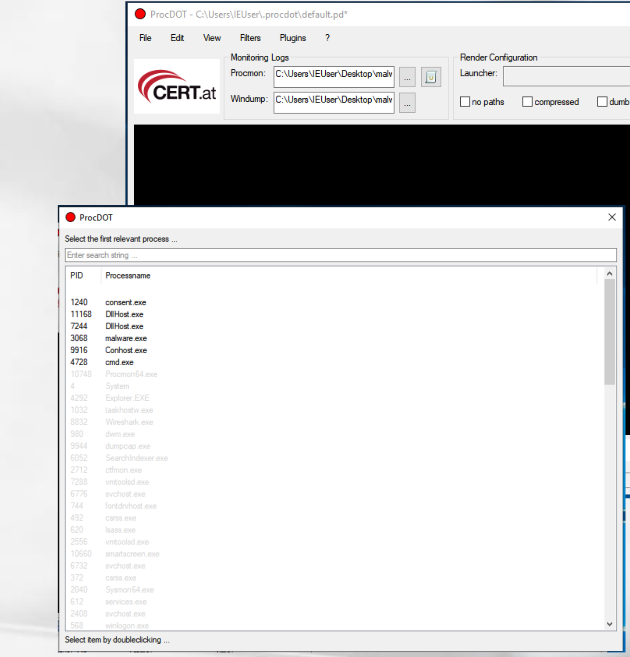

ProcDOT assisted in the Visualization of Process Activity. You can load it with the ProcMon CSV file generated when the malicious sample was executed, as well as the PCAP file captured by various tools, and then ask ProcDOT to generate these visuals for you.

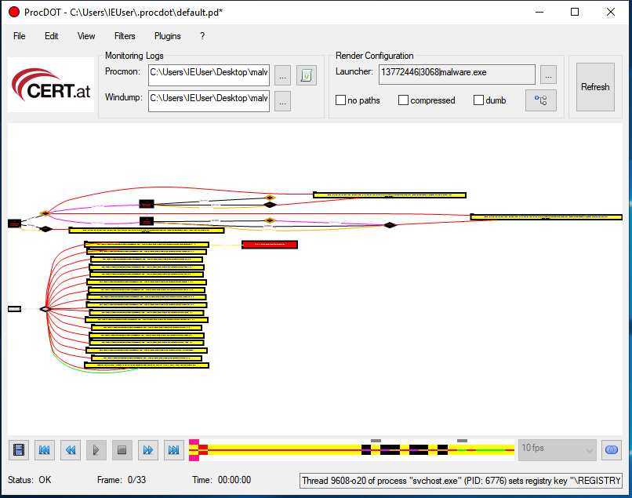

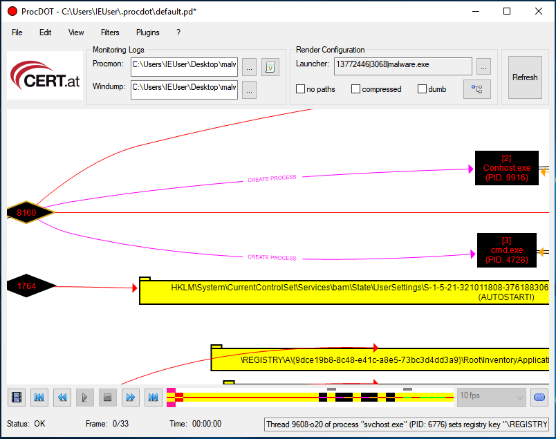

## Fiddler

> "Is a web debugging proxy tool to log all HTTP(S) traffic between your computer and the Internet. Inspect traffic, set breakpoints, and fiddle with request/response."
> -- <cite>Telerik</cite>

[Fiddler](https://www.telerik.com/fiddler) - We can use it to intercept traffic in cases where the malware uses HTTP(s) for communication.

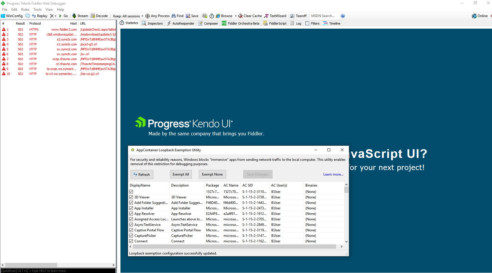

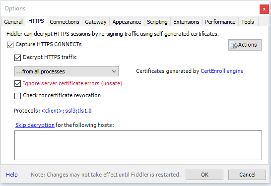

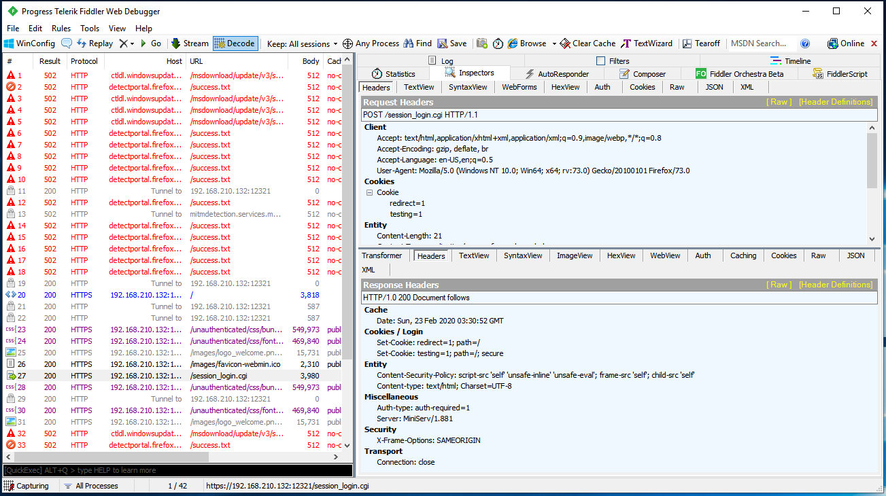

There is a `Capture Traffic` option under the `File` menu. The option is by default enabled. This means that Fiddler registers itself in the Windows registry as a proxy server.
This setting is used by Internet Explorer, Edge, and Chrome, which means `HTTP` packets from these browsers will be routed through Fiddler:

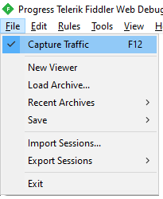

If the `File -> Capture Traffic` option is disabled, Fiddler will no longer function as a system proxy and will only capture packets that are sent directly to Fiddler's address. This may have occurred if you manually configured your application or browser to use Fiddler's IP and port.
By default Fiddler listens on port `127.0.0.1:8888`

Option `Retain all sessions` - In this mode, Fiddler does not clear the `HTTP` packet collection history. If Fiddler needs to work for an extended period of time, there will be a large number of these packages, and Fiddler will consume all of the available RAM. To prevent this from occurring, change the mode to `Keep: 100 sessions.`

`Decode` choice - Disabled by default. During the analysis of collected packets, it is recommended to automatically decode the packets. Alternately, you can select the built packages using Ctrl+A, open the context menu by right-clicking the selected packages, and then click `Decode Selected Sessions.`:

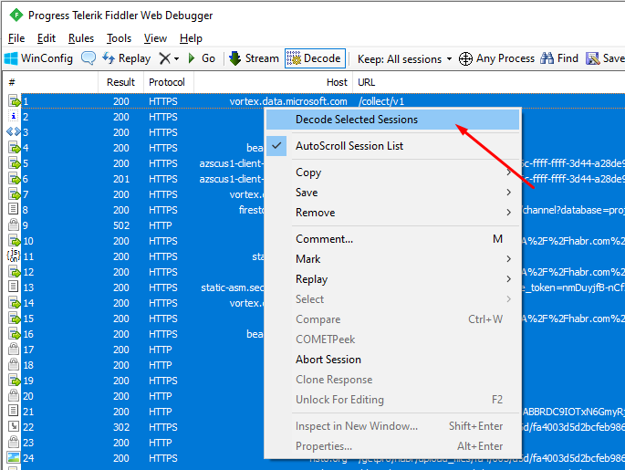

> This is just an example to explain the idea

## DependencyWalker

[DependencyWalker](http://www.dependencywalker.com/)

Extremely helpful tool for analyzing Windows executables and constructing a hierarchy of the libraries and functions referenced by the executable.

It can list all modules exported by a library (module) and all functions actually called by other libraries.

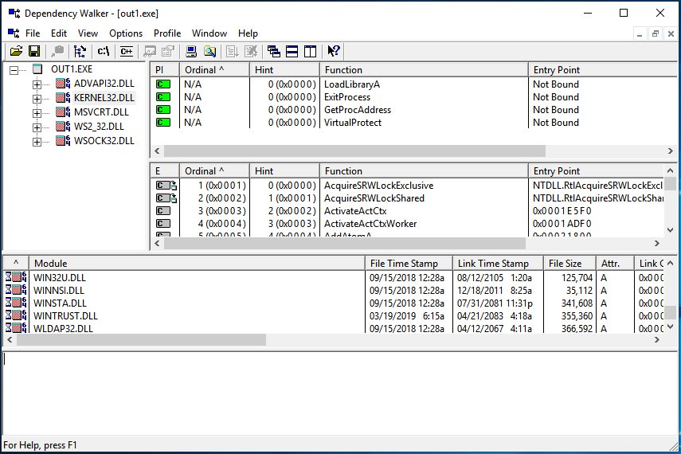

## RegShot

[RegShot](https://sourceforge.net/projects/regshot/) - Is an open-source application that enables the comparison of two registry snapshots.

It can also be configured to scan a directory and compare the results to a previous scan for file and directory changes.

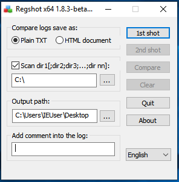

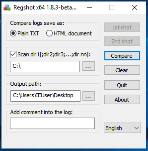

Results after comparing between registry snapshots and file/directory scans:

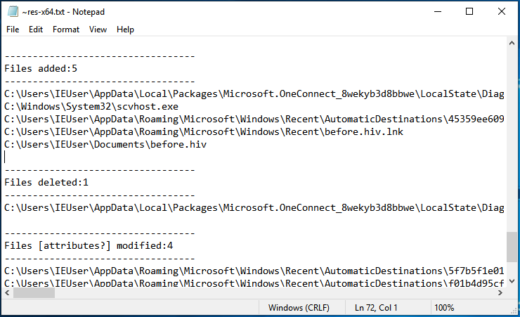

As mentioned previously in our blog, there are numerous online services that provide sandboxes for testing and analyzing samples. We can also create our own with Cuckoo.

Just a reminder for the different services available online:

- [VirusTotal](https://www.virustotal.com/)
- [Any.run](https://any.run/)
- [JoeSandbox](https://www.joesandbox.com/#windows)

## Cuckoo Sandbox

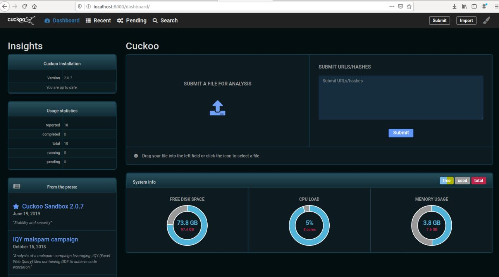

Cuckoo Sandbox is a sophisticated, highly modular, and 100 percent open source malware analysis system with limitless application possibilities.
It is default capable of:

- Analyze a variety of malicious files (executables, office documents, pdf files, emails, etc.) and malicious websites in Windows, Linux, macOS, and Android virtual environments.

- Trace API calls and the general behavior of the file, and distill this data into signatures and high-level information that can be understood by anyone.

- Dump and analyze network traffic, even when it is SSL/TLS encrypted. With the ability to drop all traffic or route it through InetSIM, a network interface, or a VPN.

- Perform advanced memory analysis using Volatility and YARA on the infected virtualized system's process memory granularity.

In the past few years, the Cuckoo project has undergone significant changes; new tools have been added, support for additional software has been added, the number of signatures has increased dramatically, a system for rating the harmfulness of a scanned file has been added, the entire user interface has been rewritten, and a dark theme can now be configured.

## References

[Process Hacker](https://processhacker.sourceforge.io/)

[Fiddler](https://www.telerik.com/fiddler)

[ProcDOT](https://www.procdot.com/)

[DependencyWalker](http://www.dependencywalker.com/)

[RegShot](https://sourceforge.net/projects/regshot/)

[Cuckoo Sandbox docs](https://docs.cuckoosandbox.org/en/latest/)

> **Want to learn practical Malware Analysis? Enrol in [MCSI's MRE - Certified Reverse Engineer Certification Programme](https://www.mosse-institute.com/certifications/mre-certified-reverse-engineer.html).**
