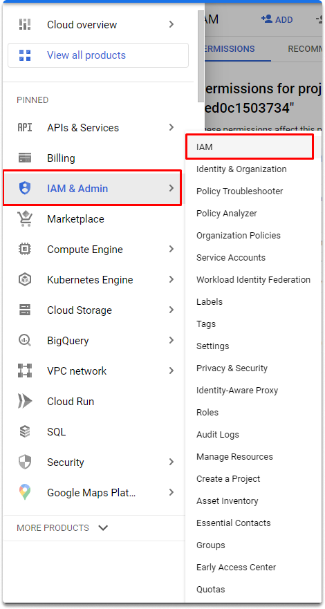

:orphan:
(understanding-gcp-identity-and-access-management)=

# Understanding GCP Identity and Access Management

GCP IAM is a fine-grained identity and access management service powered by Google Cloud. You may use this utility to restrict which users have access to which resources.

## Roles

Roles are groups of rights that may be allocated to individuals. Cloud IAM makes advantage of the idea of roles. Rather than simply allocating rights to individuals, you provide privileges to roles and afterward grant individuals various roles. This implies that identities can only be granted permissions through roles. This concept must be clearly understood for securing your resources.

## GCP IAM Essentials

Users, groups, and service accounts are granted access to resources in Google Cloud by providing those identity roles. As previously stated, roles are collections of permissions. Once an identity is assigned a role, it receives all of the privileges associated with that position.

GCP uses three types of roles:

- Primitive roles
- Predefined roles
- and Custom roles

Let’s look at briefly each of them:

### Primitive roles

These are 3 primitive roles: Owner, Editor, and Viewer. Because these roles apply at the project level, they are classified as project-level access controls.

- The Viewer role: This primitive role provides resources with read-only access.

- The Editor role: This role grants all Viewer rights as well as the ability to change the status of a resource.
- The Owner role: The owner role has all Editor role permissions and the ability to manage roles and permissions, as well as the ability to set up payment for a project.

Primitive roles should be avoided in general, unless you need project-level access constraints. You might, for example, utilize basic roles to allow access to programmers in a development environment, because the developers would be in charge of managing the programming environment.

### Predefined roles

These are established roles that are particular to a Google Cloud service and correspond to the normal employment responsibilities of persons who use such services. Every service will have a predetermined set of roles.

In general, predefined roles are connected with a GCP service, like App Engine or BigQuery, as well as a group of shared tasks, such as changing information in the database or publishing a program to App Engine. The naming standard for roles is `roles/` followed by a string that specifies the service, and finally an action, such as get, list, or create.

`roles/appengine.deployer`

`roles/bigquery.user`

### Custom roles

These sorts of responsibilities must be created and managed by you, but they are an integral part of the least privilege concept. You should grant the minimal set of permissions needed for individuals to perform their jobs. We may use custom roles to get the utmost degree of granularity given by IAM. We may construct a new role by selecting from a list of permissions for a position. Users must be assigned the iam.roles. To be able to establish a custom role, you must first create authorization. The owner of a specific project gets this privilege by default and may design and implement custom roles.

## Quick exercise :

### Attempting to manage roles with an owner and viewer account in Google Cloud IAM

Let’s go to the Navigation menu > IAM & Admin > IAM as shown in the image.

As you can see since we are the project owner we can manage the roles and permissions of our project.

Let’s login with another account that has only viewer permissions and attempt to manage roles.

As you can see, add button is greyed out and gives us a warning.

Let’s go back to our first owner account and try to add a role. As you can see we can manage roles in this account.

## Conclusion

Upon completion of this blog, you are capable of basic understanding of GCP IAM, roles and applying your knowledge on the GCP IAM console.

## Test your knowledge

- How you can access to Roles in GCP dashboard?

- Which following roles are available for every resource type in Google Cloud Platform?

  - Custom roles
  - Primitive roles
  - Predefined roles

:::{seealso}
Want to learn practical cloud skills? Enroll in MCSI’s - [MCSF Cloud Services Fundamentals ](https://www.mosse-institute.com/certifications/mcsf-cloud-services-fundamentals.html)
:::
