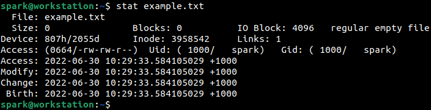
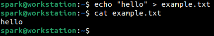
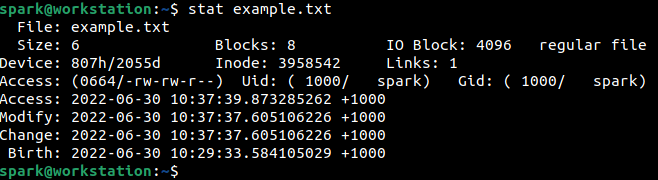
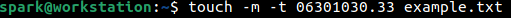
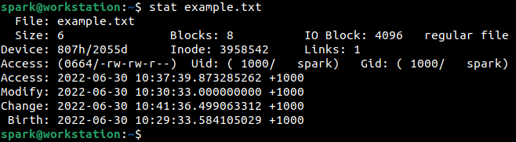

:orphan:
(understanding-linux-timestamps-for-dfir)=
# Understanding Linux Timestamps for DFIR
 
Every file on a Linux computer has four timestamps associated with it. In this blog post, we will explore how those timestamps exist, some interesting facts surrounding the timestamps and their implications in DFIR.

## Linux Timestamps

The four timestamps associated with any file on Linux are:

- **Creation time**: it refers to when the file was created on the system. It is also referred to as ‘birth time’. It is sometimes abbreviated as *btime*. 

On Windows computers, storage media like the *C:* drive are formatted using New Technology File System (NTFS). Likewise, storage media on Linux computers may be formatted using the Fourth Extended File System (EXT4), XFS, BTRFS or ZFS. There are other filesystems available for use on Linux. Recent versions of these filesystems store the creation time of a file, older versions did not.

- **Change time**: it refers to time at which the metadata associated with the file underwent change. Metadata can refer to timestamps, permissions, ownership, file size, etc. It is abbreviated as *ctime*.

- **Modify time**: it refers to the time at which the contents of the file underwent change. Even if a single space or newline character is added to or removed from a file, this timestamp is updated. It is abbreviated as *mtime*.

- **Access time**: it refers to the time at which the file was last accessed. It is abbreviated as *atime*.

To view all the timestamps associated with the file, `stat` command can be used. In the following screenshot, `stat` is used to view the timestamps for a text file *example.txt*. This file has just been created and is currently empty.

You can view the file name, size, permission string, file owner (spark), group that the file belongs to (spark) and the four timestamps along with time zone information. All the timestamps are the same for the newly created file.

As shown below, a single line was written into the file and the contents of the file were viewed. See *[this](linux-command-line-101-basic-redirection-and-pipes)* post for a quick introduction to using basic Linux commands.

The following changes have occurred on the file:

- File contents have been modified. This would result in the file modification time being updated.
- File size has been modified. This would result in the file change time being updated. (change to file metadata)
- File contents have been viewed using `cat`. This would result in the file access time being updated.

Let us take a look at the file’s timestamps using `stat` to confirm our hypothesis. In the following screenshot, we can see that *ctime*, *mtime* and *atime* have all been updated to reflect the recent changes to the file. Since the access operation was performed last, note the seconds field in the access time – it appears later than the other two timestamps.

## Can a timestamp be ‘altered’?

Typically, we expect timestamps to be updated when a user performs operations on the file – like viewing it or modifying it. On Linux systems, there is a command called `touch` that can be used to alter a file’s timestamps to any time. Let’s take a look.

To alter the ‘access time’ of a file to the current time, the following command can be used:

`touch -a [filename]`

To alter the ‘modify time’ of a file to the current time, the following command can be used:

`touch -m [filename]`

To alter the ‘modify time’ of a file to a specific time, the following command can be used:

`touch -m -t [mmddhhmm.ss] [filename]`

Where *mmdd* refers to the month and day and *hhmm.ss* refers to the timestamp in 24-hour format,

In the following screenshot, we can see that the modification time of the file is being altered using `touch` to 2022-06-30 10:30.33.

Let us take a look at the timestamps associated with the file. We can see that the modification time has been altered. However, this value also results in a metadata change – timestamps qualify as file metadata. This is why the change time associated with the file has been updated to reflect when the `touch` command had been executed, on 2022-06-30 at 10:41.36 hours.

Isn’t it interesting? 

There is another fact associated with the access time of the file. The access time is not updated every time it is accessed. It is considered as a ‘costly’ filesystem operation. The file system has an option called *relatime*. When this option is set, the access time of a file is updated in two situations:

- When the *atime* was updated more than 24 hours ago
- When the *atime* is older than *mtime* or *ctime*

The system can also be configured to always update *atime* or never update it at all. These values are typically set by the system administrator depending on the business requirements. The default behaviour is to have the *relatime* option set as discussed above.

## How to interpret Linux timestamps for DFIR?

Now we have an idea about the four timestamps that exist for a file on Linux. We also know that `touch` command can be used to alter the access time and modification time of a file. We know about the default behaviour of the file system regarding the *atime* field.

A timestamp is a very important entity in DFIR – it helps to build timeline of activity observed. A cyber adversary who has gained access to a Linux system can easily use `touch` to modify timestamps, eliminating any footprints of activity. If an adversary had accessed a file, the access time may not be updated if *relatime* option is set.

While investigating a Linux system, a DFIR professional must be aware of the various facts associated with timestamps. Timestamps on Linux may not always serve as concrete evidence. Looking for other evidence on the system, like shell history or log files, may help provide clarity about recent activity on the system.

:::{seealso}
Want to learn practical Digital Forensics and Incident Response skills? Enrol in [MDFIR - Certified DFIR Specialist](https://www.mosse-institute.com/certifications/mdfir-certified-dfir-specialist.html)
:::