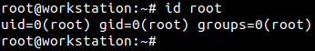
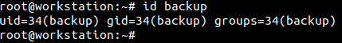
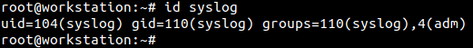
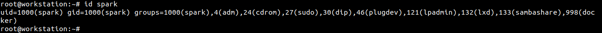
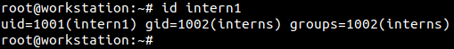

:orphan:
(user-accounts-on-linux-systems)=

# User Accounts on Linux Systems

It is important to have a mechanism to manage the various users on a computer and the access they can have to the data on the computer. On Windows machines, you may have encountered administrators and regular users whose activity on the system is controlled by administrators. This means a Windows machine would have an administrator account and user accounts. In the same way, on Linux machines too there is a mechanism to manage the various types of user accounts. This blog post will introduce you to the various types of user accounts on Linux and their significance for cybersecurity.

## Introduction to User Accounts on Linux

There are three main types of user accounts on Linux:

1. Root User Account
2. System Account
3. Regular User Account

Each user account would be assigned a unique user identifier (UID). Users can also be organised into groups. Each group is also assigned a unique group identifier (GID). A user can be part of multiple groups.

## Root User Account

The root user is the most powerful user on a Linux system having the highest privileges with access to all the services and all users’ data. It is typically used to perform administrative tasks. It is not recommended to use the root user account on a regular basis.

Typically, when a logged-in user opens the _Terminal_ application, they are greeted with a prompt that looks like this:

`[username]@[hostname]:~`

Where hostname is the name of the computer as seen across an internal network.

When logged in as the root user, when you open the terminal, you will see a # symbol at the end of the prompt.

`[username]@[hostname]:~#`

`id` command can be used to print the UID and GID for a particular user. Its syntax for usage is:

`id [username]`

As seen in the following screenshot, root user is always assigned the UID and GID as 0. The ‘groups’ parameter seen below refers to the groups the user is part of.

The root account is created at the time of OS installation.

## System Account

System accounts are service accounts created by installed services. One example is the ‘backup’ account that creates and manages backups as requested by a user. The following screenshots shows the UID and GID of ‘backup’ account.

The following screenshot shows the UID and GID of ‘syslog’ account. It is the account used by the syslog server that collects logs from various active services and applications; and stores them. This account seems to be a part of two groups.

## Regular User Account

The final account type corresponds to regular users, like you and me. These users must be created and their access level configured, before use. The following screenshot shows the UID and GID of user ‘spark’ on a computer. It appears that this user account is part of many groups.

Another user ‘intern1’ was created on the same computer. A group called ‘interns’ was created. ‘intern1’ was added to the ‘interns’ group. This information is represented in the following screenshot.

In this way, administrators, managers, developers, testers and interns can all have their own user accounts but also be part of specific groups on a Linux computer.

When a regular user logs in to the machine and opens the _Terminal_ application, a dollar ($) symbol appears at the end of the prompt, as seen in the following screenshot.

In a terminal, if you see a # symbol at the end of the prompt it means you have elevated privileges. If you see a $ symbol at the end of the prompt, it means you have regular user-level privileges.

## More about UIDs and GIDs

Depending on the distribution type, UID and GID ranges are reserved for system accounts and user accounts. For example, on Debian based distributions like Ubuntu, system accounts are usually assigned identifiers between 100 and 999; whereas user accounts are assigned identifiers between 1000-9999. On some systems, information about this reserved range can be found within `/etc/login.defs` file.

## Why do cybersecurity professionals need to know about Linux user account types?

- As a penetration tester or red teamer, you may need to gain additional privileges on a Linux machine by getting access to the root account.
- As a threat hunter, being aware of the various accounts on a system will help track the activity of a particular account.
- As a digital forensic investigator, you may need to identify the users on a system and the various levels of access assigned to each person.
- As a cloud security professional, you may need to create users and assign permissions to them, to manage access to cloud infrastructure.

## Next Steps

Now that you know about the types of user accounts on Linux, here is a project idea for you:

- Set up Ubuntu or Fedora or Cent OS on a virtual machine
- Login as the root user
- Add two users to the system: ‘intern1’ and ‘intern2’
- Add another user: ‘manager1’
- Create a group called ‘interns’
- Add ‘intern1’ and ‘intern2’ to the ‘interns’ group
- View the UID and GID of all newly created users
