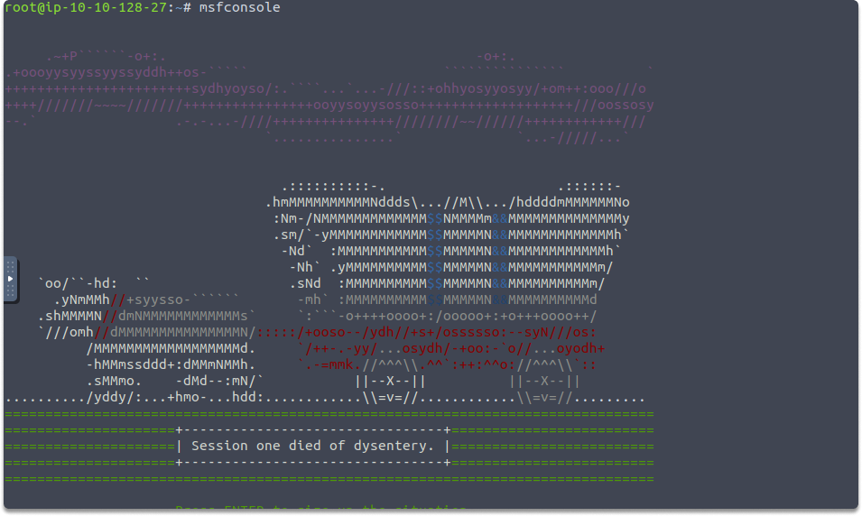
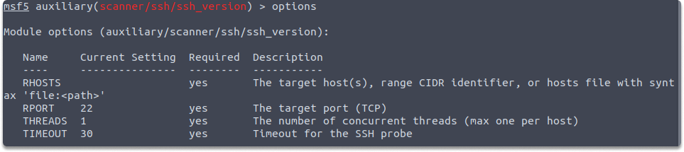
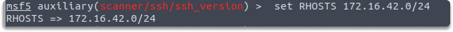
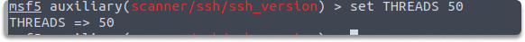
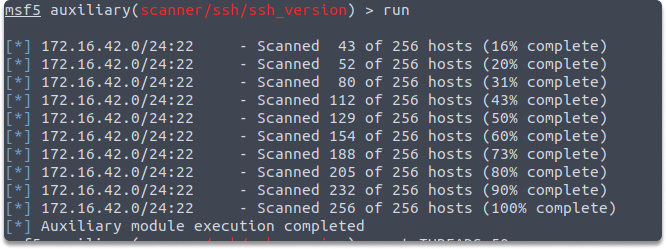

:orphan:
(using-metasploit-to-enumerate-ssh)=

# Using Metasploit to Enumerate SSH

When you find valuable information about your target machine's SSH server, as a penetration tester you can research common vulnerabilities and exploits to compromise this service using these findings. As you might guess, today's blog post is about SSH and how to enumerate SSH servers using Metasploit.

## What is SSH?

Secure Shell (SSH) is a popular network protocol that may be found on the systems of many businesses. It enables IT experts, to connect their device to a distant server over a secure, encrypted Terminal connection. SSH also allows network communication tunneling and forwarding, allowing you to utilize it as a VPN to safely access information.
Here are three subsystems that are frequently accessible to users:

- Secure shell (SSH), which allows access to the command line.
- Secure copy (SCP) allows users to transfer and recover files.
- Secure FTP (SFTP), a functionality file transmission protocol

### SSH and port 22

While doing active network scanning, you may see that port 22 is open on several servers. Although some sys admins may set their remote servers to use a non-standard port for SSH, SSH uses port 22 by default.

## Associated vulnerabilities of SSH

SSH services are susceptible to various attack types:

- Brute-force attacks
- Unauthorized access owing to key disclosure.
- Unauthorized remote manipulation of common software flaws.
- Exploits of common flaws, leading in privilege escalation.

## Hands-on Activity: SSH enumeration

_Time estimated: 5 minutes_

To identify the SSH version operating on the targeted system, we can utilize the Metasploit Framework's ssh version module. To begin enumerating SSH, follow these steps:

First, open a terminal and run the following command to launch the Metasploit framework:

`$ sudo msfconsole`

Then, use the following commands to choose and show the SSH version checker module's configurations:

`$ use auxiliary/scanner/ssh/ssh_version`

`options`

As seen in the screenshot, the RHOST value is empty, and the RPORT (remote port) has been configured to 22.

Lastly, use the following commands to configure the victim's IP address and start the module:

`$ set RHOSTS 172.30.1.26`
`run`

`$ set THREADS 50`

As you can see The Metasploit module was not able able to identify the service version of SSH of the target. However, you can never know when you'll find a machine that hasn't been upgraded.

## Conclusion

Having completed this blog post, you have learned how to use Metasploit to scan and enumerate ssh on a target system.

> **Looking to expand your knowledge of penetration testing? Check out our online course, [MPT - Certified Penetration Tester](https://www.mosse-institute.com/certifications/mpt-certified-penetration-tester.html)**
