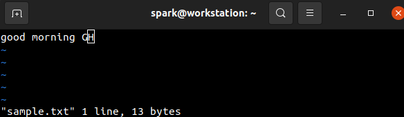

:orphan:
(vi-editor-in-linux)=

# Vi Editor in Linux

Whenever you use a Linux system, you will encounter text files and configuration files that you will need to edit. There are a variety of text editors across all Linux distributions to help you for this task. Most, text editor applications come with a GUI. On Linux server machines and other specific distros, only a command-line version of the operating system is available. In that case, a non-GUI based text editor must be used. This blog post introduces you to the command-line based Vi text editor, that is installed on most Linux systems by default.

## Available Text Editors

Here is a short list of some commonly used GUI-based text editors:

- Gedit
- Leafpad
- Emacs
- Sublime Text
- Bluefish

Here is a list of commonly used non-GUI based text editors:

- Vi (currently has an improved version ‘Vim’)
- Emacs (has a command line version too)
- nano editor
- ne

In this blog post, we will focus on one non-GUI based text editor _Vi_ that is installed by default on most Linux systems. This is not the case with Emacs or the other available options.

## Introducing Vi Text Editor

Nowadays, the improved version of _Vi_ referred to as _Vim_ is installed by default. _Vim_ or _Vi_, depending on the installation, can be accessed using the command-line tool `vi`. Since Linux distributions have _Vim_ installed for use, even when we type the commands using `vi`, remember that we are using _Vim_ in the background.

_Vi_ is not a conventional text editor. It has special ‘modes’ to create and edit documents. You can follow along with this blog post on your Linux machine. Soon, you will be able to start using the _Vi_ Editor!

### Modes in Vi

The _Vi_ editor operates in two modes:

1. **Command mode**: In this mode, the user instructs _Vi_ about the activity to be performed – inserting text or deleting text or copying text. When you open _Vi_ editor, it opens by default in command mode.
2. **Input mode**: Also referred to as _Insert mode_. Once the command is received for a specific task, say inserting text, then _Vi_ switches to input mode. Whatever content is typed on the screen, is accepted as input into the file.

To switch between the modes _Esc_ key is used.

Let’s begin exploring these modes by inserting and deleting text from a file _sample.txt_.

### Inserting text

To open a file in _Vi_, simply type `vi` followed by the file name as shown in the following screenshot. If the file does not exist in the current directory, then it is created.

The following screenshot demonstrates how _Vi_ editor appears once it is opened. Whenever _Vi_ opens, the cursor exists at the beginning of the file. Towards the end of the terminal screen, you can find the name of the file.

To begin inserting content into the file, we must first instruct _Vi_ to accept input. This can be done by pressing `i` when in the command mode. It indicates _Vi_ to insert text starting at the current position of the cursor. Then _Vi_ switches into input mode and text can be typed. Here the content ‘good’ has been written into the file.

The next task is to save the changes to the file. To do this, _Vi_ must be instructed with a command.

To move into the command mode, press _Esc_ and type the command to save the file – which is `:wq`. You can see this command typed at the bottom of the terminal screen. This is represented in the following screenshot. ‘w’ means write to the file and ‘q’ means to quit.

Once the _Enter_ key is pressed, then content is written into the file and we move back into the terminal. To verify that the content has been successfully written into the file, `cat` command can be used to view the file’s contents, as shown in the following screenshot. The result is as expected.

Next, let us attempt to add the word ‘morning’ to our file ‘sample.txt’. We want the file to contain the words ‘good morning’. Let us open up the file in _Vi_ again. We know that when _Vi_ opens, the cursor is always present at the beginning of the file. If we use the `i` command to insert text, then text would be inserted in the current position of the cursor. This means the content we type will overwrite the existing content. How do we begin appending text to the existing content? Simply by using a different command `A` that appends text to the existing content.

Once the command `A` is issued, the editor moves into input mode. The remaining word can be typed into the file,

And the work can be saved.

The updated file contents can be viewed using `cat` as shown in the following screenshot.

Let’s try editing the file again. This time we have erroneously written some contents to the file. We do not want to save the file’s contents. We simply want to quit the editor. Can you guess which command can be used to quit the editor?

Close! It is `:q`. Let’s see what happens when you press _Enter_.

There is an error message that there is a new character in the buffer that has not been written to the file yet.

To override this error and simply quit the editor, issue the command `:q!`. The ! symbol indicates _Vi_ to quit without saving any existing changes in the buffer.

The file’s contents remains the same.

### Deleting text

What if we want to delete a file’s contents. There are separate commands in _Vi_ to delete a character, a word and a line. We will discuss how a character can be deleted. Using the `A` command, characters G and H have been appended to the file as shown in the following screenshot.

Character H needs to be removed. Since the cursor is under H (note the box around H in the screenshot above), the command to delete a character can be issued. Press ‘Esc’ to ensure you are in command mode and issue `x` to delete the character the cursor is under.

From the following screenshot, we can see that H has been deleted successfully.

## Refresher

- We have seen that _Vi_ editor has two modes: command mode and input/insert mode.
- _Vi_ opens by default in insert mode, with the cursor in the beginning of the file
- `i` command is used to insert content at the position the cursor is in, which by default is the beginning of the file
- `A` command is used to append content to the end of the file
- `x` command is used to delete the character at the current position of the cursor

## Next Steps

Explore the _Vi_ commands for the following tasks:

- Insert five lines into a file
- Copy the 2nd line and paste it after the 5th file
- Delete the 3rd line of the file
- Navigate within the file and insert text at the beginning, middle and end of a line
- Search for a string within a file

## Why should cybersecurity professionals know to use Vi Editor?

- During penetration testing/red teaming engagements, you may gain access to a Linux machine without a GUI. Some text/configuration files may have to be created/edited for post-exploitation activities. Knowing how to use the Vi editor comes in handy then.
- During a digital forensics engagement, ability to use the Vi editor helps with the collection and processing of evidence on a Linux machine without a GUI.
- A cloud security professional will not have a GUI when working with Linux instances in the cloud. Knowledge about using Vi editor makes their tasks easier. For example: to configure web server settings.
- A system/network security professional who works with non-GUI based server machines frequently, will benefit from using the Vi editor to configure security settings - for example: to configure firewall rules.

Once you are comfortable with using Vi Editor, you will be better prepared to use Linux systems without a GUI!
